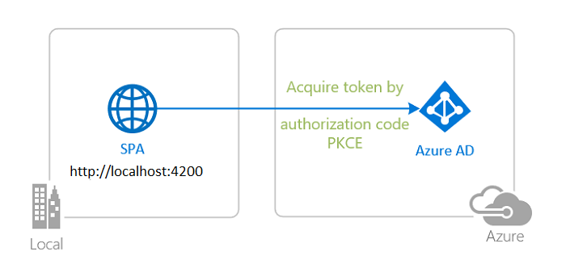
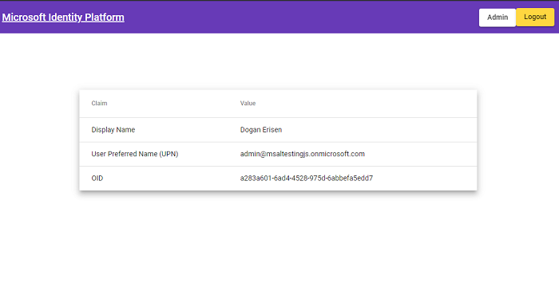

# Angular single-page application using MSAL Angular to sign-in users with Azure Active Directory

 1. [Overview](#overview)
 1. [Scenario](#scenario)
 1. [Contents](#contents)
 1. [Prerequisites](#prerequisites)
 1. [Setup](#setup)
 1. [Registration](#registration)
 1. [Running the sample](#running-the-sample)
 1. [Explore the sample](#explore-the-sample)
 1. [About the code](#about-the-code)
 1. [More information](#more-information)
 1. [Community Help and Support](#community-help-and-support)
 1. [Contributing](#contributing)

## Overview

This sample demonstrates an Angular single-page application (SPA) that lets users sign-in with Azure Active Directory (Azure AD) using the [Microsoft Authentication Library for Angular](https://github.com/AzureAD/microsoft-authentication-library-for-js/tree/dev/lib/msal-angular) (MSAL Angular).

Here you'll learn about [ID Tokens](https://docs.microsoft.com/azure/active-directory/develop/id-tokens), [OIDC scopes](https://docs.microsoft.com/azure/active-directory/develop/v2-permissions-and-consent#openid-connect-scopes), [single-sign on](https://docs.microsoft.com/azure/active-directory/develop/msal-js-sso), **silent requests** and more.

## Scenario

1. The client Angular SPA uses **MSAL Angular** to obtain an ID Token from **Azure AD**.
2. The **ID Token** proves that the user has successfully authenticated against **Azure AD**.



## Contents

| File/folder                     | Description                                               |
|---------------------------------|-----------------------------------------------------------|
| `src/app/auth-config.ts`        | Authentication parameters reside here.                    |
| `src/app/app.module.ts`         | MSAL Angular configuration parameters reside here.        |
| `src/app/app-routing.module.ts` | Configure your MSAL-Guard here.                           |

## Prerequisites

- An **Azure AD** tenant. For more information see: [How to get an Azure AD tenant](https://docs.microsoft.com/azure/active-directory/develop/quickstart-create-new-tenant)
- A user account in your **Azure AD** tenant. This sample will not work with a **personal Microsoft account**. Therefore, if you signed in to the [Azure portal](https://portal.azure.com) with a personal account and have never created a user account in your directory before, you need to do that now.

## Setup

### Step 1: Clone or download this repository

From your shell or command line:

```console
    git clone https://github.com/Azure-Samples/ms-identity-javascript-angular-tutorial.git
```

or download and extract the repository .zip file.

> :warning: To avoid path length limitations on Windows, we recommend cloning into a directory near the root of your drive.

### Step 2: Install project dependencies

```console
    cd ms-identity-javascript-angular-tutorial
    cd 1-Authentication/1-sign-in/SPA
    npm install
```

## Registration

There is one project in this sample. To register it, you can:

- follow the steps below for manually register your apps
- or use PowerShell scripts that:
  - **automatically** creates the Azure AD applications and related objects (passwords, permissions, dependencies) for you.
  - modify the projects' configuration files.

<details>
  <summary>Expand this section if you want to use this automation:</summary>

> :warning: If you have never used **Azure AD Powershell** before, we recommend you go through the [App Creation Scripts](./AppCreationScripts/AppCreationScripts.md) once to ensure that your environment is prepared correctly for this step.

1. On Windows, run PowerShell as **Administrator** and navigate to the root of the cloned directory
1. If you have never used Azure AD Powershell before, we recommend you go through the [App Creation Scripts](./AppCreationScripts/AppCreationScripts.md) once to ensure that your environment is prepared correctly for this step.
1. In PowerShell run:

   ```PowerShell
   Set-ExecutionPolicy -ExecutionPolicy RemoteSigned -Scope Process -Force
   ```

1. Run the script to create your Azure AD application and configure the code of the sample application accordingly.
1. In PowerShell run:

   ```PowerShell
   cd .\AppCreationScripts\
   .\Configure.ps1
   ```

   > Other ways of running the scripts are described in [App Creation Scripts](./AppCreationScripts/AppCreationScripts.md)
   > The scripts also provide a guide to automated application registration, configuration and removal which can help in your CI/CD scenarios.

</details>

### Choose the Azure AD tenant where you want to create your applications

As a first step you'll need to:

1. Sign in to the [Azure portal](https://portal.azure.com).
1. If your account is present in more than one Azure AD tenant, select your profile at the top right corner in the menu on top of the page, and then **switch directory** to change your portal session to the desired Azure AD tenant.

### Register the app (msal-angular-spa)

1. Navigate to the [Azure portal](https://portal.azure.com) and select the **Azure AD** service.
1. Select the **App Registrations** blade on the left, then select **New registration**.
1. In the **Register an application page** that appears, enter your application's registration information:
   - In the **Name** section, enter a meaningful application name that will be displayed to users of the app, for example `msal-angular-spa`.
   - Under **Supported account types**, select **Accounts in this organizational directory only**.
   - In the **Redirect URI** section, select **Single-page application** in the combo-box and enter the following redirect URI: `http://localhost:4200`.
1. Select **Register** to create the application.
1. In the app's registration screen, find and note the **Application (client) ID**. You use this value in your app's configuration file(s) later in your code.
1. Select **Save** to save your changes.

#### Configure the app (msal-angular-spa) to use your app registration

Open the project in your IDE (like Visual Studio or Visual Studio Code) to configure the code.

> In the steps below, "ClientID" is the same as "Application ID" or "AppId".

1. Open the `SPA\src\app\auth-config.ts` file.
1. Find the key `Enter_the_Application_Id_Here` and replace the existing value with the application ID (clientId) of `msal-angular-spa` app copied from the Azure portal.
1. Find the key `Enter_the_Tenant_Info_Here` and replace the existing value with the tenant ID of `msal-angular-spa` app copied from the Azure portal.

## Running the sample

```console
    cd 1-Authentication/1-sign-in/SPA
    npm start
```

## Explore the sample

1. Open your browser and navigate to `http://localhost:4200`.
1. Select the **Sign-in** button on the top right corner. Once you sign-in, you will see some of the important claims in your ID token.



> :information_source: Did the sample not work for you as expected? Then please reach out to us using the [GitHub Issues](../../../../issues) page.

## We'd love your feedback!

Were we successful in addressing your learning objective? Consider taking a moment to [share your experience with us](https://forms.office.com/Pages/ResponsePage.aspx?id=v4j5cvGGr0GRqy180BHbR73pcsbpbxNJuZCMKN0lURpUOU5PNlM4MzRRV0lETkk2ODBPT0NBTEY5MCQlQCN0PWcu).

## About the code

MSAL Angular is a wrapper around MSAL.js (i.e. *msal-browser*). As such, many of MSAL.js's public APIs are also available to use with MSAL Angular, while MSAL Angular itself offers additional [public APIs](https://github.com/AzureAD/microsoft-authentication-library-for-js/blob/dev/lib/msal-angular/docs/v2-docs/public-apis.md).

### Configuration

You can initialize your application in several ways, for instance, by loading the configuration parameters from another server. See [Configuration options](https://github.com/AzureAD/microsoft-authentication-library-for-js/blob/dev/lib/msal-angular/docs/v2-docs/configuration.md) for more information.

In the sample, authentication parameters reside in [auth-config.ts](./SPA/src/app/auth-config.ts). These parameters then are used for initializing MSAL Angular configuration options in [app.module.ts](./SPA/src/app/app.module.ts).

### Sign-in

**MSAL Angular** exposes 3 login methods: `loginPopup()`, `loginRedirect()` and `ssoSilent()`. First, setup your default interaction type in [app.module.ts](./SPA/src/app/app.module.ts):

```typescript
export function MSALGuardConfigFactory(): MsalGuardConfiguration {
  return { 
    interactionType: InteractionType.Redirect,
  };
}
```

Then, define a login method in [app.component.ts](./SPA/src/app/app.component.ts) as follows:

```typescript
export class AppComponent implements OnInit {

  constructor(
    @Inject(MSAL_GUARD_CONFIG) private msalGuardConfig: MsalGuardConfiguration,
    private authService: MsalService,
    private msalBroadcastService: MsalBroadcastService
  ) {}

  ngOnInit(): void {

  login() {
    if (this.msalGuardConfig.interactionType === InteractionType.Popup) {
      if (this.msalGuardConfig.authRequest) {
        this.authService.loginPopup({...this.msalGuardConfig.authRequest} as PopupRequest)
          .subscribe((response: AuthenticationResult) => {
            this.authService.instance.setActiveAccount(response.account);
          });
        } else {
          this.authService.loginPopup()
            .subscribe((response: AuthenticationResult) => {
              this.authService.instance.setActiveAccount(response.account);
            });
      }
    } else {
      if (this.msalGuardConfig.authRequest) {
        this.authService.loginRedirect({...this.msalGuardConfig.authRequest} as RedirectRequest);
      } else {
        this.authService.loginRedirect();
      }
    }
  }
}
```

If you already have a session that exists with the authentication server, you can use the `ssoSilent()` API to make a request for tokens without interaction. You will need to pass a [loginHint](https://docs.microsoft.com/azure/active-directory/develop/msal-js-sso#automatically-select-account-on-azure-ad) in the request object in order to successfully obtain a token silently.

```typescript
export class AppComponent implements OnInit {

  constructor(
    private authService: MsalService,
  ) {}

  ngOnInit(): void {
    const silentRequest: SsoSilentRequest = {
      scopes: ["User.Read"],
      loginHint: "user@contoso.com"
    }

    this.authService.ssoSilent(silentRequest)
      .subscribe({
        next: (result: AuthenticationResult) => {
          console.log("SsoSilent succeeded!");
        }, 
        error: (error) => {
          this.authService.loginRedirect();
        }
      });
  }
}
```

### Sign-in audience and account types

This sample is meant to work with accounts in your organization (aka *single-tenant*). If you would like to allow sign-ins from other organizations and/or with other types of accounts, you have to configure your `authority` string in `authConfig.js` accordingly. For example:

```typescript
const msalConfig = {
    auth: {
      clientId: "<YOUR_CLIENT_ID>",
      authority: "https://login.microsoftonline.com/common", // allows sign-ins with any type of account
      redirectUri: "<YOUR_REDIRECT_URI>",
    },
```

For more information about audiences and account types, please see: [Validation differences by supported account types (signInAudience)](https://docs.microsoft.com/azure/active-directory/develop/supported-accounts-validation)

> :warning: Be aware that making an application multi-tenant entails more than just modifying the `authority` string. For more information, please see [How to: Sign in any Azure Active Directory user using the multi-tenant application pattern](https://docs.microsoft.com/azure/active-directory/develop/howto-convert-app-to-be-multi-tenant).

### ID Token Validation

When you receive an [ID token](https://docs.microsoft.com/azure/active-directory/develop/id-tokens) directly from the IdP on a secure channel (e.g. HTTPS), such is the case with SPAs, there’s no need to validate it. If you were to do it, you would validate it by asking the same server that gave you the ID token to give you the keys needed to validate it, which renders it pointless, as if one is compromised so is the other.

### Sign-out

The application redirects the user to the **Microsoft identity platform** logout endpoint to sign out. This endpoint clears the user's session from the browser. If your app did not go to the logout endpoint, the user may re-authenticate to your app without entering their credentials again, because they would have a valid single sign-in session with the **Microsoft identity platform** endpoint. For more information, see: [Send a sign-out request](https://docs.microsoft.com/azure/active-directory/develop/v2-protocols-oidc#send-a-sign-out-request).

### Securing Routes

You can add authentication to secure specific routes in your application by just adding `canActivate: [MsalGuard]` to your route definition. It can be added at the parent or child routes. This ensures that the user must be signed-in to access the secured route.

```typescript
    const routes: Routes = [
        {
            path: 'guarded',
            component: GuardedComponent,
            canActivate: [ 
                MsalGuard 
            ]
        }
    ]
```

### Events API

Using the event API, you can register an event callback that will do something when an event is emitted. When registering an event callback in an Angular component you will need to make sure you do 2 things.

1. The callback is registered only once
2. The callback is unregistered before the component unmounts.

```typescript
export class HomeComponent implements OnInit {

  private readonly _destroying$ = new Subject<void>();

  constructor(private authService: MsalService, private msalBroadcastService: MsalBroadcastService) { }

  ngOnInit(): void {
    this.msalBroadcastService.msalSubject$
      .pipe(
        filter((msg: EventMessage) => msg.eventType === EventType.LOGIN_SUCCESS),
        takeUntil(this._destroying$)
      )
      .subscribe((result: EventMessage) => {
        // do something with the result, such as accessing ID token
      });
  }

  ngOnDestroy(): void {
    this._destroying$.next(undefined);
    this._destroying$.complete();
  }
}
```

For more information, see: [Events in MSAL Angular v2](https://github.com/AzureAD/microsoft-authentication-library-for-js/blob/dev/lib/msal-angular/docs/v2-docs/events.md).

### Authentication with National Clouds

**National Clouds** (aka Sovereign Clouds) are physically isolated instances of Azure. These regions of Azure are designed to make sure that data residency, sovereignty, and compliance requirements are honored within geographical boundaries. Enabling your application for sovereign clouds requires you to:

- register your application in a specific portal, depending on the cloud.
- use a specific authority, depending on the cloud in the configuration file for your application.
- in case you want to call the graph, this requires a specific Graph endpoint URL, depending on the cloud.

For instance, to configure this sample for **Azure AD Germany** National Cloud:

1. Open the `src\app\auth-config.ts` file.
1. Find the app key `Enter_the_Application_Id_Here` and replace the existing value with the application ID (clientId) of the `ms-identity-javascript-angular-signin` application copied from the Azure portal.
1. Find the app key `https://login.microsoftonline.com/Enter_the_Tenant_Info_Here` and replace the existing value with `https://portal.microsoftazure.de/<your-tenant-id>`.

See [National Clouds](https://docs.microsoft.com/azure/active-directory/develop/authentication-national-cloud#app-registration-endpoints) for more information.

## More information

- [Microsoft identity platform (Azure Active Directory for developers)](https://docs.microsoft.com/azure/active-directory/develop/)
- [Overview of Microsoft Authentication Library (MSAL)](https://docs.microsoft.com/azure/active-directory/develop/msal-overview)
- [Quickstart: Register an application with the Microsoft identity platform](https://docs.microsoft.com/azure/active-directory/develop/quickstart-register-app)
- [Quickstart: Configure a client application to access web APIs](https://docs.microsoft.com/azure/active-directory/develop/quickstart-configure-app-access-web-apis)
- [National Clouds](https://docs.microsoft.com/azure/active-directory/develop/authentication-national-cloud#app-registration-endpoints)
- [Initialize client applications using MSAL.js](https://docs.microsoft.com/azure/active-directory/develop/msal-js-initializing-client-applications)
- [Single sign-on with MSAL.js](https://docs.microsoft.com/azure/active-directory/develop/msal-js-sso)
- [Handle MSAL.js exceptions and errors](https://docs.microsoft.com/azure/active-directory/develop/msal-handling-exceptions?tabs=javascript)
- [Logging in MSAL.js applications](https://docs.microsoft.com/azure/active-directory/develop/msal-logging?tabs=javascript)
- [Pass custom state in authentication requests using MSAL.js](https://docs.microsoft.com/azure/active-directory/develop/msal-js-pass-custom-state-authentication-request)
- [Prompt behavior in MSAL.js interactive requests](https://docs.microsoft.com/azure/active-directory/develop/msal-js-prompt-behavior)
- [Use MSAL.js to work with Azure AD B2C](https://docs.microsoft.com/azure/active-directory/develop/msal-b2c-overview)

For more information about how OAuth 2.0 protocols work in this scenario and other scenarios, see [Authentication Scenarios for Azure AD](https://docs.microsoft.com/azure/active-directory/develop/authentication-flows-app-scenarios).

## Community Help and Support

Use [Stack Overflow](http://stackoverflow.com/questions/tagged/msal) to get support from the community.
Ask your questions on Stack Overflow first and browse existing issues to see if someone has asked your question before.
Make sure that your questions or comments are tagged with [`azure-active-directory` `azure-ad-b2c` `ms-identity` `adal` `msal`].

If you find a bug in the sample, raise the issue on [GitHub Issues](../../../../issues).

To provide feedback on or suggest features for Azure Active Directory, visit [User Voice page](https://feedback.azure.com/forums/169401-azure-active-directory).

## Contributing

If you'd like to contribute to this sample, see [CONTRIBUTING.MD](/CONTRIBUTING.md).

This project has adopted the [Microsoft Open Source Code of Conduct](https://opensource.microsoft.com/codeofconduct/). For more information, see the [Code of Conduct FAQ](https://opensource.microsoft.com/codeofconduct/faq/) or contact [opencode@microsoft.com](mailto:opencode@microsoft.com) with any additional questions or comments.
