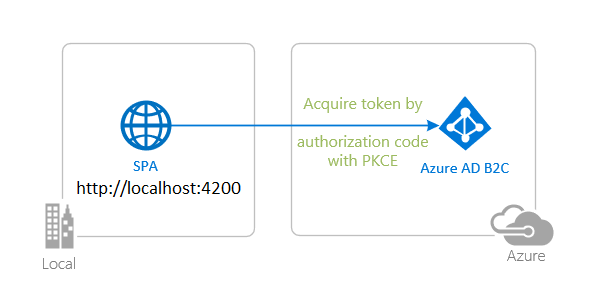
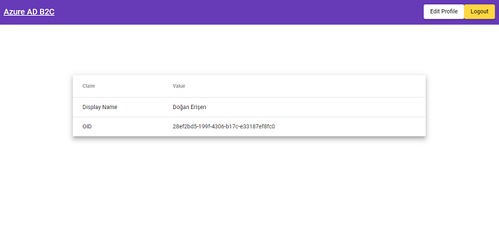

# Angular single-page application using MSAL Angular to sign-in users against Azure AD B2C

* [Overview](#overview)
* [Scenario](#scenario)
* [Contents](#contents)
* [Prerequisites](#prerequisites)
* [Setup the sample](#setup-the-sample)
* [Explore the sample](#explore-the-sample)
* [Troubleshooting](#troubleshooting)
* [About the code](#about-the-code)
* [Next Steps](#next-steps)
* [Contributing](#contributing)
* [Learn More](#learn-more)

## Overview

This sample demonstrates an Angular single-page application (SPA) that lets users sign-in with [Azure AD B2C](https://azure.microsoft.com/services/active-directory/external-identities/b2c/) using the [Microsoft Authentication Library for Angular](https://github.com/AzureAD/microsoft-authentication-library-for-js/tree/dev/lib/msal-angular) (MSAL Angular).

Here you'll learn about [ID Tokens](https://docs.microsoft.com/azure/active-directory-b2c/tokens-overview#token-types), [OIDC Scopes](https://docs.microsoft.com/azure/active-directory/develop/v2-permissions-and-consent#openid-connect-scopes), [external identity providers](https://docs.microsoft.com/azure/active-directory-b2c/technical-overview#external-identity-providers), [consumer social accounts](https://docs.microsoft.com/azure/active-directory-b2c/technical-overview#consumer-accounts), [single-sign on (SSO)](https://docs.microsoft.com/azure/active-directory-b2c/session-overview), **silent requests** and more.

> :information_source: See the community call: [Deep dive on using MSAL.js to integrate Angular single-page applications with Azure Active Directory](https://www.youtube.com/watch?v=EJey9KP1dZA)

## Scenario

1. The client Angular SPA uses **MSAL Angular** to obtain an ID Token from **Azure AD B2C**.
2. The **ID Token** proves that the user has successfully authenticated against **Azure AD B2C**.



## Contents

| File/folder                     | Description                                               |
|---------------------------------|-----------------------------------------------------------|
| `src/app/auth-config.ts`        | Authentication parameters reside here.                    |
| `src/app/app.module.ts`         | MSAL Angular configuration parameters reside here.        |
| `src/app/app-routing.module.ts` | Configure your MSAL Guard here.                           |

## Prerequisites

* [Node.js](https://nodejs.org/en/download/) must be installed to run this sample.
* [Visual Studio Code](https://code.visualstudio.com/download) is recommended for running and editing this sample.
* [VS Code Azure Tools](https://marketplace.visualstudio.com/items?itemName=ms-vscode.vscode-node-azure-pack) extension is recommended for interacting with Azure through VS Code Interface.
* A modern web browser. This sample uses **ES6** conventions and will not run on **Internet Explorer**.
* An **Azure AD B2C** tenant. For more information, see: [How to get an Azure AD B2C tenant](https://docs.microsoft.com/azure/active-directory-b2c/tutorial-create-tenant)
* A user account in your **Azure AD B2C** tenant.

## Setup the sample

### Step 1: Clone or download this repository

From your shell or command line:

```console
git clone https://github.com/Azure-Samples/ms-identity-javascript-angular-tutorial.git
```

or download and extract the repository *.zip* file.

> :warning: To avoid path length limitations on Windows, we recommend cloning into a directory near the root of your drive.

### Step 2: Install project dependencies

```console
    cd ms-identity-javascript-angular-tutorial
    cd 1-Authentication/2-sign-in-b2c/SPA
    npm install
```

### Step 3: Register the sample application in your tenant

:warning: This sample comes with a pre-registered application for demo purposes. If you would like to use your own **Azure AD B2C** tenant and application, follow the steps below to register and configure the application on **Azure portal**. Otherwise, continue with the steps for [Explore the sample](#explore-the-sample).

#### Choose the Azure AD B2C tenant where you want to create your applications

As a first step you'll need to:

1. Sign in to the [Azure portal](https://portal.azure.com).
1. If your account is present in more than one Azure AD B2C tenant, select your profile at the top right corner in the menu on top of the page, and then **switch directory** to change your portal session to the desired Azure AD B2C tenant.

#### Create User Flows and Custom Policies

Please refer to: [Tutorial: Create user flows in Azure Active Directory B2C](https://docs.microsoft.com/azure/active-directory-b2c/tutorial-create-user-flows)

#### Add External Identity Providers

Please refer to: [Tutorial: Add identity providers to your applications in Azure Active Directory B2C](https://docs.microsoft.com/azure/active-directory-b2c/tutorial-add-identity-providers)

#### Register the app (msal-angular-spa)

1. Navigate to the [Azure portal](https://portal.azure.com) and select the **Azure Active Directory B2C** service.
1. Select the **App Registrations** blade on the left, then select **New registration**.
1. In the **Register an application page** that appears, enter your application's registration information:
    1. In the **Name** section, enter a meaningful application name that will be displayed to users of the app, for example `msal-angular-spa`.
    1. Under **Supported account types**, select **Accounts in any identity provider or organizational directory (for authenticating users with user flows)**
    1. Select **Register** to create the application.
1. In the **Overview** blade, find and note the **Application (client) ID**. You use this value in your app's configuration file(s) later in your code.
1. In the app's registration screen, select the **Authentication** blade to the left.
1. If you don't have a platform added, select **Add a platform** and select the **Single-page application** option.
    1. In the **Redirect URI** section enter the following redirect URIs:
        1. `http://localhost:4200`
        1. `http://localhost:4200/auth`
    1. Click **Save** to save your changes.

##### Configure the app (msal-angular-spa) to use your app registration

Open the project in your IDE (like Visual Studio or Visual Studio Code) to configure the code.

> In the steps below, "ClientID" is the same as "Application ID" or "AppId".

1. Open the `SPA\src\app\auth-config.ts` file.
1. Find the key `clientId` and replace the existing value with the application ID (clientId) of `msal-react-spa` app copied from the Azure portal.

To setup your B2C user-flows, do the following:

1. Find the key `b2cPolicies.names` and populate it with your policy names e.g. `signUpSignIn`.
1. Find the key `b2cPolicies.authorities` and populate it with your policy authority strings e.g. `https://<your-tenant-name>.b2clogin.com/<your-tenant-name>.onmicrosoft.com/b2c_1_susi`.
1. Find the key `b2cPolicies.authorityDomain` and populate it with the domain portion of your authority string e.g. `<your-tenant-name>.b2clogin.com`.

### Step 4: Running the sample

From your shell or command line, execute the following commands:

```console
    cd 1-Authentication/2-sign-in-b2c/SPA
    npm start
```

## Explore the sample

1. Open your browser and navigate to `http://localhost:4200`.
1. Select the **Sign-in** button on the top right corner. Once you sign-in, you will see some of the important claims in your ID token.



> :information_source: Did the sample not work for you as expected? Then please reach out to us using the [GitHub Issues](../../../../issues) page.

> :information_source: if you believe your issue is with the B2C service itself rather than with the sample, please file a support ticket with the B2C team by following the instructions [here](https://docs.microsoft.com/azure/active-directory-b2c/support-options).

## We'd love your feedback!

Were we successful in addressing your learning objective? Consider taking a moment to [share your experience with us](https://forms.office.com/Pages/ResponsePage.aspx?id=v4j5cvGGr0GRqy180BHbR73pcsbpbxNJuZCMKN0lURpUOU5PNlM4MzRRV0lETkk2ODBPT0NBTEY5MCQlQCN0PWcu).

## Troubleshooting

<details>
	<summary>Expand for troubleshooting info</summary>

Use [Stack Overflow](http://stackoverflow.com/questions/tagged/msal) to get support from the community.
Ask your questions on Stack Overflow first and browse existing issues to see if someone has asked your question before.
Make sure that your questions or comments are tagged with [`azure-active-directory` `azure-ad-b2c` `ms-identity` `adal` `msal`].

If you find a bug in the sample, raise the issue on [GitHub Issues](../../../../issues).

To provide feedback on or suggest features for Azure Active Directory, visit [User Voice page](https://feedback.azure.com/d365community/forum/79b1327d-d925-ec11-b6e6-000d3a4f06a4).
</details>

## About the code

MSAL Angular is a wrapper around MSAL.js (i.e. *msal-browser*). As such, many of MSAL.js's public APIs are also available to use with MSAL Angular, while MSAL Angular itself offers additional [public APIs](https://github.com/AzureAD/microsoft-authentication-library-for-js/blob/dev/lib/msal-angular/docs/v2-docs/public-apis.md).

### Configuration

You can initialize your application in several ways, for instance, by loading the configuration parameters from another server. See [configuration options](https://github.com/AzureAD/microsoft-authentication-library-for-js/blob/dev/lib/msal-angular/docs/v2-docs/configuration.md) for more information.

In the sample, authentication parameters reside in [auth-config.ts](./SPA/src/app/auth-config.ts). These parameters are used for initializing MSAL Angular configuration options in [app.module.ts](./SPA/src/app/app.module.ts).

### Sign-in

**MSAL Angular** exposes 3 login APIs: `loginPopup()`, `loginRedirect()` and `ssoSilent()`. First, setup your default interaction type in [app.module.ts](./SPA/src/app/app.module.ts):

```typescript
export function MSALGuardConfigFactory(): MsalGuardConfiguration {
    return { 
        interactionType: InteractionType.Redirect,
    };
}
```

Then, define a login method in [app.component.ts](./SPA/src/app/app.component.ts) as follows:

```typescript
export class AppComponent implements OnInit {

constructor(
    @Inject(MSAL_GUARD_CONFIG) private msalGuardConfig: MsalGuardConfiguration,
    private authService: MsalService,
    private msalBroadcastService: MsalBroadcastService
) {}

ngOnInit(): void {

    login() {
    if (this.msalGuardConfig.interactionType === InteractionType.Popup) {
            if (this.msalGuardConfig.authRequest) {
            this.authService.loginPopup({...this.msalGuardConfig.authRequest} as PopupRequest)
                .subscribe((response: AuthenticationResult) => {
                    this.authService.instance.setActiveAccount(response.account);
                });
        } else {
            this.authService.loginPopup()
                .subscribe((response: AuthenticationResult) => {
                    this.authService.instance.setActiveAccount(response.account);
                });
        }
    } else {
        if (this.msalGuardConfig.authRequest) {
            this.authService.loginRedirect({...this.msalGuardConfig.authRequest} as RedirectRequest);
        } else {
            this.authService.loginRedirect();
        }
    }
    }
}
```

If you already have a session that exists with the authentication server, you can use the `ssoSilent()` API to make a request for tokens without interaction. You will need to pass a [loginHint](https://docs.microsoft.com/azure/active-directory/develop/msal-js-sso#automatically-select-account-on-azure-ad) in the request object in order to successfully obtain a token silently.

```typescript
export class AppComponent implements OnInit {

constructor(
private authService: MsalService,
) {}

ngOnInit(): void {
    const silentRequest: SsoSilentRequest = {
        scopes: ["User.Read"],
        loginHint: "user@contoso.com"
    }

    this.authService.ssoSilent(silentRequest)
        .subscribe({
            next: (result: AuthenticationResult) => {
                console.log("SsoSilent succeeded!");
            }, 
            error: (error) => {
                this.authService.loginRedirect();
            }
        });
   }
}
```

### Sign-out

The application redirects the user to the **Microsoft identity platform** logout endpoint to sign out. This endpoint clears the user's session from the browser. If your app did not go to the logout endpoint, the user may re-authenticate to your app without entering their credentials again, because they would have a valid single sign-in session with the **Microsoft identity platform** endpoint. See for more: [Send a sign-out request](https://docs.microsoft.com/azure/active-directory/develop/v2-protocols-oidc#send-a-sign-out-request).

The sign-out clears the user's single sign-on session with **Azure AD B2C**, but it might not sign the user out of their **social identity provider** session. If the user selects the same identity provider during a subsequent sign-in, they might re-authenticate without entering their credentials. Here the assumption is that, if a user wants to sign out of the application, it doesn't necessarily mean they want to sign out of their social account (e.g. Facebook) itself.

### ID Token Validation

When you receive an [ID token](https://learn.microsoft.com/azure/active-directory-b2c/tokens-overview) directly from the IdP on a secure channel (e.g. HTTPS), such is the case with SPAs, there’s no need to validate it. If you were to do it, you would validate it by asking the same server that gave you the ID token to give you the keys needed to validate it, which renders it pointless, as if one is compromised so is the other.

### Securing Routes

You can add authentication to secure specific routes in your application by just adding `canActivate: [MsalGuard]` to your route definition. It can be added at the parent or child routes. This ensures that the user must be signed-in to access the secured route. See [app-routing.module.ts](./SPA/src/app/app-routing.module.ts) for more.

```typescript
const routes: Routes = [
    {
        path: 'guarded',
        component: GuardedComponent,
        canActivate: [ 
            MsalGuard 
        ]
    }
]
```

### Events API

Using the event API, you can register an event callback that will do something when an event is emitted. When registering an event callback in an Angular component you will need to make sure you do 2 things.

1. The callback is registered only once
2. The callback is unregistered before the component unmounts.

```typescript
export class HomeComponent implements OnInit {

    private readonly _destroying$ = new Subject<void>();
    
    constructor(private authService: MsalService, private msalBroadcastService: MsalBroadcastService) { }

    ngOnInit(): void {
        this.msalBroadcastService.msalSubject$
            .pipe(
            filter((msg: EventMessage) => msg.eventType === EventType.LOGIN_SUCCESS),
            takeUntil(this._destroying$)
            )
            .subscribe((result: EventMessage) => {
            // do something with the result, such as accessing ID token
            });
    }

    ngOnDestroy(): void {
        this._destroying$.next(undefined);
        this._destroying$.complete();
    }
}
```

For more information, see: [Events in MSAL Angular v2](https://github.com/AzureAD/microsoft-authentication-library-for-js/blob/dev/lib/msal-angular/docs/v2-docs/events.md).

### Integrating user-flows

* **Sign-up/sign-in**

This user-flow allows your users to sign-in to your application if the user has an account already, or sign-up for an account if not. This is the default user-flow that we pass during the initialization of MSAL instance.

* **Edit Profile**

This user-flow allows your users to update their profile information. When a user selects the **Edit Profile** button on the navigation bar, we simply initiate a sign-in flow against the edit profile user-flow authority:

```typescript
// in app.component.ts

editProfile() {
    let editProfileFlowRequest = {
        scopes: ["openid"],
        authority: b2cPolicies.authorities.editProfile.authority,
    };
    
    this.login(editProfileFlowRequest);
}
```

* **Password Reset**

Password reset user-flow allows your users to change their password in case they forgot it or etc. When a user selects the **forgot my password** link on Azure AD B2C sing-in page, the B2C service will throw an error to the application, of which the application must catch and handle it by initiating a login against the password-reset user-flow authority.

```typescript
// in app.component.ts

this.msalBroadcastService.msalSubject$
    .pipe(
        filter((msg: EventMessage) => msg.eventType === EventType.LOGIN_FAILURE || msg.eventType === EventType.ACQUIRE_TOKEN_FAILURE),
        takeUntil(this._destroying$)
    )
    .subscribe((result: EventMessage) => {
        // Checking for the forgot password error. Learn more about B2C error codes at
        // https://learn.microsoft.com/azure/active-directory-b2c/error-codes
        if (result.error && result.error.message.indexOf('AADB2C90118') > -1) {
            let resetPasswordFlowRequest: RedirectRequest | PopupRequest = {
                authority: b2cPolicies.authorities.resetPassword.authority,
                scopes: [],
            };

            this.login(resetPasswordFlowRequest);
        };
    });
```

## Next Steps

Learn how to:

* [Protect and call a web API](../../../3-Authorization-II/2-call-api-b2c/README.md).
* [Deploy your apps to Azure](../../../4-Deployment/README.md)

## Contributing

If you'd like to contribute to this sample, see [CONTRIBUTING.MD](/CONTRIBUTING.md).

This project has adopted the [Microsoft Open Source Code of Conduct](https://opensource.microsoft.com/codeofconduct/). For more information, see the [Code of Conduct FAQ](https://opensource.microsoft.com/codeofconduct/faq/) or contact [opencode@microsoft.com](mailto:opencode@microsoft.com) with any additional questions or comments.

## Learn More

* [What is Azure Active Directory B2C?](https://docs.microsoft.com/azure/active-directory-b2c/overview)
* [Application types that can be used in Active Directory B2C](https://docs.microsoft.com/azure/active-directory-b2c/application-types)
* [Recommendations and best practices for Azure Active Directory B2C](https://docs.microsoft.com/azure/active-directory-b2c/best-practices)
* [Azure AD B2C session](https://docs.microsoft.com/azure/active-directory-b2c/session-overview)
* [Building Zero Trust ready apps](https://aka.ms/ztdevsession)
* [Initialize client applications using MSAL.js](https://docs.microsoft.com/azure/active-directory/develop/msal-js-initializing-client-applications)
* [Single sign-on with MSAL.js](https://docs.microsoft.com/azure/active-directory/develop/msal-js-sso)
* [Handle MSAL.js exceptions and errors](https://docs.microsoft.com/azure/active-directory/develop/msal-handling-exceptions?tabs=javascript)
* [Logging in MSAL.js applications](https://docs.microsoft.com/azure/active-directory/develop/msal-logging?tabs=javascript)
* [Pass custom state in authentication requests using MSAL.js](https://docs.microsoft.com/azure/active-directory/develop/msal-js-pass-custom-state-authentication-request)
* [Prompt behavior in MSAL.js interactive requests](https://docs.microsoft.com/azure/active-directory/develop/msal-js-prompt-behavior)
* [Use MSAL.js to work with Azure AD B2C](https://docs.microsoft.com/azure/active-directory/develop/msal-b2c-overview)
