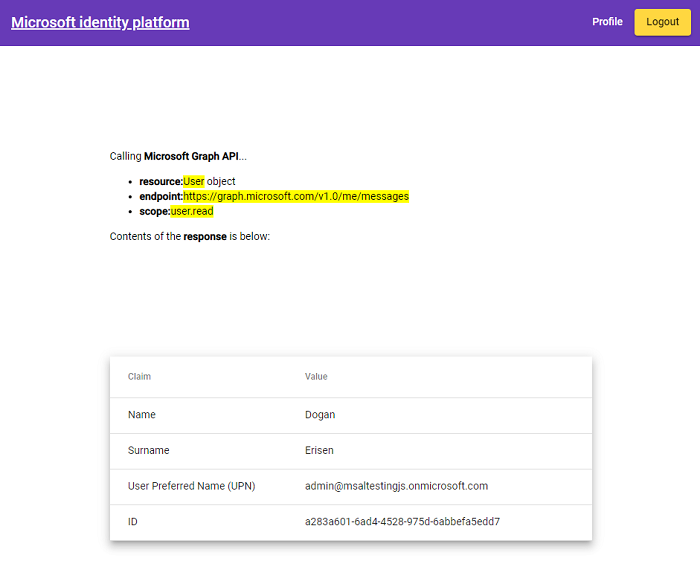

# Angular single-page application using MSAL Angular to sign-in users with Azure AD and call the Microsoft Graph API

* [Overview](#overview)
* [Scenario](#scenario)
* [Contents](#contents)
* [Prerequisites](#prerequisites)
* [Setup the sample](#setup-the-sample)
* [Explore the sample](#explore-the-sample)
* [Troubleshooting](#troubleshooting)
* [About the code](#about-the-code)
* [Next Steps](#next-steps)
* [Contributing](#contributing)
* [Learn More](#learn-more)

## Overview

This sample demonstrates an Angular single-page application (SPA) that lets users sign-in with Azure Active Directory (Azure AD) using the [Microsoft Authentication Library for Angular](https://github.com/AzureAD/microsoft-authentication-library-for-js/tree/dev/lib/msal-angular) (MSAL Angular). In addition, this sample also demonstrates how to use [Microsoft Graph JavaScript SDK](https://github.com/microsoftgraph/msgraph-sdk-javascript) client with MSAL as a custom authentication provider to call the Graph API on behalf of a user.

> :information_source: Note that you are not required to implement a custom provider, as the v3.0 of the SDK offers a [default provider](https://github.com/microsoftgraph/msgraph-sdk-javascript/blob/dev/docs/AuthCodeMSALBrowserAuthenticationProvider.md) that implements MSAL.js.

Here you'll learn about [Access Tokens](https://aka.ms/access-tokens), [acquiring a token](https://docs.microsoft.com/azure/active-directory/develop/scenario-spa-acquire-token), [calling a protected web API](https://docs.microsoft.com/azure/active-directory/develop/scenario-spa-call-api), as well as [Dynamic Scopes and Incremental Consent](https://docs.microsoft.com/azure/active-directory/develop/v2-permissions-and-consent), **silent token acquisition**, **working with multiple resources** and more.

> :information_source: See the community call: [An introduction to Microsoft Graph for developers](https://www.youtube.com/watch?v=EBbnpFdB92A)

> :information_source: See the community call: [Deep dive on using MSAL.js to integrate Angular single-page applications with Azure Active Directory](https://www.youtube.com/watch?v=EJey9KP1dZA)

## Scenario

1. The client Angular SPA uses the Microsoft Authentication Library (MSAL) to sign-in a user with **Azure AD** and obtain a JWT access token for Ms Graph API.
1. The access token is used as a *bearer* token to authorize the user to call the Microsoft Graph Api.


## Contents

| File/folder                                               | Description                                                           |
|-----------------------------------------------------------|-----------------------------------------------------------------------|
| `src/app/auth-config.ts`                                  | Authentication configuration parameters reside here.                  |
| `src/app/app.module.ts`                                   | MSAL-Angular configuration parameters reside here.                    |
| `src/app/app-routing.module.ts`                           | Configure your MSAL-Guard here.                                       |
| `src/app/graph.service.ts`                                | Class to call graph API.                                              |
| `src/app/account-switch/account-switch.component.ts`      | Contains logic to handle multiple account selection with MSAL.js.     |


## Prerequisites

* [Node.js](https://nodejs.org/en/download/) must be installed to run this sample.
* [Visual Studio Code](https://code.visualstudio.com/download) is recommended for running and editing this sample.
* [VS Code Azure Tools](https://marketplace.visualstudio.com/items?itemName=ms-vscode.vscode-node-azure-pack) extension is recommended for interacting with Azure through VS Code Interface.
* A modern web browser. This sample uses **ES6** conventions and will not run on **Internet Explorer**.
* [Angular-CLI](https://cli.angular.io/) must be installed **globally** to run this sample.
* An **Azure AD** tenant. For more information, see: [How to get an Azure AD tenant](https://docs.microsoft.com/azure/active-directory/develop/test-setup-environment#get-a-test-tenant)
* A user account in your **Azure AD** tenant. This sample will not work with a **personal Microsoft account**. If you're signed in to the [Azure portal](https://portal.azure.com) with a personal Microsoft account and have not created a user account in your directory before, you will need to create one before proceeding.

## Setup the sample

### Step 1: Clone or download this repository

From your shell or command line:

```console
    git clone https://github.com/Azure-Samples/ms-identity-javascript-angular-tutorial.git
```

or download and extract the repository *.zip* file.

> :warning: To avoid path length limitations on Windows, we recommend cloning into a directory near the root of your drive.

### Step 2: Install project dependencies

```console
    cd ms-identity-javascript-angular-tutorial
    cd 2-Authorization-I/1-call-graph/SPA
    npm install
```

### Step 3: Register the sample application(s) in your tenant

There is one project in this sample. To register it, you can:

* follow the steps below for manually register your apps
* or use PowerShell scripts that:
  * **automatically** creates the Azure AD applications and related objects (passwords, permissions, dependencies) for you.
  * modify the projects' configuration files.

  <details>
   <summary>Expand this section if you want to use this automation:</summary>

    > :warning: If you have never used **Microsoft Graph PowerShell** before, we recommend you go through the [App Creation Scripts Guide](./AppCreationScripts/AppCreationScripts.md) once to ensure that your environment is prepared correctly for this step.
  
    1. On Windows, run PowerShell as **Administrator** and navigate to the root of the cloned directory
    1. In PowerShell run:

       ```PowerShell
       Set-ExecutionPolicy -ExecutionPolicy RemoteSigned -Scope Process -Force
       ```

    1. Run the script to create your Azure AD application and configure the code of the sample application accordingly.
    1. For interactive process -in PowerShell, run:

       ```PowerShell
       cd .\AppCreationScripts\
       .\Configure.ps1 -TenantId "[Optional] - your tenant id" -AzureEnvironmentName "[Optional] - Azure environment, defaults to 'Global'"
       ```

    > Other ways of running the scripts are described in [App Creation Scripts guide](./AppCreationScripts/AppCreationScripts.md). The scripts also provide a guide to automated application registration, configuration and removal which can help in your CI/CD scenarios.

  </details>

#### Choose the Azure AD tenant where you want to create your applications

To manually register the apps, as a first step you'll need to:

1. Sign in to the [Azure portal](https://portal.azure.com).
1. If your account is present in more than one Azure AD tenant, select your profile at the top right corner in the menu on top of the page, and then **switch directory** to change your portal session to the desired Azure AD tenant.

#### Register the spa app (msal-angular-spa)

1. Navigate to the [Azure portal](https://portal.azure.com) and select the **Azure Active Directory** service.
1. Select the **App Registrations** blade on the left, then select **New registration**.
1. In the **Register an application page** that appears, enter your application's registration information:
    1. In the **Name** section, enter a meaningful application name that will be displayed to users of the app, for example `msal-angular-spa`.
    1. Under **Supported account types**, select **Accounts in this organizational directory only**
    1. Select **Register** to create the application.
1. In the **Overview** blade, find and note the **Application (client) ID**. You use this value in your app's configuration file(s) later in your code.
1. In the app's registration screen, select the **Authentication** blade to the left.
1. If you don't have a platform added, select **Add a platform** and select the **Single-page application** option.
    1. In the **Redirect URI** section enter the following redirect URIs:
        1. `http://localhost:4200/`
        1. `http://localhost:4200/auth`
    1. Click **Save** to save your changes.
1. Since this app signs-in users, we will now proceed to select **delegated permissions**, which is is required by apps signing-in users.
   1. In the app's registration screen, select the **API permissions** blade in the left to open the page where we add access to the APIs that your application needs:
   1. Select the **Add a permission** button and then,
   1. Ensure that the **Microsoft APIs** tab is selected.
   1. In the *Commonly used Microsoft APIs* section, select **Microsoft Graph**
      * Since this app signs-in users, we will now proceed to select **delegated permissions**, which is is requested by apps when signing-in users.
           1. In the **Delegated permissions** section, select the **User.Read**, **Contacts.Read** in the list. Use the search box if necessary.
   1. Select the **Add permissions** button at the bottom.

##### Configure Optional Claims

1. Still on the same app registration, select the **Token configuration** blade to the left.
1. Select **Add optional claim**:
    1. Select **optional claim type**, then choose **ID**.
    1. Select the optional claim **acct**. This claim provides user's account status in tenant. If the user is a member of the tenant, the value is 0. If they're a guest, the value is 1.
    1. Select **Add** to save your changes.

##### Configure the spa app (msal-angular-spa) to use your app registration

Open the project in your IDE (like Visual Studio or Visual Studio Code) to configure the code.

> In the steps below, "ClientID" is the same as "Application ID" or "AppId".

1. Open the `SPA\src\app\auth-config.ts` file.
1. Find the key `Enter_the_Application_Id_Here` and replace the existing value with the application ID (clientId) of `msal-angular-spa` app copied from the Azure portal.
1. Find the key `Enter_the_Tenant_Info_Here` and replace the existing value with your Azure AD tenant/directory ID.

### Step 4: Running the sample

From your shell or command line, execute the following commands:

```console
    cd 2-Authorization-I/1-call-graph/SPA
    npm start
```

## Explore the sample

1. Open your browser and navigate to `http://localhost:4200`.
1. Click the **sign-in** button on the top right corner.
1. Once you authenticate, click the **Profile** button on the navigation bar.This will make a call to the Graph API
1. click the **Contacts** button on the navigation bar. This will make a call to the Graph API.(:warning: the user needs to have an Office subscription for this call to work).



> :information_source: Did the sample not work for you as expected? Then please reach out to us using the [GitHub Issues](../../../../issues) page.

## We'd love your feedback

Were we successful in addressing your learning objective? Consider taking a moment to [share your experience with us](https://forms.office.com/Pages/ResponsePage.aspx?id=v4j5cvGGr0GRqy180BHbR73pcsbpbxNJuZCMKN0lURpUOU5PNlM4MzRRV0lETkk2ODBPT0NBTEY5MCQlQCN0PWcu).

## Troubleshooting

<details>
 <summary>Expand for troubleshooting info</summary>

> * Use [Stack Overflow](http://stackoverflow.com/questions/tagged/msal) to get support from the community.
Ask your questions on Stack Overflow first and browse existing issues to see if someone has asked your question before.
Make sure that your questions or comments are tagged with [`azure-active-directory` `angular` `ms-identity` `adal` `msal`].

If you find a bug in the sample, raise the issue on [GitHub Issues](../../../../issues).
</details>

## About the code

### Protected resources and scopes

In order to access a protected resource (a web APis ike MS Graph usually) on behalf of a signed-in user, the app needs to present a valid **Access Token** to that resource owner (in this case, Microsoft Graph). **Access Token** requests to Azure AD in **MSAL** are meant to be *per-resource-per-scope(s)*. This means that an **Access Token** requested for resource **A** with scope `User.Read`:

* cannot be used for accessing resource **A** API that expects a different scope, like  `files.Read`, and,
* cannot be used for accessing resources in any other API, like **B** with any scope.

The intended recipient of an **Access Token** is represented by the `aud` claim (in this case, it should be the Microsoft Graph API's App ID); in case the value for the `aud` claim does not mach the resource **APP ID URI**, the token will be considered invalid. Likewise, the permissions that an **Access Token** grants is represented by the `scp` claim (Delegated Permissions) and `roles` claim (App permissions). See [Access Token claims](https://docs.microsoft.com/azure/active-directory/develop/access-tokens#payload-claims) for more information.

MSAL Angular provides the `MsalInterceptor` for obtaining Access tokens for resources (MS Graph) and adding them to HTTP requests as *authorization* header. The `protectedResourceMap` is part of the `MsalInterceptorConfiguration` object, initialized in [app.module.ts](./SPA/src/app/app.module.ts).

```typescript
export function MSALInterceptorConfigFactory(): MsalInterceptorConfiguration {
    const protectedResourceMap = new Map<string, Array<string>>();

    protectedResourceMap.set("https://graph.microsoft.com/v1.0/me", ["User.Read"]);

    return {
      interactionType: InteractionType.Redirect,
      protectedResourceMap
    };
}
```

See for more: [FAQ: Using the protectedResourceMap](https://github.com/AzureAD/microsoft-authentication-library-for-js/blob/dev/lib/msal-angular/docs/FAQ.md#how-do-i-add-tokens-to-api-calls)

### Acquire a Token

Setting `protectedResourceMap` at app initialization takes care of acquiring tokens and attaching them to HTTP requests. Simply call your API using a HTTP client and MSAL Angular will handle attaching tokens to your call.

```typescript
export class ProfileComponent implements OnInit {
    profile!: ProfileType;
    
    constructor(
      private http: HttpClient
    ) { }

    ngOnInit() {
        this.getProfile();
    }

    getProfile() {
        this.http.get("https://graph.microsoft.com/v1.0/me")
          .subscribe((profile: ProfileType) => {
                console.log(profile);
          });
    }
}
```

Alternatively, you can also explicitly acquire Access tokens using the *acquireToken* APIs. **MSAL.js** exposes 3 APIs for acquiring a token: `acquireTokenPopup()`, `acquireTokenRedirect()` and `acquireTokenSilent()`. For more information about *acquireToken* APIs please check the following [Acquiring and Using an Access Token](https://github.com/AzureAD/microsoft-authentication-library-for-js/blob/dev/lib/msal-browser/docs/acquire-token.md)

> :information_source: When using `acquireTokenRedirect`, you may want to set `navigateToLoginRequestUrl` in [msalConfig](./SPA/src/authConfig.js) to **true** if you wish to return back to the page where *acquireTokenRedirect* was called.

### Working with multiple resources

When you have to access multiple resources, initiate a separate token request for each:

 ```javascript
     // "User.Read" stands as shorthand for "graph.microsoft.com/User.Read"
     const graphToken = await msalInstance.acquireTokenSilent({
          scopes: [ "User.Read" ]
     });
     const customApiToken = await msalInstance.acquireTokenSilent({
          scopes: [ "api://<myCustomApiClientId>/My.Scope" ]
     });
 ```

Bear in mind that you *can* request multiple scopes for the same resource (e.g. `User.Read`, `User.Write` and `Calendar.Read` for **MS Graph API**).

 ```javascript
     const graphToken = await msalInstance.acquireTokenSilent({
          scopes: [ "User.Read", "User.Write", "Calendar.Read"] // all MS Graph API scopes
     });
 ```

For more information, see: [Resources and Scopes](https://github.com/AzureAD/microsoft-authentication-library-for-js/blob/dev/lib/msal-browser/docs/resources-and-scopes.md)

### Handle Continuous Access Evaluation (CAE) challenge from Microsoft Graph

Continuous access evaluation (CAE) enables applications to do just-in time token validation, for instance enforcing user session revocation in the case of password change/reset but there are other benefits. For details, see [Continuous access evaluation](https://docs.microsoft.com/azure/active-directory/conditional-access/concept-continuous-access-evaluation).

Microsoft Graph is now CAE-enabled. This means that it can ask its client apps for more claims when conditional access policies require it. Your can enable your application to be ready to consume CAE-enabled APIs by:

1. Declaring that the client app is capable of handling [claims challenges](https://aka.ms/claimschallenge).
2. Processing the claim challenge when they are thrown by MS Graph Api.

#### Declare the CAE capability in the configuration

This sample app declares that it's CAE-capable by adding the `clientCapabilities` property in the configuration in `auth-config.ts`:

```javascript
    const msalConfig = {
        auth: {
            clientId: 'Enter_the_Application_Id_Here', 
            authority: 'https://login.microsoftonline.com/Enter_the_Tenant_Info_Here',
            redirectUri: "/", 
            postLogoutRedirectUri: "/",
            navigateToLoginRequestUrl: true, 
            clientCapabilities: ["CP1"] // this lets the resource owner (MS Graph) know that this client is capable of handling claims challenge.
        }
    }

    const msalInstance = new PublicClientApplication(msalConfig);
```

#### Processing the CAE challenge from Microsoft Graph

Once the client app receives the CAE claims challenge from Microsoft Graph, it needs to proces the challenge and redirect the user back to Azure AD for further processing. To do so, we use MSAL's `acquireToken` API and provide the claims challenge as a parameter in the token request. This is shown in [graph.service.ts](../SPA/src/app/graph.service.ts), where we handle the response from the Microsoft Graph API with the `handleClaimsChallenge` method:

```typescript
  handleClaimsChallenge(response: any, providerOptions: ProviderOptions): void {
      const authenticateHeader: string = response.headers.get('www-authenticate');
      const claimsChallengeMap: any = this.parseChallenges(authenticateHeader);
      let account: AccountInfo = this.authService.instance.getActiveAccount()!;
      addClaimsToStorage(
        claimsChallengeMap.claims,
        `cc.${msalConfig.auth.clientId}.${account?.idTokenClaims?.oid}.${
          new URL(providerOptions.endpoint).hostname
        }`
      );
      
      new MsalAuthenticationProvider(providerOptions, this.authService).getAccessToken()
  }

  parseChallenges<T>(header: string): T {
      const schemeSeparator = header.indexOf(' ');
      const challenges = header.substring(schemeSeparator + 1).split(',');
      const challengeMap = {} as any;

      challenges.forEach((challenge: string) => {
        const [key, value] = challenge.split('=');
        challengeMap[key.trim()] = window.decodeURI(value.replace(/['"]+/g, ''));
      });

      return challengeMap;
  }
```

After that, we require a new access token via the `MsalAuthenticationProvider` Class, fetch the claims challenge from the browser's localStorage, and pass it to the `acquireToken` API in the request parameter. This is shown in [graph.service.ts](../SPA/src/app/graph.service.ts)

### Access Token validation

Clients should treat access tokens as opaque strings, as the contents of the token are intended for the **resource only** (such as a web API or Microsoft Graph). For validation and debugging purposes, developers can decode **JWT**s (*JSON Web Tokens*) using a site like [jwt.ms](https://jwt.ms).

### Calling the Microsoft Graph API

[Microsoft Graph JavaScript SDK](https://github.com/microsoftgraph/msgraph-sdk-javascript) provides various utility methods to query the Graph API. While the SDK has a default *authentication provider* that can be used in basic scenarios, it can also be extended to use with a custom authentication provider such as the MSAL SDK. To do so, we will initialize the Graph SDK client with [clientOptions](https://github.com/microsoftgraph/msgraph-sdk-javascript/blob/dev/docs/CreatingClientInstance.md) method, which contains an `authProvider` object of class **MyAuthenticationProvider** that handles the token acquisition process for the client. We offer this as a service to other components as shown below:

```typescript
export class GraphService {
    constructor(private authService: MsalService) { }

    getGraphClient = (providerOptions: ProviderOptions) => {
        let clientOptions = {
          authProvider: new MyAuthenticationProvider(providerOptions, this.authService),
        };
        const graphClient = Client.initWithMiddleware(clientOptions);
        return graphClient;
    }
}
```

**MyAuthenticationProvider** class needs to implement the [IAuthenticationProvider](https://github.com/microsoftgraph/msgraph-sdk-javascript/blob/dev/src/IAuthenticationProvider.ts) interface, which can be done as shown in [graph.service.ts](./SPA/src/app/graph.service.ts). The Graph client then can be used in your components as shown below:

```typescript
getProfile(providerOptions: ProviderOptions) {
    this.graphService
        .getGraphClient(providerOptions)
        .api('/me')
        .responseType(ResponseType.RAW)
        .get()
        .then((response: any) => {
          if (response.status === 200) return response.json();
          if (response.status === 401) {
            if (response.headers.get('www-authenticate')) {
              this.graphService.handleClaimsChallenge(response, providerOptions);
            }
          }
        })
        .then((profileResponse: Profile) => {
          // do something with response
        })
        .catch((error: any) => {
          // do something with response
        });
}
```

## Next Steps

Learn how to:

* [Use MSAL Angular to sign-in users with Azure Active Directory and call a .NET Core web API](https://github.com/Azure-Samples/ms-identity-javascript-angular-tutorial/blob/main/3-Authorization-II/1-call-api/README.md)
* [Use MSAL Angular TO authenticate users with Azure AD B2C and calls a protected .NET Core web API](https://github.com/Azure-Samples/ms-identity-javascript-angular-tutorial/blob/main/3-Authorization-II/2-call-api-b2c/README.md)

## Contributing

If you'd like to contribute to this sample, see [CONTRIBUTING.MD](/CONTRIBUTING.md).

This project has adopted the [Microsoft Open Source Code of Conduct](https://opensource.microsoft.com/codeofconduct/). For more information, see the [Code of Conduct FAQ](https://opensource.microsoft.com/codeofconduct/faq/) or contact [opencode@microsoft.com](mailto:opencode@microsoft.com) with any additional questions or comments.

## Learn More

* [Microsoft identity platform (Azure Active Directory for developers)](https://docs.microsoft.com/azure/active-directory/develop/)
* [Overview of Microsoft Authentication Library (MSAL)](https://docs.microsoft.com/azure/active-directory/develop/msal-overview)
* [Register an application with the Microsoft identity platform](https://docs.microsoft.com/azure/active-directory/develop/quickstart-register-app)
* [Configure a client application to access web APIs](https://docs.microsoft.com/azure/active-directory/develop/quickstart-configure-app-access-web-apis)
* [Understanding Azure AD application consent experiences](https://docs.microsoft.com/azure/active-directory/develop/application-consent-experience)
* [Understand user and admin consent](https://docs.microsoft.com/azure/active-directory/develop/howto-convert-app-to-be-multi-tenant#understand-user-and-admin-consent)
* [Application and service principal objects in Azure Active Directory](https://docs.microsoft.com/azure/active-directory/develop/app-objects-and-service-principals)
* [Authentication Scenarios for Azure AD](https://docs.microsoft.com/azure/active-directory/develop/authentication-flows-app-scenarios)
* [Building Zero Trust ready apps](https://aka.ms/ztdevsession)
* [National Clouds](https://docs.microsoft.com/azure/active-directory/develop/authentication-national-cloud#app-registration-endpoints)
* [Azure AD code samples](https://docs.microsoft.com/azure/active-directory/develop/sample-v2-code)
* [Initialize client applications using MSAL.js](https://docs.microsoft.com/azure/active-directory/develop/msal-js-initializing-client-applications)
* [Single sign-on with MSAL.js](https://docs.microsoft.com/azure/active-directory/develop/msal-js-sso)
* [Handle MSAL.js exceptions and errors](https://docs.microsoft.com/azure/active-directory/develop/msal-handling-exceptions?tabs=javascript)
* [Logging in MSAL.js applications](https://docs.microsoft.com/azure/active-directory/develop/msal-logging?tabs=javascript)
* [Pass custom state in authentication requests using MSAL.js](https://docs.microsoft.com/azure/active-directory/develop/msal-js-pass-custom-state-authentication-request)
* [Prompt behavior in MSAL.js interactive requests](https://docs.microsoft.com/azure/active-directory/develop/msal-js-prompt-behavior)
* [Use MSAL.js to work with Azure AD B2C](https://docs.microsoft.com/azure/active-directory/develop/msal-b2c-overview)