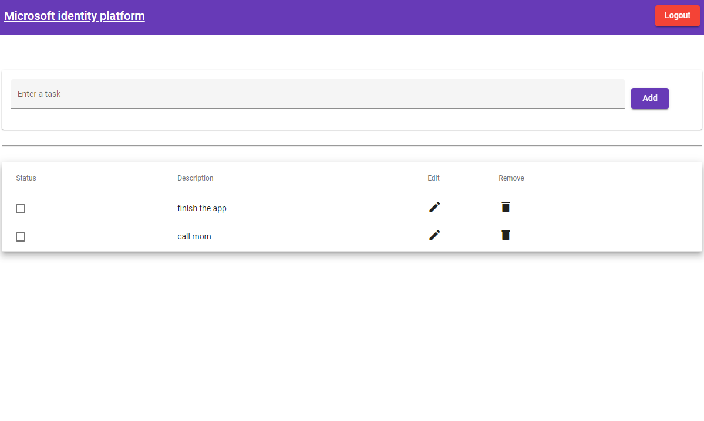

# Angular single-page application using MSAL Angular to sign-in users with Azure Active Directory and call a .NET Core web API

* [Overview](#overview)
* [Scenario](#scenario)
* [Contents](#contents)
* [Prerequisites](#prerequisites)
* [Setup the sample](#setup-the-sample)
* [Explore the sample](#explore-the-sample)
* [Troubleshooting](#troubleshooting)
* [About the code](#about-the-code)
* [Contributing](#contributing)
* [Learn More](#learn-more)

## Overview

This sample demonstrates an Angular single-page application (SPA) to sign-in users and call a ASP.NET Core web API secured with [Azure Active Directory](https://aka.ms/identityplatform) (Azure AD) using the [Microsoft Authentication Library for Angular](https://github.com/AzureAD/microsoft-authentication-library-for-js/tree/dev/lib/msal-angular) (MSAL Angular) for the SPA and the [Microsoft.Identity.Web](https://github.com/AzureAD/microsoft-identity-web) (MIW) for the web API.

> :information_source: See the community call: [Implement authorization in your applications with the Microsoft identity platform](https://www.youtube.com/watch?v=LRoc-na27l0)

## Scenario

1. The client Angular SPA uses **MSAL Angular** to sign-in and obtain a JWT [access token](https://aka.ms/access-tokens) from **Azure AD**.
2. The access token is used as a bearer token to authorize the user to call the .NET Core web API protected by **Azure AD**.
3. The web API responds with the currently signed-in user's todolist.


## Contents

| File/folder                         | Description                                                |
|-------------------------------------|------------------------------------------------------------|
| `SPA/src/app/auth-config.ts`        | Authentication parameters for SPA project reside here.     |
| `SPA/src/app/app.module.ts`         | MSAL Angular is initialized here.                          |
| `API/TodoListAPI/appsettings.json`  | Authentication parameters for API project reside here.     |
| `API/TodoListAPI/Startup.cs`        | Microsoft.Identity.Web is initialized here.                |
| `API/TodoListAPI/Controllers/TodoListController.cs` | Contains logic for controlling access to data. |

## Setup the sample

### Step 1. Install .NET Core API dependencies

```console
    cd ms-identity-javascript-angular-tutorial
    cd 3-Authorization-II/1-call-api/API/TodoListAPI
    dotnet restore
```

The .NET Core project runs on HTTPS. You might need to trust the development certificates if this is your first time running a project. To do so, execute the following from your shell or command line:

```console
    dotnet dev-certs https --clean
    dotnet dev-certs https --trust
```

For more information and potential issues, see: [HTTPS in .NET Core](https://docs.microsoft.com/aspnet/core/security/enforcing-ssl).

### Step 2. Install Angular SPA dependencies

```console
    cd ../
    cd SPA
    npm install
```

### Step 3: Register the sample application(s) in your tenant

There are two projects in this sample. Each needs to be separately registered in your Azure AD tenant. To register these projects, you can:

- follow the steps below for manually register your apps
- or use PowerShell scripts that:
  - **automatically** creates the Azure AD applications and related objects (passwords, permissions, dependencies) for you.
  - modify the projects' configuration files.

  <details>
   <summary>Expand this section if you want to use this automation:</summary>

    > :warning: If you have never used **Microsoft Graph PowerShell** before, we recommend you go through the [App Creation Scripts Guide](./AppCreationScripts/AppCreationScripts.md) once to ensure that your environment is prepared correctly for this step.
  
    1. On Windows, run PowerShell as **Administrator** and navigate to the root of the cloned directory
    1. In PowerShell run:

       ```PowerShell
       Set-ExecutionPolicy -ExecutionPolicy RemoteSigned -Scope Process -Force
       ```

    1. Run the script to create your Azure AD application and configure the code of the sample application accordingly.
    1. For interactive process -in PowerShell, run:

       ```PowerShell
       cd .\AppCreationScripts\
       .\Configure.ps1 -TenantId "[Optional] - your tenant id" -AzureEnvironmentName "[Optional] - Azure environment, defaults to 'Global'"
       ```

    > Other ways of running the scripts are described in [App Creation Scripts guide](./AppCreationScripts/AppCreationScripts.md). The scripts also provide a guide to automated application registration, configuration and removal which can help in your CI/CD scenarios.

  </details>

#### Register the service app (msal-dotnet-api)

1. Navigate to the [Azure portal](https://portal.azure.com) and select the **Azure Active Directory** service.
1. Select the **App Registrations** blade on the left, then select **New registration**.
1. In the **Register an application page** that appears, enter your application's registration information:
    1. In the **Name** section, enter a meaningful application name that will be displayed to users of the app, for example `msal-dotnet-api`.
    1. Under **Supported account types**, select **Accounts in this organizational directory only**
    1. Select **Register** to create the application.
1. In the **Overview** blade, find and note the **Application (client) ID**. You use this value in your app's configuration file(s) later in your code.
1. In the app's registration screen, select the **Expose an API** blade to the left to open the page where you can publish the permission as an API for which client applications can obtain [access tokens](https://aka.ms/access-tokens) for. The first thing that we need to do is to declare the unique [resource](https://docs.microsoft.com/azure/active-directory/develop/v2-oauth2-auth-code-flow) URI that the clients will be using to obtain access tokens for this API. To declare an resource URI(Application ID URI), follow the following steps:
    1. Select **Set** next to the **Application ID URI** to generate a URI that is unique for this app.
    1. For this sample, accept the proposed Application ID URI (`api://{clientId}`) by selecting **Save**. Read more about Application ID URI at [Validation differences by supported account types \(signInAudience\)](https://docs.microsoft.com/azure/active-directory/develop/supported-accounts-validation).
 
##### Publish Delegated Permissions

1. All APIs must publish a minimum of one [scope](https://docs.microsoft.com/azure/active-directory/develop/v2-oauth2-auth-code-flow#request-an-authorization-code), also called [Delegated Permission](https://docs.microsoft.com/azure/active-directory/develop/v2-permissions-and-consent#permission-types), for the client's to obtain an access token for a *user* successfully. To publish a scope, follow these steps:
1. Select **Add a scope** button open the **Add a scope** screen and Enter the values as indicated below:
    1. For **Scope name**, use `TodoList.Read`.
    1. Select **Admins and users** options for **Who can consent?**.
    1. For **Admin consent display name** type in the details, `e.g. Allows to read Todolist items`.
    1. For **Admin consent description** type in the details `e.g. Allow the app to read Todolist items on your behalf.`
    1. For **User consent display name** type in the details `e.g. Allows to read Todolist items`.
    1. For **User consent description** type in the details `e.g. Allow the app to read Todolist items on your behalf.`
    1. Keep **State** as **Enabled**.
    1. Select the **Add scope** button on the bottom to save this scope.
    > Repeat the steps above for another scope named **TodoList.ReadWrite**
1. Select the **Manifest** blade on the left.
    1. Set `accessTokenAcceptedVersion` property to **2**.
    1. Select on **Save**.

##### Publish Application Permissions

1. All APIs should publish a minimum of one [App role](https://docs.microsoft.com/azure/active-directory/develop/howto-add-app-roles-in-azure-ad-apps#assign-app-roles-to-applications), also called [Application Permission](https://docs.microsoft.com/azure/active-directory/develop/v2-permissions-and-consent#permission-types), for the client apps to obtain an access token as *themselves*, i.e. when they are not signing-in a user. **Application permissions** are the type of permissions that APIs should publish when they want to enable client applications to successfully authenticate as themselves and not need to sign-in users. To publish an application permission, follow these steps:
1. Still on the same app registration, select the **App roles** blade to the left.
1. Select **Create app role**:
    1. For **Display name**, enter a suitable name for your application permission, for instance **TodoList.Read.All**.
    1. For **Allowed member types**, choose **Application** to ensure other applications can be granted this permission.
    1. For **Value**, enter **TodoList.Read.All**.
    1. For **Description**, enter **Allow this application to read every users Todo list items**.
    1. Select **Apply** to save your changes.
    > Repeat the steps above for another app permission named **TodoList.ReadWrite.All**

##### Configure Optional Claims

1. Still on the same app registration, select the **Token configuration** blade to the left.
1. Select **Add optional claim**:
    1. Select **optional claim type**, then choose **Access**.
    1. Select the optional claim **idtyp**.
    1. Select **Add** to save your changes.

> :information_source: Be aware of [the principle of least privilege](https://docs.microsoft.com/azure/active-directory/develop/secure-least-privileged-access) whenever you are publishing permissions for a web API.

##### Configure the service app (msal-dotnet-api) to use your app registration

Open the project in your IDE (like Visual Studio or Visual Studio Code) to configure the code.

> In the steps below, "ClientID" is the same as "Application ID" or "AppId".

1. Open the `API\TodoListAPI\appsettings.json` file.
1. Find the key `Enter the domain of your Azure AD tenant, e.g. 'contoso.onmicrosoft.com'` and replace the existing value with your Azure AD tenant name.
1. Find the key `Enter the Client ID (aka 'Application ID')` and replace the existing value with the application ID (clientId) of `msal-dotnet-api` app copied from the Azure portal.
1. Find the key `Enter the tenant ID` and replace the existing value with your Azure AD tenant ID.

#### Update the client app's registration (msal-angular-spa)

1. Navigate to the [Azure portal](https://portal.azure.com) and select the **Azure AD** service.
1. Select the **App Registrations** blade on the left, then find and select the application that you have registered in the previous tutorial (`msal-angular-spa`).
1. In the app's registration screen, select the **API permissions** blade in the left to open the page where we add access to the APIs that your application needs.
    1. Select the **Add a permission** button and then,
        1. Ensure that the **My APIs** tab is selected.
        1. In the list of APIs, select the API `msal-dotnet-api`.
        1. In the **Delegated permissions** section, select the **TodoList.Read** and **TodoList.ReadWrite** in the list. Use the search box if necessary.
        1. Select the **Add permissions** button at the bottom.

##### Configure the client app (msal-angular-spa) to use your app registration

Open the project in your IDE (like Visual Studio or Visual Studio Code) to configure the code.

> In the steps below, "ClientID" is the same as "Application ID" or "AppId".

1. Open the `SPA\src\app\auth-config.ts` file.
1. Find the key `Enter_the_Application_Id_Here` and replace the existing value with the application ID (clientId) of `msal-angular-spa` app copied from the Azure portal.
1. Find the key `Enter_the_Tenant_Info_Here` and replace the existing value with your Azure AD tenant ID.
1. Find the key `Enter_the_Web_Api_Application_Id_Here` and replace the existing value(s) with the application ID (client ID) of the web API project that you've registered earlier, e.g. `api://<msal-dotnet-api-client-id>/TodoList.Read`

### Step 4: Running the sample

From your shell or command line, execute the following commands:

```console
    cd 3-Authorization-II\1-call-api\API
    dotnet run
```

Then, open a separate command line and run: 

```console
    cd 3-Authorization-II\1-call-api\SPA
    npm start
```

## Explore the sample

1. Open your browser and navigate to `http://localhost:4200`.
1. Select the **Sign In** button on the top right corner.
1. Select the **TodoList** button on the navigation bar. This will make a call to the TodoList web API.



> :information_source: Did the sample not work for you as expected? Then please reach out to us using the [GitHub Issues](../../../issues) page.

## We'd love your feedback!

Were we successful in addressing your learning objective? Consider taking a moment to [share your experience with us](https://forms.office.com/Pages/ResponsePage.aspx?id=v4j5cvGGr0GRqy180BHbR73pcsbpbxNJuZCMKN0lURpUOU5PNlM4MzRRV0lETkk2ODBPT0NBTEY5MCQlQCN0PWcu).

## Troubleshooting

Use [Stack Overflow](http://stackoverflow.com/questions/tagged/msal) to get support from the community. Ask your questions on Stack Overflow first and browse existing issues to see if someone has asked your question before. Make sure that your questions or comments are tagged with [`azure-active-directory` `angular` `ms-identity` `adal` `msal`].

If you find a bug in the sample, raise the issue on [GitHub Issues](../../../../issues).

## About the code

### CORS settings

You need to set **cross-origin resource sharing** (CORS) policy to be able to call the **TodoListAPI** in [Startup.cs](./API/TodoListAPI/Startup.cs). For the purpose of the sample, **CORS** is enabled for **all** domains and methods. This is insecure and only used for demonstration purposes here. In production, you should modify this as to allow only the domains that you designate. If your web API is going to be hosted on **Azure App Service**, we recommend configuring CORS on the App Service itself.

```csharp
public void ConfigureServices(IServiceCollection services)
{
    // ...

    services.AddCors(o => o.AddPolicy("default", builder =>
    {
        builder.AllowAnyOrigin()
               .AllowAnyMethod()
               .AllowAnyHeader();
    }));
}
```

### Access token validation

On the web API side, the `AddMicrosoftIdentityWebApiAuthentication` method in [Startup.cs](./API/TodoListAPI/Startup.cs) protects the web API by [validating access tokens](https://docs.microsoft.com/azure/active-directory/develop/access-tokens#validating-tokens) sent tho this API. Check out [Protected web API: Code configuration](https://docs.microsoft.com/azure/active-directory/develop/scenario-protected-web-api-app-configuration) which explains the inner workings of this method in more detail. Simply add the following line under the `ConfigureServices` method:

```csharp
public void ConfigureServices(IServiceCollection services)
{
    // Adds Microsoft Identity platform (AAD v2.0) support to protect this Api
    services.AddMicrosoftIdentityWebApiAuthentication(Configuration);

    // ...
}
```

For validation and debugging purposes, developers can decode **JWT**s (*JSON Web Tokens*) using [jwt.ms](https://jwt.ms).

### Verifying permissions

Access tokens that have neither the **scp** (for delegated permissions) nor **roles** (for application permissions) claim with the required scopes/permissions should not be accepted. In the sample, this is illustrated via the `RequiredScopeOrAppPermission` attribute in [TodoListController.cs](./API/TodoListAPI/Controllers/TodoListController.cs):

```csharp
[HttpGet]
/// <summary>
/// An access token issued by Azure AD will have at least one of the two claims. Access tokens
/// issued to a user will have the 'scp' claim. Access tokens issued to an application will have
/// the roles claim. Access tokens that contain both claims are issued only to users, where the scp
/// claim designates the delegated permissions, while the roles claim designates the user's role.
/// </summary>
[RequiredScopeOrAppPermission(
    AcceptedScope = new string[] { _todoListRead, _todoListReadWrite },
    AcceptedAppPermission = new string[] { _todoListReadAll, _todoListReadWriteAll }
)]
public async Task<ActionResult<IEnumerable<TodoItem>>> GetTodoItems()
{
    // route logic ...
}
```

### Access to data

Web API endpoints should be prepared to accept calls from both users and applications, and should have control structures in place to respond to each accordingly. For instance, a call from a user via delegated permissions should be responded with user's data, while a call from an application via application permissions might be responded with the entire todolist. This is illustrated in the [TodoListController](./API/TodoListAPI/Controllers/TodoListController.cs) controller:

```csharp
// GET: api/TodoItems
[HttpGet]
[RequiredScopeOrAppPermission(
    AcceptedScope = new string[] { _todoListRead, _todoListReadWrite },
    AcceptedAppPermission = new string[] { _todoListReadAll, _todoListReadWriteAll }
)]
public async Task<ActionResult<IEnumerable<TodoItem>>> GetTodoItems()
{
    if (!IsAppOnlyToken())
    {
        /// <summary>
        /// The 'oid' (object id) is the only claim that should be used to uniquely identify
        /// a user in an Azure AD tenant. The token might have one or more of the following claim,
        /// that might seem like a unique identifier, but is not and should not be used as such:
        ///
        /// - upn (user principal name): might be unique amongst the active set of users in a tenant
        /// but tend to get reassigned to new employees as employees leave the organization and others
        /// take their place or might change to reflect a personal change like marriage.
        ///
        /// - email: might be unique amongst the active set of users in a tenant but tend to get reassigned
        /// to new employees as employees leave the organization and others take their place.
        /// </summary>
        return await _context.TodoItems.Where(x => x.Owner == HttpContext.User.GetObjectId()).ToListAsync();
    }
    else
    {
        return await _context.TodoItems.ToListAsync();
    }
}

/// <summary>
/// Indicates if the AT presented has application or delegated permissions.
/// </summary>
/// <returns></returns>
private bool IsAppOnlyToken()
{
    // Add in the optional 'idtyp' claim to check if the access token is coming from an application or user.
    // See: https://docs.microsoft.com/en-us/azure/active-directory/develop/active-directory-optional-claims
    if (HttpContext.User.Claims.Any(c => c.Type == "idtyp"))
    {
        return HttpContext.User.Claims.Any(c => c.Type == "idtyp" && c.Value == "app");
    }
    else
    {
        // alternatively, if an AT contains the roles claim but no scp claim, that indicates it's an app token
        return HttpContext.User.Claims.Any(c => c.Type == "roles") && !HttpContext.User.Claims.Any(c => c.Type == "scp");
    }
}
```

When granting access to data based on scopes, be sure to follow [the principle of least privilege](https://docs.microsoft.com/azure/active-directory/develop/secure-least-privileged-access).

### Debugging the sample

To debug the .NET Core web API that comes with this sample, install the [C# extension](https://marketplace.visualstudio.com/items?itemName=ms-dotnettools.csharp) for Visual Studio Code.

Learn more about using [.NET Core with Visual Studio Code](https://docs.microsoft.com/dotnet/core/tutorials/with-visual-studio-code).

## Next Tutorial

Continue with the next tutorial: [Deploy your apps to Azure](../../4-Deployment/README-incremental.md).

## Contributing

If you'd like to contribute to this sample, see [CONTRIBUTING.MD](/CONTRIBUTING.md).

This project has adopted the [Microsoft Open Source Code of Conduct](https://opensource.microsoft.com/codeofconduct/). For more information, see the [Code of Conduct FAQ](https://opensource.microsoft.com/codeofconduct/faq/) or contact [opencode@microsoft.com](mailto:opencode@microsoft.com) with any additional questions or comments.

## Learn More

- [Microsoft identity platform (Azure Active Directory for developers)](https://docs.microsoft.com/azure/active-directory/develop/)
- [Overview of Microsoft Authentication Library (MSAL)](https://docs.microsoft.com/azure/active-directory/develop/msal-overview)
- [Quickstart: Register an application with the Microsoft identity platform](https://docs.microsoft.com/azure/active-directory/develop/quickstart-register-app)
- [Quickstart: Configure a client application to access web APIs](https://docs.microsoft.com/azure/active-directory/develop/quickstart-configure-app-access-web-apis)
- [Initialize client applications using MSAL.js](https://docs.microsoft.com/azure/active-directory/develop/msal-js-initializing-client-applications)
- [Handle MSAL.js exceptions and errors](https://docs.microsoft.com/azure/active-directory/develop/msal-handling-exceptions?tabs=javascript)
- [Logging in MSAL.js applications](https://docs.microsoft.com/azure/active-directory/develop/msal-logging?tabs=javascript)
- [Microsoft Identity Web authentication library](https://docs.microsoft.com/azure/active-directory/develop/microsoft-identity-web)
- [Logging in MSAL.NET applications](https://docs.microsoft.com/azure/active-directory/develop/msal-logging-dotnet)
- [Handle errors and exceptions in MSAL.NET](https://docs.microsoft.com/azure/active-directory/develop/msal-error-handling-dotnet)
- [Building Zero Trust ready apps](https://aka.ms/ztdevsession)
- [National Clouds](https://docs.microsoft.com/azure/active-directory/develop/authentication-national-cloud#app-registration-endpoints)
- [Azure AD code samples](https://docs.microsoft.com/azure/active-directory/develop/sample-v2-code)