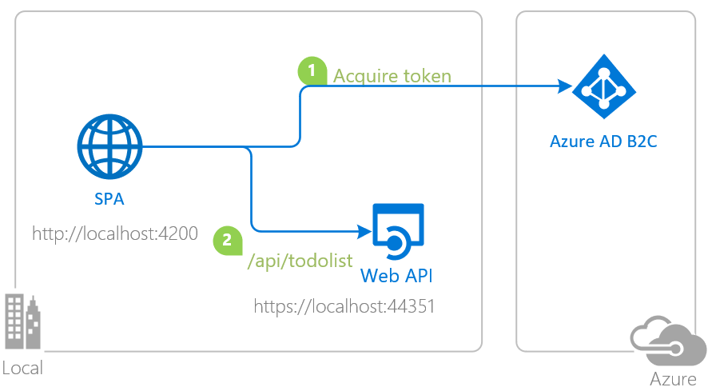

# Angular single-page application that authenticates users with Azure AD B2C and calls a protected .NET Core web API

* [Overview](#overview)
* [Scenario](#scenario)
* [Setup the sample](#setup-the-sample)
* [Explore the sample](#explore-the-sample)
* [Troubleshooting](#troubleshooting)
* [About the code](#about-the-code)
* [Next tutorial](#next-tutorial)
* [Contributing](#contributing)

## Overview

This sample demonstrates an Angular single-page application (SPA) calling a ASP.NET Core web API secured with [Azure AD B2C](https://docs.microsoft.com/azure/active-directory-b2c/overview) using the [Microsoft Authentication Library for Angular](https://github.com/AzureAD/microsoft-authentication-library-for-js/tree/dev/lib/msal-angular) (MSAL Angular) for the SPA and the [Microsoft.Identity.Web](https://github.com/AzureAD/microsoft-identity-web) (M.I.W) for the web API.

> :information_source: See the community call: [Deep dive on using MSAL.js to integrate Angular single-page applications with Azure Active Directory](https://www.youtube.com/watch?v=EJey9KP1dZA)

## Scenario

1. The client Angular SPA uses [MSAL Angular](https://github.com/AzureAD/microsoft-authentication-library-for-js/tree/dev/lib/msal-angular) to sign-in a user and obtain a JWT [Access Token](https://aka.ms/access-tokens) from **Azure AD B2C**.
1. The access token is used as a *bearer* token to authorize the user to call the .NET Core web API protected by **Azure AD B2C**.
1. The service uses the [Microsoft.Identity.Web](https://aka.ms/microsoft-identity-web) to protect the Web api, check permissions and validate tokens.



## Contents

| File/folder                         | Description                                                |
|-------------------------------------|------------------------------------------------------------|
| `SPA/src/app/auth-config.ts`        | Authentication parameters for SPA project reside here.     |
| `SPA/src/app/app.module.ts`         | MSAL Angular is initialized here.                          |
| `API/TodoListAPI/appsettings.json`  | Authentication parameters for API project reside here.     |
| `API/TodoListAPI/Startup.cs`        | Microsoft.Identity.Web is initialized here.                |
| `API/TodoListAPI/Controllers/TodoListController.cs` | Contains logic for controlling access to data. |

## Setup the sample

### Step 1: Clone or download this repository

From your shell or command line:

```console
git clone https://github.com/Azure-Samples/ms-identity-javascript-angular-tutorial.git
```

or download and extract the repository *.zip* file.

> :warning: To avoid path length limitations on Windows, we recommend cloning into a directory near the root of your drive.

### Step 2. Install .NET Core API dependencies

```console
    cd ms-identity-javascript-angular-tutorial
    cd 3-Authorization-II/2-call-api-b2c/API/TodoListAPI
    dotnet restore
```

### Step 3. Trust development certificates

```console
    dotnet dev-certs https --clean
    dotnet dev-certs https --trust
```

For more information and potential issues, see: [HTTPS in .NET Core](https://docs.microsoft.com/aspnet/core/security/enforcing-ssl).

### Step 4. Install Angular SPA dependencies

```console
    cd ../
    cd SPA
    npm install
```

### Step 5: Register the sample application(s) in your tenant

> :warning: This sample comes with a pre-registered application for demo purposes. If you would like to use your own **Azure AD B2C** tenant and application, follow the steps below to register and configure the application on **Azure portal**. Otherwise, continue with the steps for [Explore the sample](#explore-the-sample).

#### Choose the Azure AD B2C tenant where you want to create your applications

As a first step you'll need to:

1. Sign in to the [Azure portal](https://portal.azure.com).
1. If your account is present in more than one Azure AD B2C tenant, select your profile at the top right corner in the menu on top of the page, and then **switch directory** to change your portal session to the desired Azure AD B2C tenant.

#### Create User Flows and Custom Policies

Please refer to: [Tutorial: Create user flows in Azure Active Directory B2C](https://docs.microsoft.com/azure/active-directory-b2c/tutorial-create-user-flows)

#### Add External Identity Providers

Please refer to: [Tutorial: Add identity providers to your applications in Azure Active Directory B2C](https://docs.microsoft.com/azure/active-directory-b2c/tutorial-add-identity-providers)

#### Register the service app (msal-dotnet-api)

1. Navigate to the [Azure portal](https://portal.azure.com) and select the **Azure Active Directory B2C** service.
1. Select the **App Registrations** blade on the left, then select **New registration**.
1. In the **Register an application page** that appears, enter your application's registration information:
    1. In the **Name** section, enter a meaningful application name that will be displayed to users of the app, for example `msal-dotnet-api`.
    1. Under **Supported account types**, select **Accounts in any identity provider or organizational directory (for authenticating users with user flows)**
    1. Select **Register** to create the application.
1. In the **Overview** blade, find and note the **Application (client) ID**. You use this value in your app's configuration file(s) later in your code.
1. In the app's registration screen, select the **Expose an API** blade to the left to open the page where you can publish the permission as an API for which client applications can obtain [access tokens](https://aka.ms/access-tokens) for. The first thing that we need to do is to declare the unique [resource](https://docs.microsoft.com/azure/active-directory/develop/v2-oauth2-auth-code-flow) URI that the clients will be using to obtain access tokens for this API. To declare an resource URI(Application ID URI), follow the following steps:
    1. Select **Set** next to the **Application ID URI** to generate a URI that is unique for this app.
    1. For this sample, accept the proposed Application ID URI (`https://{tenantName}.onmicrosoft.com/{clientId}`) by selecting **Save**. Read more about Application ID URI at [Validation differences by supported account types \(signInAudience\)](https://docs.microsoft.com/azure/active-directory/develop/supported-accounts-validation).

##### Publish Delegated Permissions

1. All APIs must publish a minimum of one [scope](https://docs.microsoft.com/azure/active-directory/develop/v2-oauth2-auth-code-flow#request-an-authorization-code), also called [Delegated Permission](https://docs.microsoft.com/azure/active-directory/develop/v2-permissions-and-consent#permission-types), for the client apps to obtain an access token for a *user* successfully. To publish a scope, follow these steps:
1. Select **Add a scope** button open the **Add a scope** screen and Enter the values as indicated below:
    1. For **Scope name**, use `ToDoList.Read`.
    1. For **Admin consent display name** type in *Read users ToDo list using the 'msal-dotnet-api'*.
    1. For **Admin consent description** type in *Allow the app to read the user's ToDo list using the 'msal-dotnet-api'*.
    1. Keep **State** as **Enabled**.
    1. Select the **Add scope** button on the bottom to save this scope.
    > Repeat the steps above for another scope named **ToDoList.ReadWrite**
1. Select the **Manifest** blade on the left.
    1. Set `accessTokenAcceptedVersion` property to **2**.
    1. Select on **Save**.

> :information_source:  Follow [the principle of least privilege when publishing permissions](https://learn.microsoft.com/security/zero-trust/develop/protected-api-example) for a web API.

##### Configure the service app (msal-dotnet-api) to use your app registration

Open the project in your IDE (like Visual Studio or Visual Studio Code) to configure the code.

> In the steps below, "ClientID" is the same as "Application ID" or "AppId".

1. Open the `API\TodoListAPI\appsettings.json` file.
1. Find the key `Instance` and replace the existing value with your Azure AD B2C tenant name e.g.`https://{tenantName}.b2clogin.com`.
1. Find the key `ClientId` and replace the existing value with the application ID (clientId) of `msal-dotnet-api` app copied from the Azure portal.
1. Find the key `Domain` and replace the existing value with your Azure AD B2C tenant name e.g.`{tenantName}.onmicrosoft.com`
1. Find the key `SignUpSignInPolicyId` and replace the existing value with the user-flow/custom policy Id that you will call this API with e.g. `b2c_1_susi` (:warning: this should match the policy ID in the default authority in SPA project configuration).

#### Register the client app (msal-angular-spa)

1. Navigate to the [Azure portal](https://portal.azure.com) and select the **Azure AD B2C** service.
1. Select the **App Registrations** blade on the left, then find and select the application that you have registered in the previous tutorial (`msal-angular-spa`).
1. Since this app signs-in users, we will now proceed to select **delegated permissions**, which is is required by apps signing-in users.
    1. In the app's registration screen, select the **API permissions** blade in the left to open the page where we add access to the APIs that your application needs:
    1. Select the **Add a permission** button and then:
    1. Ensure that the **My APIs** tab is selected.
    1. In the list of APIs, select the API `msal-dotnet-api`.
        1. Select **delegated permissions**, which is requested by apps that signs-in users.
        1. In the **Delegated permissions** section, select **ToDoList.Read** and **ToDoList.ReadWrite** in the list. Use the search box if necessary.
    1. Select the **Add permissions** button at the bottom.

##### Configure the client app (msal-angular-spa) to use your app registration

Open the project in your IDE (like Visual Studio or Visual Studio Code) to configure the code.

> In the steps below, "ClientID" is the same as "Application ID" or "AppId".

1. Open the `SPA\src\app\auth-config.ts` file.
1. Find the key `msalConfig.clientId` and replace the existing value with the application ID (clientId) of `msal-angular-spa` app copied from the Azure portal.
1. Find the key `protectedResources.scopes.read` and replace the existing value with the `ToDoList.Read` scope you have exposed in the `msal-dotnet-api` registration steps earlier e.g. `https://fabrikamb2c.onmicrosoft.com/TodoList/ToDoList.Read`
1. Find the key `protectedResources.scopes.write` and replace the existing value with the `ToDoList.ReadWrite` scope you have exposed in the `msal-dotnet-api` registration steps earlier e.g. `https://fabrikamb2c.onmicrosoft.com/TodoList/ToDoList.ReadWrite`

### Step 6: Running the sample

From your shell or command line, execute the following commands:

```console
    cd SPA
    npm start
```

Then, open a separate command line and run:

```console
    cd API/TodoListAPI
    dotnet run
```

## Explore the sample

1. Open your browser and navigate to `http://localhost:4200`.
2. Sign-in using the button on the top-right corner.
3. Select the **TodoList** button on the navigation bar to access your todo list.

> :information_source: Did the sample not work for you as expected? Then please reach out to us using the [GitHub Issues](../../../../issues) page.

> :information_source: if you believe your issue is with the B2C service itself rather than with the sample, please file a support ticket with the B2C team by following the instructions [here](https://docs.microsoft.com/azure/active-directory-b2c/support-options).

## We'd love your feedback!

Were we successful in addressing your learning objective? Consider taking a moment to [share your experience with us](https://forms.office.com/Pages/ResponsePage.aspx?id=v4j5cvGGr0GRqy180BHbR73pcsbpbxNJuZCMKN0lURpUOU5PNlM4MzRRV0lETkk2ODBPT0NBTEY5MCQlQCN0PWcu).

## Troubleshooting

Use [Stack Overflow](http://stackoverflow.com/questions/tagged/msal) to get support from the community. Ask your questions on Stack Overflow first and browse existing issues to see if someone has asked your question before. Make sure that your questions or comments are tagged with [`azure-active-directory` `angular` `ms-identity` `adal` `msal`].

If you find a bug in the sample, raise the issue on [GitHub Issues](../../../../issues).

## About the code

### CORS settings

You need to set **cross-origin resource sharing** (CORS) policy to be able to call the **TodoListAPI** in [Startup.cs](./API/TodoListAPI/Startup.cs). For the purpose of the sample, **CORS** is enabled for **all** domains and methods. This is insecure and only used for demonstration purposes here. In production, you should modify this as to allow only the domains that you designate. If your web API is going to be hosted on **Azure App Service**, we recommend configuring CORS on the App Service itself.

```csharp
public void ConfigureServices(IServiceCollection services)
{
    // ...

    services.AddCors(o => o.AddPolicy("default", builder =>
    {
        builder.AllowAnyOrigin()
               .AllowAnyMethod()
               .AllowAnyHeader();
    }));
}
```

### Access token validation

On the web API side, the `AddMicrosoftIdentityWebApiAuthentication` method in [Startup.cs](./API/TodoListAPI/Startup.cs) protects the web API by [validating access tokens](https://docs.microsoft.com/azure/active-directory/develop/access-tokens#validating-tokens) sent tho this API. Check out [Protected web API: Code configuration](https://docs.microsoft.com/azure/active-directory/develop/scenario-protected-web-api-app-configuration) which explains the inner workings of this method in more detail. Simply add the following line under the `ConfigureServices` method:

```csharp
public void ConfigureServices(IServiceCollection services)
{
    // Adds Microsoft Identity platform (AAD v2.0) support to protect this Api
    services.AddMicrosoftIdentityWebApiAuthentication(Configuration);

    // ...
}
```

For validation and debugging purposes, developers can decode **JWT**s (*JSON Web Tokens*) using [jwt.ms](https://jwt.ms).

### Verifying permissions

Access tokens that does not have the **scp** (for delegated permissions) claim with the required scopes/permissions should not be accepted. In the sample, this is illustrated via the `RequiredScope` attribute in [TodoListController.cs](./API/TodoListAPI/Controllers/TodoListController.cs):

```csharp
// GET: api/TodoItems
[HttpGet]
[RequiredScope(RequiredScopesConfigurationKey = "AzureAd:Scopes:Read")]
public async Task<ActionResult<IEnumerable<TodoItem>>> GetTodoItems()
{
    /// <summary>
    /// The 'oid' (object id) is the only claim that should be used to uniquely identify
    /// a user in an Azure AD tenant. The token might have one or more of the following claim,
    /// that might seem like a unique identifier, but is not and should not be used as such:
    ///
    /// - upn (user principal name): might be unique amongst the active set of users in a tenant
    /// but tend to get reassigned to new employees as employees leave the organization and others
    /// take their place or might change to reflect a personal change like marriage.
    ///
    /// - email: might be unique amongst the active set of users in a tenant but tend to get reassigned
    /// to new employees as employees leave the organization and others take their place.
    /// </summary>
    return await _TodoListContext.TodoItems.Where(x => x.Owner == _currentPrincipalId).ToListAsync();
}
```

When granting access to data based on scopes, be sure to follow [the principle of least privilege](https://docs.microsoft.com/azure/active-directory/develop/secure-least-privileged-access).

### Debugging the sample

To debug the .NET Core web API that comes with this sample, install the [C# extension](https://marketplace.visualstudio.com/items?itemName=ms-dotnettools.csharp) for Visual Studio Code.

Learn more about using [.NET Core with Visual Studio Code](https://docs.microsoft.com/dotnet/core/tutorials/with-visual-studio-code).

## Next Tutorial

Continue with the next tutorial: [Deploy your apps to Azure](../../4-Deployment/README-incremental.md).

## Contributing

If you'd like to contribute to this sample, see [CONTRIBUTING.MD](/CONTRIBUTING.md).

This project has adopted the [Microsoft Open Source Code of Conduct](https://opensource.microsoft.com/codeofconduct/). For more information, see the [Code of Conduct FAQ](https://opensource.microsoft.com/codeofconduct/faq/) or contact [opencode@microsoft.com](mailto:opencode@microsoft.com) with any additional questions or comments.

* [What is Azure Active Directory B2C?](https://docs.microsoft.com/azure/active-directory-b2c/overview)
* [Application types that can be used in Active Directory B2C](https://docs.microsoft.com/azure/active-directory-b2c/application-types)
* [Recommendations and best practices for Azure Active Directory B2C](https://docs.microsoft.com/azure/active-directory-b2c/best-practices)
* [Azure AD B2C session](https://docs.microsoft.com/azure/active-directory-b2c/session-overview)
* [Building Zero Trust ready apps](https://aka.ms/ztdevsession)
* [Microsoft.Identity.Web](https://aka.ms/microsoft-identity-web)
* [Validating Access Tokens](https://docs.microsoft.com/azure/active-directory/develop/access-tokens#validating-tokens)
* [User and application tokens](https://docs.microsoft.com/azure/active-directory/develop/access-tokens#user-and-application-tokens)
* [Validation differences by supported account types](https://docs.microsoft.com/azure/active-directory/develop/supported-accounts-validation)
* [How to manually validate a JWT access token using the Microsoft identity platform](https://github.com/Azure-Samples/active-directory-dotnet-webapi-manual-jwt-validation/blob/master/README.md)
