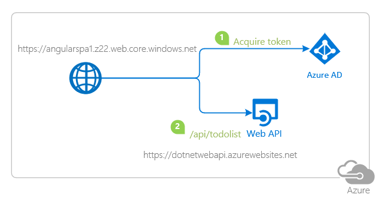

# Deploy your Angular application to Azure Cloud and use Azure services to manage your operations

 1. [Overview](#overview)
 1. [Scenario](#scenario)
 1. [Prerequisites](#prerequisites)
 1. [Registration](#registration)
 1. [Deployment](#deployment)
 1. [Explore the sample](#explore-the-sample)
 1. [More information](#more-information)
 1. [Community Help and Support](#community-help-and-support)
 1. [Contributing](#contributing)

## Overview

This sample demonstrates how to deploy an Angular single-page application (SPA) coupled with a .NET Core web API to **Azure Cloud** using [Azure Storage](https://docs.microsoft.com/azure/storage/blobs/) and [Azure App Service](https://docs.microsoft.com/azure/app-service/), respectively. To do so, we will use the [same code sample from Chapter 3](../3-Authorization-II/1-call-api).

> :information_source: You may also choose to deploy the [B2C sample from Chapter 3](../3-Authorization-II/2-call-api-b2c/README.md) instead. Steps below are more or less the same.

## Scenario

1. The client application uses **MSAL Angular** to sign-in a user and obtain a JWT **Access Token** from **Azure AD**.
1. The **Access Token** is used as a **bearer** token to *authorize* the user to call the protected web API.
1. The protected web API responds with the claims in the **Access Token**.



## Prerequisites

- An **Azure subscription**. This sample uses **Azure Storage** and **Azure App Service**.

## Setup

### Step 1: Clone or download this repository

From your shell or command line:

```console
    git clone https://github.com/Azure-Samples/ms-identity-javascript-angular-tutorial.git
```

or download and extract the repository .zip file.

> :warning: To avoid path length limitations on Windows, we recommend cloning into a directory near the root of your drive.

### Step 2: Install project dependencies

- Setup the service app:

```console
    cd ms-identity-javascript-angular-tutorial
    cd 3-Authorization-II/1-call-api
    cd API
    dotnet restore
```

- Setup the client app:

```console
    cd ..
    cd SPA
    npm install
```

## Registration

### Register the service app (.NET Core web API)

Use the same app registration credentials that you've obtained during [**chapter 3-1**](../3-Authorization-II/1-call-api/README.md#registration). Update your project files here as needed.

### Register the client app (Angular SPA)

Use the same app registration credentials that you've obtained during [**chapter 3-1**](../3-Authorization-II/1-call-api/README.md#registration). Update your project files here as needed.

## Deployment

### Deploying web API to Azure App Services

There is one .NET Core web API in this sample. To deploy it to **Azure App Services**, you'll need to:

- create an **Azure App Service**
- publish the projects to the **App Services**

#### Publish your files

1. Sign-in to **App Service** using an Azure AD Account.
1. Open the `API` project folder.
1. Choose **View** > **Terminal** from the main menu.
1. The terminal opens in the `API` folder.
1. Run the following command:

    ```console
    dotnet publish --configuration Release
    ```

1. Publish folder is created under path `bin/Release/<Enter_Framework_FolderName>`.
1. Right-click on **Publish** folder and select **Deploy to Web App**.
1. Select **Create New Web App**, enter a unique name for the app.
1. Select **Windows** as the OS. Press **Enter**.

#### Disable Azure App Services default authentication

1. Go to [Azure portal](https://portal.azure.com), and locate your project there.
    - On the Settings tab, select **Authentication/Authorization**. Make sure `App Service Authentication` is Off. Select **Save**.
1. Browse your website. If you see the default web page of the project, the publication was successful.

#### Enable cross-origin resource sharing (CORS)

1. Go to [Azure portal](https://portal.azure.com), and locate your project there.
    - On the API tab, select **CORS**. Check the box **Enable Access-Control-Allow-Credentials**.
    - Under **Allowed origins**, add the coordinates of your published website.

### Deploying SPA to Azure Storage

There is one Angular single-page application in this sample. To deploy it to **Azure Storage**, you'll need to:

- create an Azure Storage blob and obtain website coordinates
- build your project and upload it to Azure Storage blob
- update config files with website coordinates

> :information_source: If you would like to use **VS Code Azure Tools** extension for deployment, [watch the tutorial](https://docs.microsoft.com/azure/developer/javascript/tutorial-vscode-static-website-node-01) offered by Microsoft Docs.

#### Build and upload the Angular SPA to an Azure Storage blob

Build your project to get a distributable files folder, where your built `html`, `css` and `javascript` files will be generated.

```console
    cd SPA
    ng build --prod
```

Then follow the steps below:

> :warning: When uploading, make sure you upload the contents of your distributable files folder and **not** the entire folder itself.

> :information_source: If you don't have an account already, see: [How to create a storage account](https://docs.microsoft.com/azure/storage/common/storage-account-create).

1. Sign in to the [Azure portal](https://portal.azure.com).
1. Locate your storage account and display the account overview.
1. Select **Static website** to display the configuration page for static websites.
1. Select **Enabled** to enable static website hosting for the storage account.
1. In the **Index document name** field, specify a default index page (For example: `index.html`).
1. The default **index page** is displayed when a user navigates to the root of your static website.
1. Select **Save**. The Azure portal now displays your static website endpoint. Make a note of the **Primary endpoint field**.
1. Next, select **Storage Explorer**.
1. Expand the **BLOB CONTAINERS** node, and then select the `$web` container.
1. Choose the **Upload** button to upload files.
1. If you intend for the browser to display the contents of file, make sure that the content type of that file is set to `text/html`.
1. In the pane that appears beside the **account overview page** of your storage account, select **Static Website**. The URL of your site appears in the **Primary endpoint field**. In the next section, you will register this URI.

##### Update the Azure AD app registration

1. Navigate back to to the [Azure portal](https://portal.azure.com).
1. In the left-hand navigation pane, select the **Azure Active Directory** service, and then select **App registrations**.
1. In the resulting screen, select `msal-angular-spa`.
1. In the app's registration screen, select **Authentication** in the menu.
   - In the **Redirect URIs** section, update the reply URLs to match the site URL of your Azure deployment. For example:
      - `https://angularspa1.z22.web.core.windows.net`

### Update authentication configuration parameters

1. In your IDE, locate the `SPA` project. Then, open `SPA\src\app\auth-config.ts`.
2. Find the key for **redirect URI** and replace its value with the address of the web app you published, for example, `https://angularspa1.z22.web.core.windows.net`.
3. Find the key for **web API endpoint** and replace its value with the address of the web API you published, for example, `https://dotnetwebapi.azurewebsites.net/api/todolist`.

## Explore the sample

1. Open your browser and navigate to your deployed client app's URI, for instance: `https://angularspa1.z22.web.core.windows.net/`.
2. Select the **Sign In** button on the top right corner.
3. Select the **TodoList** button on the navigation bar to access your todo list.


## We'd love your feedback!

Were we successful in addressing your learning objective? Consider taking a moment to [share your experience with us](https://forms.office.com/Pages/ResponsePage.aspx?id=v4j5cvGGr0GRqy180BHbR73pcsbpbxNJuZCMKN0lURpUOU5PNlM4MzRRV0lETkk2ODBPT0NBTEY5MCQlQCN0PWcu).

## More information

- [Azure Blob Storage](https://docs.microsoft.com/azure/storage/blobs/)
- [Azure App Services](https://docs.microsoft.com/azure/app-service/)

For more information about how OAuth 2.0 protocols work in this scenario and other scenarios, see [Authentication Scenarios for Azure AD](https://docs.microsoft.com/azure/active-directory/develop/authentication-flows-app-scenarios).

## Community Help and Support

Use [Stack Overflow](http://stackoverflow.com/questions/tagged/msal) to get support from the community.
Ask your questions on Stack Overflow first and browse existing issues to see if someone has asked your question before.
Make sure that your questions or comments are tagged with [`azure-active-directory` `azure-ad-b2c` `ms-identity` `adal` `msal`].

If you find a bug in the sample, raise the issue on [GitHub Issues](../../../issues).

To provide feedback on or suggest features for Azure Active Directory, visit [User Voice page](https://feedback.azure.com/forums/169401-azure-active-directory).

## Contributing

If you'd like to contribute to this sample, see [CONTRIBUTING.MD](/CONTRIBUTING.md).

This project has adopted the [Microsoft Open Source Code of Conduct](https://opensource.microsoft.com/codeofconduct/). For more information, see the [Code of Conduct FAQ](https://opensource.microsoft.com/codeofconduct/faq/) or contact [opencode@microsoft.com](mailto:opencode@microsoft.com) with any additional questions or comments.