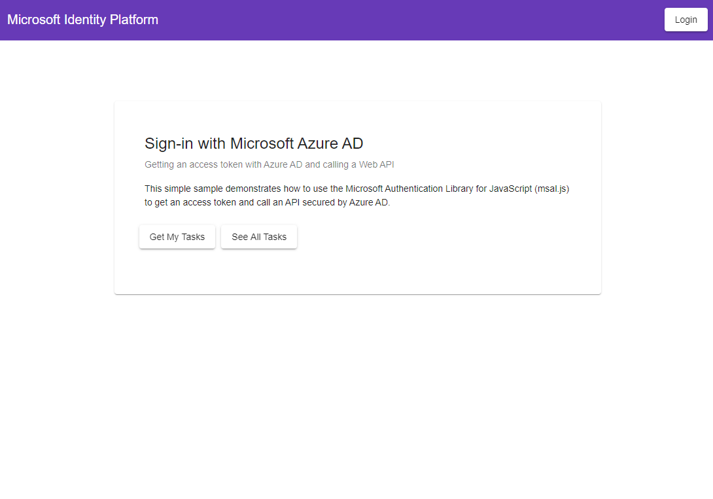
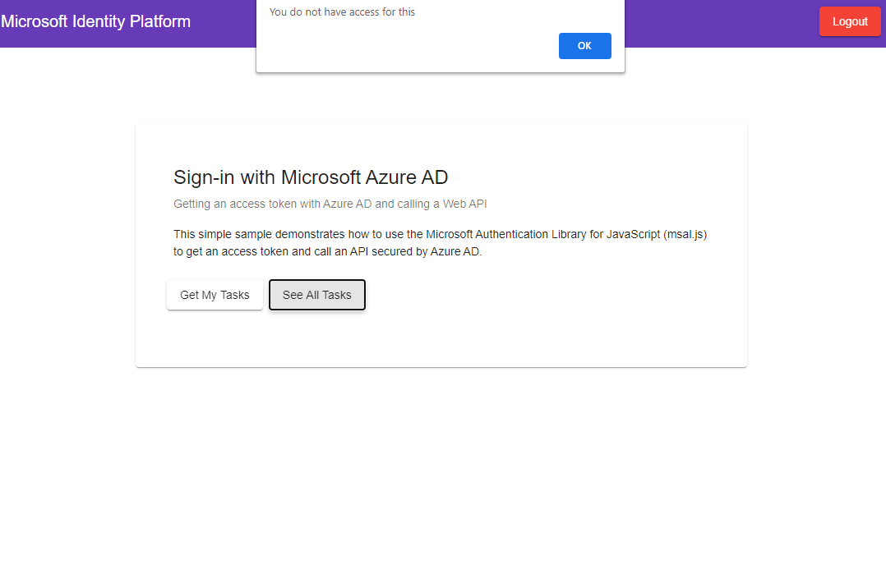

# Angular single-page application calling .NET Core web API using Security Groups to implement Role-Based Access Control

 1. [Overview](#overview)
 1. [Scenario](#scenario)
 1. [Contents](#contents)
 1. [Setup](#setup)
 1. [Registration](#registration)
 1. [Running the sample](#running-the-sample)
 1. [Explore the sample](#explore-the-sample)
 1. [About the code](#about-the-code)
 1. [More information](#more-information)
 1. [Community Help and Support](#community-help-and-support)
 1. [Contributing](#contributing)

## Overview

This sample demonstrates a cross-platform application suite involving an Angular SPA (*TodoListSPA*) calling an ASP.NET Core web API (*TodoListAPI*) secured with the Microsoft identity platform. In doing so, it implements **Role-based Access Control** (RBAC) by using Azure AD **Security Groups**.

Access control in Azure AD can also be done with **App Roles**, as shown in the [previous tutorial](../1-call-api-roles/README.md). **Groups** and **App Roles** in Azure AD are by no means mutually exclusive - they can be used in tandem to provide even finer grained access control.

## Scenario

In the sample, a dashboard component allows signed-in users to see the tasks assigned to them or other users based on their memberships to one of the two security groups, **GroupAdmin** and **GroupMember**.

- The **TodoListSPA** uses [MSAL Angular](https://github.com/AzureAD/microsoft-authentication-library-for-js/tree/dev/lib/msal-angular) to authenticate a user with the Microsoft identity platform.
- The app then obtains an [access token](https://docs.microsoft.com/azure/active-directory/develop/access-tokens) from Azure Active Directory (Azure AD) on behalf of the authenticated user for the **TodoListAPI**.
- **TodoListAPI** uses [Microsoft.Identity.Web](https://github.com/AzureAD/microsoft-identity-web) to protect its endpoint and accept only authorized calls.


## Contents

| File/folder          | Description                                                |
|----------------------|------------------------------------------------------------|
| `SPA/src/app/auth-config.ts`        | Authentication parameters for SPA project reside here.     |
| `SPA/src/app/app.module.ts`         | MSAL Angular is initialized here.                          |
| `SPA/src/app/group-guard.service.ts`| This service protects other components that require user to be in a group. |
| `SPA/src/app/graph.service.ts`      | This service queries Microsoft Graph in case of groups overage. |
| `API/appsettings.json`              | Authentication parameters for API project reside here.     |
| `API/Startup.cs`                    | Microsoft.Identity.Web is initialized here.                |
| `API/Utils/GraphHelper.cs`          | Queries Microsoft Graph with Graph SDK in case groups overage occurs. |

## Setup

### Step 1. Install .NET Core API dependencies

```console
    cd ms-identity-javascript-angular-tutorial
    cd 5-AccessControl/2-call-api-groups/API
    dotnet restore
```

### Step 2. Trust development certificates

```console
    dotnet dev-certs https --clean
    dotnet dev-certs https --trust
```

For more information and potential issues, see: [HTTPS in .NET Core](https://docs.microsoft.com/aspnet/core/security/enforcing-ssl).

### Step 3. Install Angular SPA dependencies

```console
    cd ../
    cd SPA
    npm install
```

## Registration

There are two projects in this sample. Each needs to be registered separately in your Azure AD tenant. To register these projects, you can:

- either follow the steps below for manual registration,
- or use PowerShell scripts that:
  - **automatically** creates the Azure AD applications and related objects (passwords, permissions, dependencies) for you.
  - modify the configuration files.

<details>
  <summary>Expand this section if you want to use this automation:</summary>

1. On Windows, run PowerShell as **Administrator** and navigate to the root of the cloned directory
1. In PowerShell run:

   ```PowerShell
   Set-ExecutionPolicy -ExecutionPolicy RemoteSigned -Scope Process -Force
   ```

1. Run the script to create your Azure AD application and configure the code of the sample application accordingly.
1. In PowerShell run:

   ```PowerShell
   cd .\AppCreationScripts\
   .\Configure.ps1
   ```

   > Other ways of running the scripts are described in [App Creation Scripts](./AppCreationScripts/AppCreationScripts.md)
   > The scripts also provide a guide to automated application registration, configuration and removal which can help in your CI/CD scenarios.

</details>

### Update the service app's registration (msal-dotnet-api)

1. Navigate to the [Azure portal](https://portal.azure.com) and select the **Azure AD** service.
1. Select the **App Registrations** blade on the left, then find and select the application that you have registered in the previous tutorial (`msal-dotnet-api`).
1. In the **Client secrets** section, select **New client secret**:
   - Type a key description (for instance `app secret`),
   - Select one of the available key durations (**In 1 year**, **In 2 years**, or **Never Expires**) as per your security posture.
   - The generated key value will be displayed when you select the **Add** button. Copy the generated value for use in the steps later.
   - You'll need this key later in your code's configuration files. This key value will not be displayed again, and is not retrievable by any other means, so make sure to note it from the Azure portal before navigating to any other screen or blade.
1. In the app's registration screen, select the **API permissions** blade in the left to open the page where we add access to the APIs that your application needs.
   - Select the **Add a permission** button and then,
       - Ensure that the **Microsoft APIs** tab is selected.
       - In the *Commonly used Microsoft APIs* section, select **Microsoft Graph**
       - In the **Delegated permissions** section, select the **User.Read**, **GroupMember.Read.All** in the list. Use the search box if necessary.
       - Select the **Add permissions** button at the bottom.
   - **GroupMember.Read.All** requires admin to consent. Select the **Grant/revoke admin consent for {tenant}** button, and then select **Yes** when you are asked if you want to grant consent for the requested permissions for all account in the tenant. You need to be an Azure AD tenant admin to do this.

#### Configure the service app (msal-dotnet-api) to use your app registration

Open the project in your IDE (like Visual Studio or Visual Studio Code) to configure the code.

> In the steps below, "ClientID" is the same as "Application ID" or "AppId".

1. Open the `API\appsettings.json` file.
1. Find the app key `Domain` and replace the existing value with your Azure AD tenant name.
1. Find the app key `ClientId` and replace the existing value with the application ID (clientId) of the `msal-dotnet-api` application copied from the Azure portal.
1. Find the app key `TenantId` and replace the existing value with your Azure AD tenant ID.
1. Find the app key `ClientSecret` and replace the existing value with the key you saved during the creation of the `msal-dotnet-api` app, in the Azure portal.

1. Open the `API\Controllers\TodoListController.cs` file.
1. Find the variable `scopeRequiredByApi` and replace its value with the name of the API scope that you have just exposed (by default `access_as_user`).

### Update the client app's registration (msal-angular-spa)

1. Navigate to the [Azure portal](https://portal.azure.com) and select the **Azure AD** service.
1. Select the **App Registrations** blade on the left, then find and select the application that you have registered in the previous tutorial (`msal-angular-spa`).
1. In the app's registration screen, select the **API permissions** blade in the left to open the page where we add access to the APIs that your application needs.
   - Select the **Add a permission** button and then:
       - Ensure that the **Microsoft APIs** tab is selected.
       - In the *Commonly used Microsoft APIs* section, select **Microsoft Graph**
       - In the **Delegated permissions** section, select the **GroupMember.Read.All** in the list. Use the search box if necessary.
       - Select the **Add permissions** button at the bottom.
   - **GroupMember.Read.All** requires admin to consent. Select the **Grant/revoke admin consent for {tenant}** button, and then select **Yes** when you are asked if you want to grant consent for the requested permissions for all account in the tenant. You need to be an Azure AD tenant admin to do this.

> :warning: The next step requires you to go back to your msal-dotnet-api registration.

1. Now you need to leave the registration for **msal-angular-spa** and *go back to your app registration* for **msal-dotnet-api**.
   - From the app's Overview page, select the Manifest section.
   - Find the entry for `KnownClientApplications`, and add the Application (client) ID of the `msal-angular-spa` application copied from the Azure portal. i.e. `KnownClientApplications: [ "your_client_id_for_TodoListSPA" ]`

#### Configure the client app (msal-angular-spa) to use your app registration

Open the project in your IDE (like Visual Studio or Visual Studio Code) to configure the code.

> In the steps below, "ClientID" is the same as "Application ID" or "AppId".

1. Open the `SPA\src\app\app-config.ts` file.
1. Find the app key `clientId` and replace the existing value with the application ID (clientId) of the **msal-angular-spa** application copied from the Azure portal.
1. Find the app key `todoListApi.resourceUri` and replace the existing value with the base address of the **msal-dotnet-api** project (by default `https://localhost:44351/api/todolist`).
1. Find the app key `todoListApi.resourceScopes` and replace the existing value with *Scope* you created earlier `api://{clientId-of-service}/access_as_user`.

### Configure Security Groups (msal-angular-spa and msal-dotnet-api)

You have two different options available to you on how you can further configure your application(s) to receive the `groups` claim.

1. [Receive **all the groups** that the signed-in user is assigned to in an Azure AD tenant, included nested groups](#configure-your-application-to-receive-all-the-groups-the-signed-in-user-is-assigned-to-including-nested-groups).
2. [Receive the **groups** claim values from a **filtered set of groups** that your application is programmed to work with](#configure-your-application-to-receive-the-groups-claim-values-from-a-filtered-set-of-groups-a-user-may-be-assigned-to) (Not available in the [Azure AD Free edition](https://azure.microsoft.com/pricing/details/active-directory/)).

> To get the on-premise group's `samAccountName` or `On Premises Group Security Identifier` instead of Group ID, please refer to the document [Configure group claims for applications with Azure Active Directory](https://docs.microsoft.com/azure/active-directory/hybrid/how-to-connect-fed-group-claims#prerequisites-for-using-group-attributes-synchronized-from-active-directory).

:warning: The token configuration steps below should be performed for **both** the **msal-angular-spa** and the **msal-dotnet-api**.

#### Configure your application to receive **all the groups** the signed-in user is assigned to, including nested groups

1. In the app's registration screen, select the **Token Configuration** blade in the left to open the page where you can configure the claims provided tokens issued to your application.
1. Select the **Add groups claim** button on top to open the **Edit Groups Claim** screen.
1. Select `Security groups` **or** the `All groups (includes distribution lists but not groups assigned to the application)` option. Choosing both negates the effect of `Security Groups` option.
1. Under the **ID** section, select `Group ID`. This will result in Azure AD sending the [Object ID](https://docs.microsoft.com/graph/api/resources/group?view=graph-rest-1.0) of the groups the user is assigned to in the **groups** claim of the [ID Token](https://docs.microsoft.com/azure/active-directory/develop/id-tokens) that your app receives after signing-in a user.

#### Configure your application to receive the `groups` claim values from a **filtered set of groups** a user may be assigned to

##### Prerequisites, benefits and limitations of using this option

1. This option is useful when your application is interested in a selected set of groups that a signing-in user may be assigned to and not every security group this user is assigned to in the tenant. This option also saves your application from running into the [overage](#the-groups-overage-claim) issue.
1. This feature is not available in the [Azure AD Free edition](https://azure.microsoft.com/pricing/details/active-directory/).
1. **Nested group assignments** are not available when this option is utilized.

##### Steps to enable this option in your app

1. In the app's registration screen, select the **Token Configuration** blade in the left to open the page where you can configure the claims provided tokens issued to your application.
1. Select the **Add groups claim** button on top to open the **Edit Groups Claim** screen.
1. Select `Groups assigned to the application`.
    1. Choosing additional options like `Security Groups` or `All groups (includes distribution lists but not groups assigned to the application)` will negate the benefits your app derives from choosing to use this option.
1. Under the **ID** section, select `Group ID`. This will result in Azure AD sending the [Object ID](https://docs.microsoft.com/graph/api/resources/group?view=graph-rest-1.0) of the groups the user is assigned to in the `groups` claim of the [ID Token](https://docs.microsoft.com/azure/active-directory/develop/id-tokens) that your app receives after signing-in a user.
1. If you are exposing a web API using the **Expose an API** option, then you can also choose the `Group ID` option under the **Access** section. This will result in Azure AD sending the [Object ID](https://docs.microsoft.com/graph/api/resources/group?view=graph-rest-1.0) of the groups the user is assigned to in the `groups` claim of the [Access Token](https://docs.microsoft.com/azure/active-directory/develop/access-tokens) issued to the client applications of your API.
1. In the app's registration screen, select on the **Overview** blade in the left to open the Application overview screen. Select the hyperlink with the name of your application in **Managed application in local directory** (note this field title can be truncated for instance `Managed application in ...`). When you select this link you will navigate to the **Enterprise Application Overview** page associated with the service principal for your application in the tenant where you created it. You can navigate back to the app registration page by using the *back* button of your browser.
1. Select the **Users and groups** blade in the left to open the page where you can assign users and groups to your application.
    1. Select the **Add user** button on the top row.
    1. Select **User and Groups** from the resultant screen.
    1. Choose the groups that you want to assign to this application.
    1. Click **Select** in the bottom to finish selecting the groups.
    1. Select **Assign** to finish the group assignment process.  
    1. Your application will now receive these selected groups in the `groups` claim when a user signing in to your app is a member of  one or more these **assigned** groups.
1. Select the **Properties** blade in the left to open the page that lists the basic properties of your application.Set the **User assignment required?** flag to **Yes**.

> :bulb: **Important security tip**
>
> When you set **User assignment required?** to **Yes**, Azure AD will check that only users assigned to your application in the **Users and groups** blade are able to sign-in to your app. You can assign users directly or by assigning security groups they belong to.

### Configure the client app (msal-angular-spa) to recognize Group IDs

> :warning:
> During **Token Configuration**, if you have chosen any other option except **groupID** (e.g. like **DNSDomain\sAMAccountName**) you should enter the **group name** (for example `contoso.com\Test Group`) instead of the **object ID** below:

1. Open the `SPA\src\app\app-config.ts` file.
1. Find the app key `groups.groupAdmin` and replace the existing value with the **object ID** of the **GroupAdmin** group copied from the Azure portal.
1. Find the app key `groups.groupMember` and replace the existing value with the **object ID** of the **GroupMember** group copied from the Azure portal.

### Configure the service app (msal-dotnet-api) to recognize Group IDs

> :warning:
> During **Token Configuration**, if you have chosen any other option except **groupID** (e.g. like **DNSDomain\sAMAccountName**) you should enter the **group name** (for example `contoso.com\Test Group`) instead of the **object ID** below:

1. Open the `API\appsettings.json` file.
2. Find the app key `Groups.GroupAdmin` and replace the existing value with the object ID of the **GroupAdmin** group copied from the Azure portal.
3. Find the app key `Groups.GroupMember` and replace the existing value with the object ID of the **GroupMember** group copied from the Azure portal.

## Run the sample

Using a command line interface such as VS Code integrated terminal, locate the application directory. Then:  

```console
   cd ../
   cd msal-angular-spa
   npm start
```

In a separate console window, execute the following commands:

```console
   cd msal-dotnet-api
   dotnet run
```

## Explore the sample

1. Open your browser and navigate to `http://localhost:4200`.
2. Sign-in using the button on top-right:



1. Click on the **Get My Tasks** button to access your (the signed-in user's) todo list:


1. If the signed-in user has the right privileges (i.e. in the right "group"), click on the **See All Tasks** button to access every users' todo list:


1. If the signed-in user does not have the right privileges, clicking on the **See All Tasks** will give an error:



> :information_source: Consider taking a moment to [share your experience with us](https://forms.office.com/Pages/ResponsePage.aspx?id=v4j5cvGGr0GRqy180BHbR73pcsbpbxNJuZCMKN0lURpUQ09BMkFPQ0cyWEczSEFJSVVQSVVTREw0TCQlQCN0PWcu)

## About the code

Much of the specifics of implementing **RBAC** with **Security Groups** is the same with implementing **RBAC** with **App Roles** discussed in [Chapter1](../Chapter1/). In order to avoid redundancy, here we discuss particular issues that might arise with using **groups** claim.

### Groups overage claim

To ensure that the token size doesn’t exceed HTTP header size limits, the Microsoft Identity Platform limits the number of object Ids that it includes in the **groups** claim.

If a user is member of more groups than the overage limit (**150 for SAML tokens, 200 for JWT tokens, 6 for Single Page applications**), then the Microsoft Identity Platform does not emit the group IDs in the `groups` claim in the token. Instead, it includes an **overage** claim in the token that indicates to the application to query the [MS Graph API](https://graph.microsoft.com) to retrieve the user’s group membership.

> We strongly advise you use the [group filtering feature](#configure-your-application-to-receive-the-groups-claim-values-from-a-filtered-set-of-groups-a-user-may-be-assigned-to) (if possible) to avoid running into group overages.

#### Create the overage scenario for testing

1. You can use the `BulkCreateGroups.ps1` provided in the [App Creation Scripts](./AppCreationScripts/) folder to create a large number of groups and assign users to them. This will help test overage scenarios during development. :warning: Remember to change the user's **objectId** provided in the `BulkCreateGroups.ps1` script.
1. When you run this sample and an overage occurred, then you'd see the `_claim_names` in the home page after the user signs-in.
1. We strongly advise you use the [group filtering feature](#configure-your-application-to-receive-the-groups-claim-values-from-a-filtered-set-of-groups-a-user-may-be-assigned-to) (if possible) to avoid running into group overages.
1. In case you cannot avoid running into group overage, we suggest you use the following logic to process groups claim in your token.  
    1. Check for the claim `_claim_names` with one of the values being `groups`. This indicates overage.
    1. If found, make a call to the endpoint specified in `_claim_sources` to fetch user’s groups.
    1. If none found, look into the `groups`  claim for user’s groups.

> When attending to overage scenarios, which requires a call to [Microsoft Graph](https://graph.microsoft.com) to read the signed-in user's group memberships, your app will need to have the [GroupMember.Read.All](https://docs.microsoft.com/graph/permissions-reference#group-permissions) for the [getMemberObjects](https://docs.microsoft.com/graph/api/user-getmemberobjects?view=graph-rest-1.0) function to execute successfully.

> Developers who wish to gain good familiarity of programming for Microsoft Graph are advised to go through the [An introduction to Microsoft Graph for developers](https://www.youtube.com/watch?v=EBbnpFdB92A) recorded session.

##### Angular GroupGuard service

Consider the `group-guard.service.ts`. Here, we are checking whether the token for the user has the `_claim_names` claim, which indicates that the user has too many group memberships. If so, we redirect the user to the `/overage` page. There, we initiate a call to MS Graph API's `https://graph.microsoft.com/v1.0/me/memberOf` endpoint to query the full list of groups that the user belongs to. Finally we check for the designated `groupID` among this list.

```typescript
@Injectable({
    providedIn: 'root'
  })
export class GroupGuardService implements CanActivate {

  constructor(private authService: MsalService, private graphService: GraphService, private router: Router) {}
  
  canActivate(route: ActivatedRouteSnapshot): boolean {

    const expectedGroup = route.data.expectedGroup;
    let account: Account = this.authService.instance.getAllAccounts()[0];

    this.graphService.user.displayName = account.idTokenClaims?.preferred_username!;

    if (this.graphService.user.groupIDs.includes(expectedGroup)) {
      return true;
    }

    if (account.idTokenClaims?.groups) {
      this.graphService.user.groupIDs = account.idTokenClaims?.groups;
    } else {
      if (account.idTokenClaims?._claim_names) { 
        window.alert('You have too many group memberships. The application will now query Microsoft Graph to get the full list of groups that you are a member of.');
        this.router.navigate(['/overage']);
        return false;
      }

      window.alert('Token does not have groups claim');
      return false;
    }

    window.alert('You do not have access for this');
    return false;
  }
}
```

In `app-routing.module.ts`, we add **GroupGuardService** to routes we want to check for group membership:

```typescript
const routes: Routes = [
  {
    path: 'todo-edit/:id',
    component: TodoEditComponent,
    canActivate: [
      MsalGuard,
      GroupGuardService
    ],
    data: { 
      expectedGroup: auth.groups.groupMember
    }
  },
  {
    path: 'todo-view',
    component: TodoViewComponent,
    canActivate: [
      MsalGuard,
      GroupGuardService
    ],
    data: { 
      expectedGroup: auth.groups.groupMember
    }
  },
  {
    path: 'dashboard',
    component: DashboardComponent,
    canActivate: [
      MsalGuard,
      GroupGuardService,
    ],
    data: { 
      expectedGroup: auth.groups.groupAdmin
    } 
  },
];
```

#### .NET Core web API and how to handle the overage scenario

1. In `Startup.cs`, `OnTokenValidated` event calls **GetSignedInUsersGroups** method defined in GraphHelper.cs to process groups overage claim.

    ```csharp
    services.AddAuthentication(JwtBearerDefaults.AuthenticationScheme)
                .AddMicrosoftIdentityWebApi(options =>
        {
            Configuration.Bind("AzureAd", options);
            options.Events = new JwtBearerEvents();
            options.Events.OnTokenValidated = async context =>
            {
                if (context != null)
                {
                //Calls method to process groups overage claim.
                await GraphHelper.GetSignedInUsersGroups(context);
                }
            };
        }, options => { Configuration.Bind("AzureAd", options); })
                .EnableTokenAcquisitionToCallDownstreamApi(options => Configuration.Bind("AzureAd", options))
                .AddMicrosoftGraph(Configuration.GetSection("GraphBeta"))
            .AddInMemoryTokenCaches();
    ```

`AddMicrosoftGraph` registers the service for `GraphServiceClient`. The values for `BaseUrl` and `Scopes` defined in `GraphAPI` section of the **appsettings.json**.

1. In `GraphHelper.cs`, **GetSignedInUsersGroups** method checks if incoming token contains *Group Overage* claim then it will call **ProcessUserGroupsForOverage** method to retrieve groups.

    ```csharp
            public static async Task GetSignedInUsersGroups(TokenValidatedContext context)
            {
                // Checks if the incoming token contained a 'Group Overage' claim.
                if (HasOverageOccurred(context.Principal))
                {
                    await ProcessUserGroupsForOverage(context);
                }
            }
    ```

##### Group authorization policy

The ASP.NET middleware supports roles populated from claims by specifying the claim in the `RoleClaimType` property of `TokenValidationParameters`.
Since the `groups` claim contains the object IDs of the security groups than the actual names by default, you'd use the group IDs instead of group names. See [Role-based authorization in ASP.NET Core](https://docs.microsoft.com/aspnet/core/security/authorization/roles) for more info.

```CSharp
// Startup.cs

// The following lines code instruct the asp.net core middleware to use the data in the "groups" claim in the [Authorize] attribute and for User.IsInrole()
// See https://docs.microsoft.com/aspnet/core/security/authorization/roles
services.Configure<OpenIdConnectOptions>(OpenIdConnectDefaults.AuthenticationScheme, options =>
{
    // Use the groups claim for populating roles
    options.TokenValidationParameters.RoleClaimType = "groups";
});

// Adding asp.net core authorization policies that enforce authorization using Azure AD roles.
services.AddAuthorization(options =>
{
      options.AddPolicy(AuthorizationPolicies.AssignmentToGroupAdminGroupRequired, policy => policy.RequireRole(Configuration["Groups:GroupAdmin"]));
      options.AddPolicy(AuthorizationPolicies.AssignmentToGroupMemberGroupRequired, policy => policy.RequireRole(Configuration["Groups:GroupMember"]));
});

// In code..(Controllers & elsewhere)
[Authorize(Roles = "Group-object-id")] // In controllers
// or
User.IsInRole("Group-object-id"); // In methods

```

> :information_source: Did the sample not work for you as expected? Did you encounter issues trying this sample? Then please reach out to us using the [GitHub Issues](../../../../issues) page.

## Debugging the sample

To debug the .NET Core web API that comes with this sample, install the [C# extension](https://marketplace.visualstudio.com/items?itemName=ms-dotnettools.csharp) for Visual Studio Code.

Learn more about using [.NET Core with Visual Studio Code](https://docs.microsoft.com/dotnet/core/tutorials/with-visual-studio-code).

## Next Tutorial

Learn more about how to offer your apps to other tenants (SaaS): [Multitenancy](../../6-Multitenancy/1-call-api-mt/README-incremental.md).

## More information

- [Microsoft identity platform (Azure Active Directory for developers)](https://docs.microsoft.com/azure/active-directory/develop/)
- [Overview of Microsoft Authentication Library (MSAL)](https://docs.microsoft.com/azure/active-directory/develop/msal-overview)
- [Quickstart: Register an application with the Microsoft identity platform](https://docs.microsoft.com/azure/active-directory/develop/quickstart-register-app)
- [Quickstart: Configure a client application to access web APIs](https://docs.microsoft.com/azure/active-directory/develop/quickstart-configure-app-access-web-apis)
- [Understanding Azure AD application consent experiences](https://docs.microsoft.com/azure/active-directory/develop/application-consent-experience)
- [Understand user and admin consent](https://docs.microsoft.com/azure/active-directory/develop/howto-convert-app-to-be-multi-tenant#understand-user-and-admin-consent)
- [Initialize client applications using MSAL.js](https://docs.microsoft.com/azure/active-directory/develop/msal-js-initializing-client-applications)
- [Single sign-on with MSAL.js](https://docs.microsoft.com/azure/active-directory/develop/msal-js-sso)
- [Handle MSAL.js exceptions and errors](https://docs.microsoft.com/azure/active-directory/develop/msal-handling-exceptions?tabs=javascript)
- [Logging in MSAL.js applications](https://docs.microsoft.com/azure/active-directory/develop/msal-logging?tabs=javascript)
- [Pass custom state in authentication requests using MSAL.js](https://docs.microsoft.com/azure/active-directory/develop/msal-js-pass-custom-state-authentication-request)
- [Prompt behavior in MSAL.js interactive requests](https://docs.microsoft.com/azure/active-directory/develop/msal-js-prompt-behavior)
- [Use MSAL.js to work with Azure AD B2C](https://docs.microsoft.com/azure/active-directory/develop/msal-b2c-overview)

For more information about how OAuth 2.0 protocols work in this scenario and other scenarios, see [Authentication Scenarios for Azure AD](https://docs.microsoft.com/azure/active-directory/develop/authentication-flows-app-scenarios).

## Community Help and Support

Use [Stack Overflow](http://stackoverflow.com/questions/tagged/msal) to get support from the community.
Ask your questions on Stack Overflow first and browse existing issues to see if someone has asked your question before.
Make sure that your questions or comments are tagged with [`azure-active-directory` `dotnet` `ms-identity` `adal` `msal`].

If you find a bug in the sample, raise the issue on [GitHub Issues](../../../../issues).

To provide feedback on or suggest features for Azure Active Directory, visit [User Voice page](https://feedback.azure.com/forums/169401-azure-active-directory).

## Contributing

If you'd like to contribute to this sample, see [CONTRIBUTING.MD](/CONTRIBUTING.md).

This project has adopted the [Microsoft Open Source Code of Conduct](https://opensource.microsoft.com/codeofconduct/). For more information, see the [Code of Conduct FAQ](https://opensource.microsoft.com/codeofconduct/faq/) or contact [opencode@microsoft.com](mailto:opencode@microsoft.com) with any additional questions or comments.
