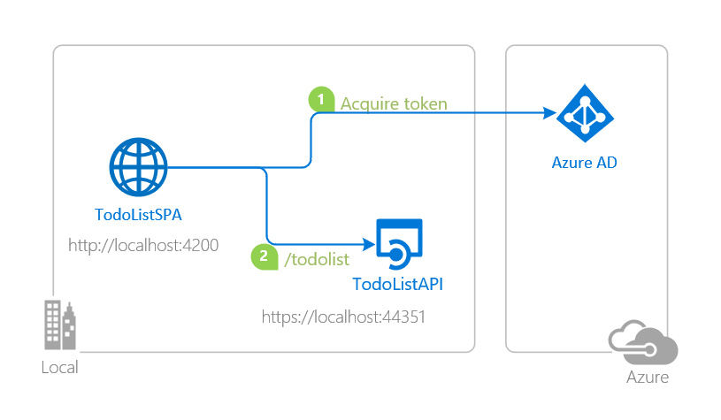
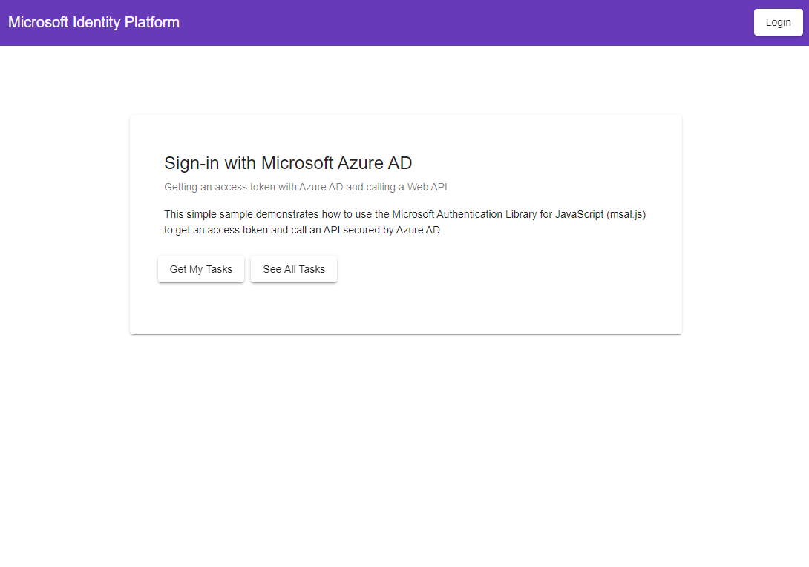
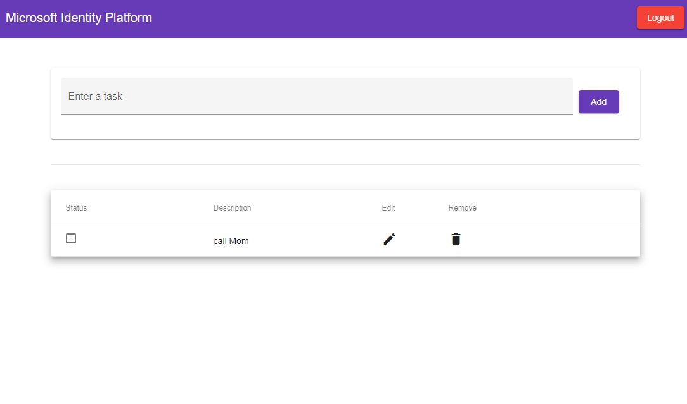

# An Angular single-page application (SPA) calling a protected web API and using App Roles to implement Role-Based Access Control (RBAC)

 1. [Overview](#overview)
 1. [Scenario](#scenario)
 1. [Contents](#contents)
 1. [Prerequisites](#prerequisites)
 1. [Setup](#setup)
 1. [Registration](#registration)
 1. [Running the sample](#running-the-sample)
 1. [Explore the sample](#explore-the-sample)
 1. [About the code](#about-the-code)
 1. [More information](#more-information)
 1. [Community Help and Support](#community-help-and-support)
 1. [Contributing](#contributing)

## Overview

This sample demonstrates a cross-platform application suite involving an Angular SPA (*TodoListSPA*) calling an ASP.NET Core web API (*TodoListAPI*) secured with the Microsoft identity platform. In doing so, it implements **role-based access control** by using Azure AD **App Roles**.

Authorization in Azure AD can also be done with **Security Groups** as well, as we will cover the [next chapter](../chapter2/README.md). **Security Groups** and **App Roles** in Azure AD are by no means mutually exclusive - they can be used in tandem to provide even finer grained access control.

## Scenario

In the sample, a **dashboard** component allows signed-in users to see the tasks assigned to users and is only accessible by users under an **app role** named **TaskAdmin**.

- The **TodoListSPA** uses [MSAL Angular (Preview)](https://github.com/AzureAD/microsoft-authentication-library-for-js/tree/dev/lib/msal-angular) to authenticate a user with the Microsoft identity platform.
- The app then obtains an [access token](https://docs.microsoft.com/azure/active-directory/develop/access-tokens) from Azure Active Directory (Azure AD) on behalf of the authenticated user for the **TodoListAPI**.
- The access token is then used by the **TodoListAPI** to authorize the user.
- **TodoListAPI** uses [MSAL.NET](https://github.com/AzureAD/microsoft-authentication-library-for-dotnet) and [Microsoft.Identity.Web](https://github.com/AzureAD/microsoft-identity-web) to protect its endpoint and accept only authorized calls.



## Contents

| File/folder          | Description                                                |
|----------------------|------------------------------------------------------------|
| `AppCreationScripts` | Contains Powershell scripts to automate app registrations. |
| `TodoListAPI`        | Source code of the TodoList API.                           |
| `TodoListSPA`        | Source code of the TodoList client SPA.                    |

## Prerequisites

- [Dotnet Core SDK](https://dotnet.microsoft.com/download) must be installed to run this sample.
- An **Azure AD** tenant. For more information see: [How to get an Azure AD tenant](https://docs.microsoft.com/azure/active-directory/develop/quickstart-create-new-tenant)
- At least **two** user accounts in your Azure AD tenant.
- A modern Browser. This sample uses **ES6** conventions and will not run on **Internet Explorer**.

## Setup

Using a command line interface such as VS Code integrated terminal, follow the steps below:

### Step 1. Install .NET Core API dependencies

```console
   cd chapter2
```

```console
   cd TodoListAPI
   dotnet restore
```

### Step 2. Trust development certificates

```console
   dotnet dev-certs https --clean
   dotnet dev-certs https --trust
```

Learn more about [HTTPS in .NET Core](https://docs.microsoft.com/aspnet/core/security/enforcing-ssl).

### Step 3. Install Angular SPA dependencies

```console
   cd ../
   cd TodoListSPA
   npm install
```

## Registration

### Register the sample application(s) with your Azure Active Directory tenant

There are two projects in this sample. Each needs to be separately registered in your Azure AD tenant. To register these projects, you can:

- follow the steps below for manually register your apps
- or use PowerShell scripts that:
  - **automatically** creates the Azure AD applications and related objects (passwords, permissions, dependencies) for you.
  - modify the projects' configuration files.

<details>
  <summary>Expand this section if you want to use this automation:</summary>

> :warning: If you have never used **Azure AD Powershell** before, we recommend you go through the [App Creation Scripts](./AppCreationScripts/AppCreationScripts.md) once to ensure that your environment is prepared correctly for this step.

1. On Windows, run PowerShell as **Administrator** and navigate to the root of the cloned directory
1. If you have never used Azure AD Powershell before, we recommend you go through the [App Creation Scripts](./AppCreationScripts/AppCreationScripts.md) once to ensure that your environment is prepared correctly for this step.
1. In PowerShell run:

   ```PowerShell
   Set-ExecutionPolicy -ExecutionPolicy RemoteSigned -Scope Process -Force
   ```

1. Run the script to create your Azure AD application and configure the code of the sample application accordingly.
1. In PowerShell run:

   ```PowerShell
   cd .\AppCreationScripts\
   .\Configure.ps1
   ```

   > Other ways of running the scripts are described in [App Creation Scripts](./AppCreationScripts/AppCreationScripts.md)
   > The scripts also provide a guide to automated application registration, configuration and removal which can help in your CI/CD scenarios.

</details>

### Choose the Azure AD tenant where you want to create your applications

As a first step you'll need to:

1. Sign in to the [Azure portal](https://portal.azure.com).
1. If your account is present in more than one Azure AD tenant, select your profile at the top right corner in the menu on top of the page, and then **switch directory** to change your portal session to the desired Azure AD tenant.

### Register the service app (TodoListAPI)

1. Navigate to the [Azure portal](https://portal.azure.com) and select the **Azure AD** service.
1. Select the **App Registrations** blade on the left, then select **New registration**.
1. In the **Register an application page** that appears, enter your application's registration information:
   - In the **Name** section, enter a meaningful application name that will be displayed to users of the app, for example `TodoListAPI`.
   - Under **Supported account types**, select **Accounts in this organizational directory only**.
1. Select **Register** to create the application.
1. In the app's registration screen, find and note the **Application (client) ID**. You use this value in your app's configuration file(s) later in your code.
1. Select **Save** to save your changes.
1. In the app's registration screen, select the **Expose an API** blade to the left to open the page where you can declare the parameters to expose this app as an API for which client applications can obtain [access tokens](https://docs.microsoft.com/azure/active-directory/develop/access-tokens) for.
The first thing that we need to do is to declare the unique [resource](https://docs.microsoft.com/azure/active-directory/develop/v2-oauth2-auth-code-flow) URI that the clients will be using to obtain access tokens for this Api. To declare an resource URI, follow the following steps:
   - Select `Set` next to the **Application ID URI** to generate a URI that is unique for this app.
   - For this sample, accept the proposed Application ID URI (`api://{clientId}`) by selecting **Save**.
1. All APIs have to publish a minimum of one [scope](https://docs.microsoft.com/azure/active-directory/develop/v2-oauth2-auth-code-flow#request-an-authorization-code) for the client's to obtain an access token successfully. To publish a scope, follow the following steps:
   - Select **Add a scope** button open the **Add a scope** screen and Enter the values as indicated below:
        - For **Scope name**, use `access_as_user`.
        - Select **Admins and users** options for **Who can consent?**.
        - For **Admin consent display name** type `Access TodoListAPI`.
        - For **Admin consent description** type `Allows the app to access TodoListAPI as the signed-in user.`
        - For **User consent display name** type `Access TodoListAPI`.
        - For **User consent description** type `Allow the application to access TodoListAPI on your behalf.`
        - Keep **State** as **Enabled**.
        - Select the **Add scope** button on the bottom to save this scope.

#### Define Application Roles

1. Still on the same app registration, select the **App roles** blade to the left.
1. Select **Create app role**:
    - For **Display name**, enter a suitable name, for instance **TaskAdmin**.
    - For **Allowed member types**, choose **User**.
    - For **Value**, enter **TaskAdmin**.
    - For **Description**, enter **Admins can read any user's todo list**.
1. Select **Create app role**:
    - For **Display name**, enter a suitable name, for instance **TaskUser**.
    - For **Allowed member types**, choose **User**.
    - For **Value**, enter **TaskUser**.
    - For **Description**, enter **Users can read and modify their todo lists**.
1. Select **Apply** to save your changes.

To add users to this app role, follow the guidelines here: [Assign users and groups to roles](https://docs.microsoft.com/azure/active-directory/develop/howto-add-app-roles-in-azure-ad-apps#assign-users-and-groups-to-roles).

> :bulb: **Important security tip**
>
> When you set **User assignment required?** to **Yes**, Azure AD will check that only users assigned to your application in the **Users and groups** blade are able to sign-in to your app. You can assign users directly or by assigning security groups they belong to.

For more information, see: [How to: Add app roles in your application and receive them in the token](https://docs.microsoft.com/azure/active-directory/develop/howto-add-app-roles-in-azure-ad-apps)

#### Configure the service app (TodoListAPI) to use your app registration

Open the project in your IDE (like Visual Studio or Visual Studio Code) to configure the code.

> In the steps below, "ClientID" is the same as "Application ID" or "AppId".

1. Open the `TodoListAPI\appsettings.json` file.
1. Find the key `Domain` and replace the existing value with your Azure AD tenant name.
1. Find the key `TenantId` and replace the existing value with your Azure AD tenant ID.
1. Find the key `ClientId` and replace the existing value with the application ID (clientId) of **TodoListAPI** app copied from the Azure portal.

### Register the client app (TodoListSPA)

1. Navigate to the [Azure portal](https://portal.azure.com) and select the **Azure AD** service.
1. Select the **App Registrations** blade on the left, then select **New registration**.
1. In the **Register an application page** that appears, enter your application's registration information:
   - In the **Name** section, enter a meaningful application name that will be displayed to users of the app, for example `TodoListSPA`.
   - Under **Supported account types**, select **Accounts in this organizational directory only**.
   - In the **Redirect URI (optional)** section, select **Single-page application** in the combo-box and enter the following redirect URI: `http://localhost:4200/`.
1. Select **Register** to create the application.
1. In the app's registration screen, find and note the **Application (client) ID**. You use this value in your app's configuration file(s) later in your code.
1. Select **Save** to save your changes.
1. In the app's registration screen, select the **API permissions** blade in the left to open the page where we add access to the APIs that your application needs.
   - Select the **Add a permission** button and then,
   - Ensure that the **My APIs** tab is selected.
   - In the list of APIs, select the API `TodoListAPI`.
   - In the **Delegated permissions** section, select the **Access 'TodoListAPI'** in the list. Use the search box if necessary.
   - Select the **Add permissions** button at the bottom.

#### Define Application Roles

1. Still on the same app registration, select the **App roles** blade to the left.
1. Select **Create app role**:
    - For **Display name**, enter a suitable name, for instance **TaskAdmin**.
    - For **Allowed member types**, choose **User**.
    - For **Value**, enter **TaskAdmin**.
    - For **Description**, enter **Admins can read any user's todo list**.
1. Select **Create app role**:
    - For **Display name**, enter a suitable name, for instance **TaskUser**.
    - For **Allowed member types**, choose **User**.
    - For **Value**, enter **TaskUser**.
    - For **Description**, enter **Users can read and modify their todo lists**.
1. Select **Apply** to save your changes.

To add users to this app role, follow the guidelines here: [Assign users and groups to roles](https://docs.microsoft.com/azure/active-directory/develop/howto-add-app-roles-in-azure-ad-apps#assign-users-and-groups-to-roles).

#### Configure the client app (TodoListSPA) to use your app registration

Open the project in your IDE (like Visual Studio or Visual Studio Code) to configure the code.

> In the steps below, "ClientID" is the same as "Application ID" or "AppId".

1. Open the `TodoListSPA\src\app\auth-config.json` file.
1. Find the key `clientId` and replace the existing value with the application ID (clientId) of **TodoListSPA** app copied from the Azure portal.
1. Find the key `tenantId` and replace the existing value with your Azure AD tenant ID copied from the Azure portal.
1. Find the key `resources.todoListApi.resourceUri` and replace the existing value with the endpoint **TodoListAPI** (by default `https://localhost:44351/api/todolist`).
1. Find the key `resources.todoListApi.resourceScopes` and replace the existing value with scope you created during the app registration of `TodoListAPI`.

1. The number of **App Roles** that can be created for an app are limited by the [App Manifest limits](https://docs.microsoft.com/azure/active-directory/develop/reference-app-manifest#manifest-limits).

1. To receive the `roles` claim in **Id** and **Access** tokens with the name of the app roles this user is assigned to, make sure that the user accounts you plan to sign-in to this app is assigned to the app roles of this app. The guide, [Assign a user or group to an enterprise app in Azure Active Directory](https://docs.microsoft.com/azure/active-directory/manage-apps/assign-user-or-group-access-portal#assign-a-user-to-an-app---portal) provides step by step instructions.

   | Role          | Rights                                                                   |
   |---------------|--------------------------------------------------------------------------|
   | `TaskAdmin`   | Admins can read others' TodoLists but cannot add/remove todos.           |
   | `TaskUser`    | Users can read and modify their TodoList but cannot see others' lists.   |

## Running the sample

Using a command line interface such as **VS Code** integrated terminal, locate the application directory. Then:  

```console
   cd ../
   cd TodoListSPA
   npm start
```

In a separate console window, execute the following commands:

```console
   cd TodoListAPI
   dotnet run
```

> For Visual Studio Users
>
> Clean the solution, rebuild the solution, and run it.  You might want to go into the solution properties and set both projects as startup projects, with the service project starting first.

## Explore the sample

1. Open your browser and navigate to `http://localhost:4200`.
2. Sign-in using the button on top-right:



1. Click on the **Get My Tasks** button to access your (the signed-in user's) todo list:



1. If the signed-in user has the right privileges (i.e. in the right "role"), click on the **See All Tasks** button to access every users' todo list:


1. If the signed-in user does not have the right privileges, clicking on the **See All Tasks** will give an error:


### We'd love your feedback!

> :information_source: Consider taking a moment to share [your experience with us](https://forms.office.com/Pages/ResponsePage.aspx?id=v4j5cvGGr0GRqy180BHbR73pcsbpbxNJuZCMKN0lURpUOU5PNlM4MzRRV0lETkk2ODBPT0NBTEY5MCQlQCN0PWcu)

## About the code

### Angular RoleGuard and protected routes for role-based access control

Our client application, TodoListSPA, has a **RoleGuard** (`role-guard.service.ts`) component that checks whether a user has the right privileges to access a protected route. It does this by checking `roles` claim the ID token of the signed-in user:

```typescript
export class RoleGuardService implements CanActivate {

  constructor(private authService: MsalService) {}
  
  canActivate(route: ActivatedRouteSnapshot): boolean {
    const expectedRole = route.data.expectedRole;

   if (!this.authService.getAccount().idTokenClaims.roles) {
      window.alert('Token does not have roles claim. Please ensure that your account is assigned to an app role and then sign-out and sign-in again.');
      return false;
   } else if (!this.authService.getAccount().idTokenClaims.roles.includes(expectedRole)) {
      window.alert('You do not have access as expected role is missing. Please ensure that your account is assigned to an app role and then sign-out and sign-in again.');
      return false;
   }

    return true;
  }
}
```

We then enable **RoleGuard** in `app-routing.module.ts` as follows:

```typescript
const routes: Routes = [
  {
    path: 'todo-edit/:id',
    component: TodoEditComponent,
    canActivate: [
      MsalGuard,
      RoleGuardService
    ],
    data: {
      expectedRole: 'TenantUser'
    }
  },
  {
    path: 'todo-view',
    component: TodoViewComponent,
    canActivate: [
      MsalGuard,
      RoleGuardService
    ],
    data: {
      expectedRole: 'TenantUser'
    }
  },
  {
    path: 'dashboard',
    component: DashboardComponent,
    canActivate: [
      MsalGuard,
      RoleGuardService,
    ],
    data: {
      expectedRole: 'TaskAdmin'
    }
  },
  {
    path: '',
    component: HomeComponent
  }
];
```

However, it is important to be aware of that no content on the front-end application can be **truly** secure. That is, our **RoleGuard** component is primarily responsible for rendering the correct pages and other UI elements for a user in a particular role; in the example above, we allow only users in the `TaskAdmin` role to see the `Dashboard` component. In order to **truly** protect data and expose certain REST operations to a selected set of users, we enable **RBAC** on the back-end/web API as well in this sample. This is shown next.

### Policy based Authorization for .NET Core web API

As mentioned before, in order to **truly** implement **RBAC** and secure data, this sample  allows only authorized calls to our web API. We do this by defining access policies and decorating our HTTP methods with them. To do so, we first add `roles` claim as a validation parameter in `Startup.cs`, and then we create authorization policies that depends on this claim:

```csharp
   // See https://docs.microsoft.com/aspnet/core/security/authorization/roles for more info.
   services.Configure<JwtBearerOptions>(JwtBearerDefaults.AuthenticationScheme, options =>
   {
         // The claim in the Jwt token where App roles are available.
         options.TokenValidationParameters.RoleClaimType = "roles";
   });

         // Adding authorization policies that enforce authorization using Azure AD roles.
   services.AddAuthorization(options =>
   {
         options.AddPolicy(AuthorizationPolicies.AssignmentToTaskUserRoleRequired, policy => policy.RequireRole(AppRole.TaskUser));
         options.AddPolicy(AuthorizationPolicies.AssignmentToTaskAdminRoleRequired, policy => policy.RequireRole(AppRole.TaskAdmin));
   });
```

We defined these roles in `AppRoles.cs` as follows:

```csharp
   public static class AppRole
   {
      public const string TaskUser = "TaskUser";
      public const string TaskAdmin = "TaskAdmin";
   }
   public static class AuthorizationPolicies
   {
      public const string AssignmentToTaskUserRoleRequired = "AssignmentToTaskUserRoleRequired";
      public const string AssignmentToTaskAdminRoleRequired = "AssignmentToTaskAdminRoleRequired";
   }
```

Finally, in `TodoListController.cs`, we decorate our routes with the appropriate policy:

```csharp
   // GET: api/todolist/getAll
   [HttpGet]
   [Route("getAll")]
   [Authorize(Policy = AuthorizationPolicies.AssignmentToTaskAdminRoleRequired)]
   public async Task<ActionResult<IEnumerable<TodoItem>>> GetAll()
   {
      HttpContext.VerifyUserHasAnyAcceptedScope(scopeRequiredByApi);
      return await _context.TodoItems.ToListAsync();
   }

   // GET: api/todolist
   [HttpGet]
   [Authorize(Policy = AuthorizationPolicies.AssignmentToTaskUserRoleRequired)]
   public async Task<ActionResult<IEnumerable<TodoItem>>> GetTodoItems()
   {
      HttpContext.VerifyUserHasAnyAcceptedScope(scopeRequiredByApi);
      string owner = User.FindFirst("preferred_username")?.Value;
      return await _context.TodoItems.Where(item => item.Owner == owner).ToListAsync();
   }
```

> :information_source: Did the sample not work for you as expected? Then please reach out to us using the [GitHub Issues](../../../../issues) page.

## Debugging the sample

To debug the .NET Core Web API that comes with this sample, install the [C# extension](https://marketplace.visualstudio.com/items?itemName=ms-dotnettools.csharp) for Visual Studio Code.

Learn more about using [.NET Core with Visual Studio Code](https://docs.microsoft.com/dotnet/core/tutorials/with-visual-studio-code).

## Community Help and Support

Use [Stack Overflow](http://stackoverflow.com/questions/tagged/msal) to get support from the community.
Ask your questions on Stack Overflow first and browse existing issues to see if someone has asked your question before.
Make sure that your questions or comments are tagged with [`azure-active-directory` `azure-ad-b2c` `ms-identity` `msal`].

If you find a bug in the sample, raise the issue on [GitHub Issues](../../../../issues).

To provide feedback on or suggest features for Azure Active Directory, visit [User Voice page](https://feedback.azure.com/forums/169401-azure-active-directory).

## Contributing

If you'd like to contribute to this sample, see [CONTRIBUTING.MD](/CONTRIBUTING.md).

This project has adopted the [Microsoft Open Source Code of Conduct](https://opensource.microsoft.com/codeofconduct/). For more information, see the [Code of Conduct FAQ](https://opensource.microsoft.com/codeofconduct/faq/) or contact [opencode@microsoft.com](mailto:opencode@microsoft.com) with any additional questions or comments.
