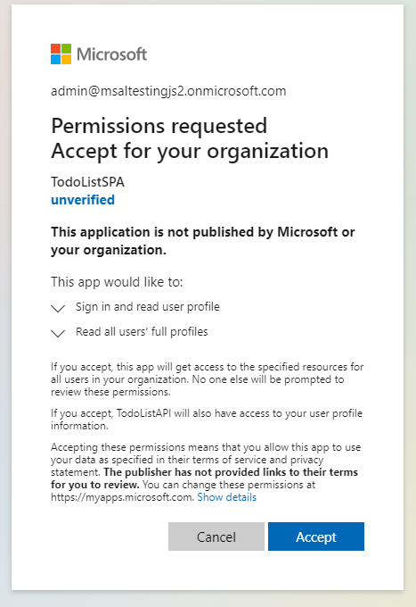
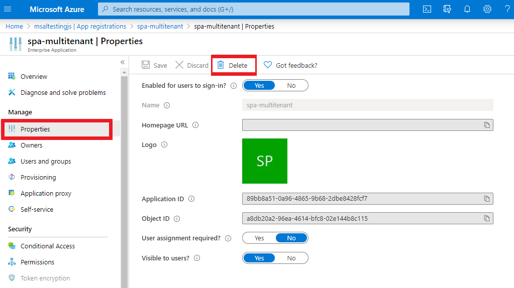
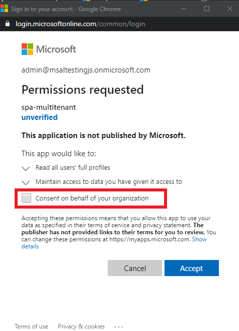
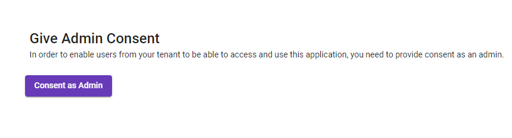
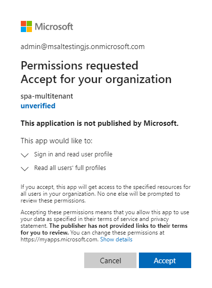

# Integrate an Angular SPA using MSAL Angular to authenticate users with Azure AD and call a protected web API using the multi-tenant integration pattern (SaaS)

* [Overview](#overview)
* [Scenario](#scenario)
* [Prerequisites](#prerequisites)
* [Setup the sample](#setup-the-sample)
* [Explore the sample](#explore-the-sample)
* [Troubleshooting](#troubleshooting)
* [About the code](#about-the-code)
* [Contributing](#contributing)
* [Learn More](#learn-more)

## Overview

This sample demonstrates how to integrate an app with Azure AD as a multi-tenant app. This cross-platform application suite comprises of an Angular single-page application (*TodoListSPA*) authenticating users and calling an ASP.NET Core web API (*TodoListAPI*) which is also secured with Azure Active Directory (Azure AD). Due to the topology of this application suite (*multi-tier*, *multi-tenant*), additional steps are needed for making the apps available to users in other tenants.

When it comes to integrate Azure AD authentication in their apps, developers can choose to configure their app to be either **single-tenant** or **multi-tenant** while registering their app in the [Azure portal](https://portal.azure.com).

- `Single tenant` apps are only available in the tenant they were registered in, also known as their **home tenant**.
- `Multi-tenant` apps are available to users in both their home tenant and other tenants where they are **provisioned**. Apps that allow users to sign-in using their personal accounts that they use to sign into services like Xbox and Skype are also multi-tenant apps. We will cover provisioning of a multi-tenant app in other tenants using [admin-consent](ADD_LINK_HERE)

> :information_source: To learn how to integrate an application with Azure AD as a [multi-tenant](https://aka.ms/multi-tenant) app, consider going through the recorded session: [Develop multi-tenant applications with the Microsoft identity platform](https://www.youtube.com/watch?v=B416AxHoMJ4).

> :information_source: To learn how to integrate a JavaScript Angular application with Azure AD, consider going through the recorded session: [Deep dive on using MSAL.js to integrate Angular single-page applications with Azure Active Directory](https://www.youtube.com/watch?v=EJey9KP1dZA)

## Scenario

* **TodoListSPA** uses [MSAL Angular](https://github.com/AzureAD/microsoft-authentication-library-for-js/tree/dev/lib/msal-angular) to authenticate a user and obtains an [access token](https://docs.microsoft.com/azure/active-directory/develop/access-tokens) from Azure AD for the API on behalf of the authenticated user.
* The access token is then used by the **TodoListAPI** to authorize the user.
* **TodoListAPI** uses [Microsoft.Identity.Web](https://github.com/AzureAD/microsoft-identity-web) to protect its endpoint and accept authorized calls.


## Contents

| File/folder                  | Description                                |
|------------------------------|--------------------------------------------|
| `API/TodoListAPI/appsettings.json`       | Authentication configuration parameters for the web API. |
| `SPA/src/app/auth-config.ts` | Authentication configuration parameters for the SPA. |
| `SPA/src/app/consent/consent.component.ts` | Contains logic for granting admin consent. |

## Prerequisites

* Either [Visual Studio](https://visualstudio.microsoft.com/downloads/) or [Visual Studio Code](https://code.visualstudio.com/download) and [.NET Core SDK](https://www.microsoft.com/net/learn/get-started)
* You would need *at least* **two** Azure Active Directory (Azure AD) tenants to successfully run this sample. For more information on how to get an Azure AD tenant, see [How to get an Azure AD tenant](https://docs.microsoft.com/azure/active-directory/develop/test-setup-environment#get-a-test-tenant).
* On each tenant, *at least* **one** admin account (:warning: i.e. global admin) and **one** non-admin/user account should be present for testing purposes.

## Setup the sample

### Step 1: Clone or download this repository

From your shell or command line:

```console
git clone https://github.com/Azure-Samples/ms-identity-javascript-angular-tutorial.git
```

or download and extract the repository *.zip* file.

> :warning: To avoid path length limitations on Windows, we recommend cloning into a directory near the root of your drive.

### Step 2. Install .NET Core API dependencies

```console
    cd ms-identity-javascript-angular-tutorial
    cd 6-AdvancedScenarios\2-call-api-mt/API
    dotnet restore
```

### Step 3. Trust development certificates

```console
    dotnet dev-certs https --clean
    dotnet dev-certs https --trust
```

For more information and potential issues, see: [HTTPS in .NET Core](https://docs.microsoft.com/aspnet/core/security/enforcing-ssl).

### Step 4. Install Angular SPA dependencies

```console
    cd ../
    cd SPA
    npm install
```

There are two projects in this sample. Each needs to be separately registered in your Azure AD tenant. To register these projects, you can:

- follow the steps below for manually register your apps
- or use PowerShell scripts that:
  - **automatically** creates the Azure AD applications and related objects (passwords, permissions, dependencies) for you.
  - modify the projects' configuration files.

<details>
   <summary>Expand this section if you want to use this automation:</summary>

    > :warning: If you have never used **Microsoft Graph PowerShell** before, we recommend you go through the [App Creation Scripts Guide](./AppCreationScripts/AppCreationScripts.md) once to ensure that your environment is prepared correctly for this step.
  
    1. On Windows, run PowerShell as **Administrator** and navigate to the root of the cloned directory
    1. In PowerShell run:

       ```PowerShell
       Set-ExecutionPolicy -ExecutionPolicy RemoteSigned -Scope Process -Force
       ```

    1. Run the script to create your Azure AD application and configure the code of the sample application accordingly.
    1. For interactive process -in PowerShell, run:

       ```PowerShell
       cd .\AppCreationScripts\
       .\Configure.ps1 -TenantId "[Optional] - your tenant id" -AzureEnvironmentName "[Optional] - Azure environment, defaults to 'Global'"
       ```

    > Other ways of running the scripts are described in [App Creation Scripts guide](./AppCreationScripts/AppCreationScripts.md). The scripts also provide a guide to automated application registration, configuration and removal which can help in your CI/CD scenarios.

</details>

#### Choose the Azure AD tenant where you want to create your applications

To manually register the apps, as a first step you'll need to:

1. Sign in to the [Azure portal](https://portal.azure.com).
1. If your account is present in more than one Azure AD tenant, select your profile at the top right corner in the menu on top of the page, and then **switch directory** to change your portal session to the desired Azure AD tenant.

#### Register the service app (msal-dotnet-mt-api)

1. Navigate to the [Azure portal](https://portal.azure.com) and select the **Azure Active Directory** service.
1. Select the **App Registrations** blade on the left, then select **New registration**.
1. In the **Register an application page** that appears, enter your application's registration information:
    1. In the **Name** section, enter a meaningful application name that will be displayed to users of the app, for example `msal-dotnet-mt-api`.
    1. Under **Supported account types**, select **Accounts in any organizational directory**
    1. Select **Register** to create the application.
1. In the **Overview** blade, find and note the **Application (client) ID**. You use this value in your app's configuration file(s) later in your code.
1. Since this app signs-in users, we will now proceed to select **delegated permissions**, which is is required by apps signing-in users.
    1. In the app's registration screen, select the **API permissions** blade in the left to open the page where we add access to the APIs that your application needs:
    1. Select the **Add a permission** button and then:
    1. Ensure that the **Microsoft APIs** tab is selected.
    1. In the *Commonly used Microsoft APIs* section, select **Microsoft Graph**
    1. In the **Delegated permissions** section, select **User.Read** in the list. Use the search box if necessary.
    1. Select the **Add permissions** button at the bottom.
1. In the app's registration screen, select the **Expose an API** blade to the left to open the page where you can publish the permission as an API for which client applications can obtain [access tokens](https://aka.ms/access-tokens) for. The first thing that we need to do is to declare the unique [resource](https://docs.microsoft.com/azure/active-directory/develop/v2-oauth2-auth-code-flow) URI that the clients will be using to obtain access tokens for this API. To declare an resource URI(Application ID URI), follow the following steps:
    1. Select **Set** next to the **Application ID URI** to generate a URI that is unique for this app.
    1. For this sample, accept the proposed Application ID URI (`api://{clientId}`) by selecting **Save**.
        > :information_source: Read more about Application ID URI at [Validation differences by supported account types (signInAudience)](https://docs.microsoft.com/azure/active-directory/develop/supported-accounts-validation).

##### Publish Delegated Permissions

1. All APIs must publish a minimum of one [scope](https://docs.microsoft.com/azure/active-directory/develop/v2-oauth2-auth-code-flow#request-an-authorization-code), also called [Delegated Permission](https://docs.microsoft.com/azure/active-directory/develop/v2-permissions-and-consent#permission-types), for the client apps to obtain an access token for a *user* successfully. To publish a scope, follow these steps:
1. Select **Add a scope** button open the **Add a scope** screen and Enter the values as indicated below:
    1. For **Scope name**, use `TodoList.Read`.
    1. Select **Admins and users** options for **Who can consent?**.
    1. For **Admin consent display name** type in *TodoList.Read*.
    1. For **Admin consent description** type in *e.g. Allows the app to read the signed-in user's files.*.
    1. For **User consent display name** type in *scopeName*.
    1. For **User consent description** type in *eg. Allows the app to read your files.*.
    1. Keep **State** as **Enabled**.
    1. Select the **Add scope** button on the bottom to save this scope.
    > Repeat the steps above for another scope named **TodoList.ReadWrite**
1. Select the **Manifest** blade on the left.
    1. Set `accessTokenAcceptedVersion` property to **2**.
    1. Select on **Save**.

> :information_source:  Follow [the principle of least privilege when publishing permissions](https://learn.microsoft.com/security/zero-trust/develop/protected-api-example) for a web API.

##### Publish Application Permissions

1. All APIs should publish a minimum of one [App role for applications](https://docs.microsoft.com/azure/active-directory/develop/howto-add-app-roles-in-azure-ad-apps#assign-app-roles-to-applications), also called [Application Permission](https://docs.microsoft.com/azure/active-directory/develop/v2-permissions-and-consent#permission-types), for the client apps to obtain an access token as *themselves*, i.e. when they are not signing-in a user. **Application permissions** are the type of permissions that APIs should publish when they want to enable client applications to successfully authenticate as themselves and not need to sign-in users. To publish an application permission, follow these steps:
1. Still on the same app registration, select the **App roles** blade to the left.
1. Select **Create app role**:
    1. For **Display name**, enter a suitable name for your application permission, for instance **TodoList.Read.All**.
    1. For **Allowed member types**, choose **Application** to ensure other applications can be granted this permission.
    1. For **Value**, enter **TodoList.Read.All**.
    1. For **Description**, enter *e.g. Allows the app to read the signed-in user's files.*.
    1. Select **Apply** to save your changes.
    > Repeat the steps above for another app permission named **TodoList.ReadWrite.All**

##### Configure Optional Claims

1. Still on the same app registration, select the **Token configuration** blade to the left.
1. Select **Add optional claim**:
    1. Select **optional claim type**, then choose **Access**.
    1. Select the optional claim **idtyp**.
    > Indicates token type. This claim is the most accurate way for an API to determine if a token is an app token or an app+user token. This is not issued in tokens issued to users.
    1. Select the optional claim **acct**.
    > Provides user's account status in tenant. If the user is a **member** of the tenant, the value is *0*. If they're a **guest**, the value is *1*.
    1. Select **Add** to save your changes.

##### Configure the service app (msal-dotnet-mt-api) to use your app registration

Open the project in your IDE (like Visual Studio or Visual Studio Code) to configure the code.

> In the steps below, "ClientID" is the same as "Application ID" or "AppId".

1. Open the `API\TodoListAPI\appsettings.json` file.
1. Find the key `Enter the Client ID (aka 'Application ID')` and replace the existing value with the application ID (clientId) of `msal-dotnet-mt-api` app copied from the Azure portal.

#### Register the client app (msal-angular-mt-spa)

1. Navigate to the [Azure portal](https://portal.azure.com) and select the **Azure Active Directory** service.
1. Select the **App Registrations** blade on the left, then select **New registration**.
1. In the **Register an application page** that appears, enter your application's registration information:
    1. In the **Name** section, enter a meaningful application name that will be displayed to users of the app, for example `msal-angular-mt-spa`.
    1. Under **Supported account types**, select **Accounts in any organizational directory**
    1. Select **Register** to create the application.
1. In the **Overview** blade, find and note the **Application (client) ID**. You use this value in your app's configuration file(s) later in your code.
1. In the app's registration screen, select the **Authentication** blade to the left.
1. If you don't have a platform added, select **Add a platform** and select the **Single-page application** option.
    1. In the **Redirect URI** section enter the following redirect URIs:
        1. `http://localhost:4200`
        1. `http://localhost:4200/auth`
        1. `http://localhost:4200/consent-redirect`
    1. Click **Save** to save your changes.
1. Since this app signs-in users, we will now proceed to select **delegated permissions**, which is is required by apps signing-in users.
    1. In the app's registration screen, select the **API permissions** blade in the left to open the page where we add access to the APIs that your application needs:
    1. Select the **Add a permission** button and then:
        1. Ensure that the **My APIs** tab is selected.
        1. In the list of APIs, select the API `msal-dotnet-mt-api`.
        1. In the **Delegated permissions** section, select **TodoList.Read**, **TodoList.ReadWrite** in the list. Use the search box if necessary.
        1. Select the **Add permissions** button at the bottom.
    1. Select the **Add a permission** button and then:
        1. Ensure that the **Microsoft APIs** tab is selected.
        1. In the *Commonly used Microsoft APIs* section, select **Microsoft Graph**
        1. In the **Delegated permissions** section, select **User.Read** in the list. Use the search box if necessary.
        1. Select the **Add permissions** button at the bottom.

##### Configure Optional Claims

1. Still on the same app registration, select the **Token configuration** blade to the left.
1. Select **Add optional claim**:
    1. Select **optional claim type**, then choose **Access**.
    1. Select the optional claim **acct**.
    > Provides user's account status in tenant. If the user is a **member** of the tenant, the value is *0*. If they're a **guest**, the value is *1*.
    1. Select **Add** to save your changes.

##### Configure the client app (msal-angular-mt-spa) to use your app registration

Open the project in your IDE (like Visual Studio or Visual Studio Code) to configure the code.

> In the steps below, "ClientID" is the same as "Application ID" or "AppId".

1. Open the `SPA\src\app\auth-config.ts` file.
1. Find the key `Enter_the_Application_Id_Here` and replace the existing value with the application ID (clientId) of `msal-angular-spa` app copied from the Azure portal.
1. Find the key `Enter_the_Web_Api_Application_Id_Here` and replace the existing value with the application ID (clientId) of `msal-dotnet-mt-api` app copied from the Azure portal.

#### Configure Known Client Applications for service (msal-dotnet-mt-api)

1. In the [Azure portal](https://portal.azure.com), navigate to your `msal-dotnet-mt-api` app registration, and select the **Manifest** blade.
1. In the manifest editor, change the `knownClientApplications: []` line so that the array contains the Client ID of the client application (`msal-angular-mt-spa`) as an element of the array.

For instance:

```json
        "knownClientApplications": ["Enter_the_Application_Id_Here"],
```

1. **Save** the changes to the manifest.

### Step 5: Running the sample

Using a command line interface such as **VS Code** integrated terminal, locate the application directory. Then:  

```console
   cd ../
   cd SPA
   npm start
```

In a separate console window, execute the following commands

```console
   cd API/TodoListAPI
   dotnet run
```

## Explore the sample

1. Open your browser and navigate to `http://localhost:4200`.

1. Sign-in using the button on top-right:


Regular users won't be able to sign-in, until an **admin-user** provides **admin-consent** to application permissions.


You can either consent as admin during initial sign-in, or if you miss this step, via the **Admin** page




1. Once **admin-consent** is provided, users can select the **Get my tasks** button to access the todo list. When you create a new task, you will also have an option to assign it to any other user from your tenant:


> :information_source: Consider taking a moment to [share your experience with us](https://forms.office.com/Pages/ResponsePage.aspx?id=v4j5cvGGr0GRqy180BHbR73pcsbpbxNJuZCMKN0lURpUOU5PNlM4MzRRV0lETkk2ODBPT0NBTEY5MCQlQCN0PWcu)

## Troubleshooting

<details>
	<summary>Expand for troubleshooting info</summary>

Use [Stack Overflow](http://stackoverflow.com/questions/tagged/msal) to get support from the community.
Ask your questions on Stack Overflow first and browse existing issues to see if someone has asked your question before.
Make sure that your questions or comments are tagged with [`azure-active-directory` `dotnet` `ms-identity` `adal` `msal`].

If you find a bug in the sample, raise the issue on [GitHub Issues](../../../../issues).

To debug the .NET Core web API that comes with this sample, install the [C# extension](https://marketplace.visualstudio.com/items?itemName=ms-dotnettools.csharp) for Visual Studio Code.

Learn more about using [.NET Core with Visual Studio Code](https://docs.microsoft.com/dotnet/core/tutorials/with-visual-studio-code).

To provide feedback on or suggest features for Azure Active Directory, visit [User Voice page](https://feedback.azure.com/d365community/forum/79b1327d-d925-ec11-b6e6-000d3a4f06a4).
</details>

## About the code

Here we discuss some of the more important aspects of multi-tenant applications.

### Testing the Application

To properly test this application, you need *at least* **2** tenants, and on each tenant, *at least* **1** administrator and **1** non-administrator account.

Before each test, you should delete your **service principal** for the tenant you are about to test, in order to remove any previously given consents and start the **provisioning process** from scratch.

> #### How to delete Service Principals
>
> You will find the entry under the **Enterprise Applications** blade. Read more about these blades in the [How and why applications are added to Azure AD](https://docs.microsoft.com/azure/active-directory/develop/active-directory-how-applications-are-added).

> In the next screen, select **Properties** and then the **Delete** button on the upper side.
>
> 
>
> You have now deleted the service principal for that tenant. Next time, once a user successfully authenticates to your application, a new service principal will be created (i.e. *provisioning*) in the tenant from which *that* user belongs to. Note that only a user with admin privileges in a tenant can provision an app into that tenant.

### Usage of `/organizations` endpoint

When registering an application with the Microsoft identity platform for developers, you are asked to select which account types your application supports to sign-in with, commonly referred as **audience** (see: [Supported account types](https://learn.microsoft.com/azure/active-directory/develop/v2-supported-account-types)). Your MSAL configuration will reflect your choice of audience in the `authority` parameter. an application that targets **accounts in any Azure AD directory** will have its authority parameter set to `https://login.microsoftonline.com/organizations`, while for an application that targets **Accounts in any Azure AD directory and personal Microsoft accounts (such as Skype, Xbox, Outlook.com)** it will be `https://login.microsoftonline.com/common`. Here, `/organizations` and `/common` are not real tenants, but just **multiplexers** that will route the request to the relevant tenant:

```typescript
export function MSALInstanceFactory(): IPublicClientApplication {
  return new PublicClientApplication({
    auth: {
        clientId: "<your-client-id>",
        authority: "https://login.microsoftonline.com/organizations",
        redirectUri: "http://localhost:4200/",
    },
  });
}
```

> Please note that if you sign-in guest users at the `/common` (or `/organizations`) endpoint, they will be directed to their home tenant for signing-in. So, if your multi-tenant app cares about applying tenant specific conditional access policies, group assignments or app roles to be applied to the guest users, the app should sign-in the guest user on the **tenanted endpoint** (`https://login.microsoftonline.com/{tenantId}`) instead of the `/common` endpoint.

### Dynamic token request

If `organizations` or `common` is used as the tenant, all tokens will be requested from the users' home tenant. However, this may not be the desired outcome. If a user is invited as a guest, the tokens may be from the wrong authority. Setting the `authRequest` in the **MsalInterceptorConfiguration** to a method allows you to dynamically change the auth request. For instance, you may set the authority based on the home tenant of the account when using guest users.

```typescript
export function MSALInterceptorConfigFactory(): MsalInterceptorConfiguration {
    const protectedResourceMap = new Map<string, Array<string>>();
    protectedResourceMap.set("https://graph.microsoft.com/v1.0/me", ["user.read"]);
    
    return {
        interactionType: InteractionType.Popup,
        protectedResourceMap,
        authRequest: (msalService, httpReq, originalAuthRequest) => {
            return {
                ...originalAuthRequest,
                authority: `https://login.microsoftonline.com/${originalAuthRequest.account?.tenantId ?? 'organizations'}`
            };
        }
    };
}
```

### Ways of providing admin consent

A service principal of your multi-tenant app is created via one of the following ways:

1. When the first user signs-in to your app for the first time in a tenant.
1. Manually or programmatically created by a tenant admin using one of the following
   1. Using the [/adminconsent endpoint](https://docs.microsoft.com/azure/active-directory/develop/v2-admin-consent)
   1. [Using the PowerShell command](https://docs.microsoft.com/powershell/azure/create-azure-service-principal-azureps).

* **Consent during sign-in:**

This method requires the most minimal setup. The only thing needed is that the tenant admin signs-in first and *optionally* choose to **consent on behalf of your organization** during the AAD sign-in as shown in the screen below:



* **Consent using the `/adminconsent` endpoint**

This method provides a programmatic control over the consent process. To be able to **consent as an admin** with this method, there are two steps your application needs to carry out:

1. Determine the `tenantId` of the signed-in (admin) user.
2. Redirect the (admin) user to the correct [/adminconsent endpoint](https://docs.microsoft.com/azure/active-directory/develop/v2-admin-consent). This is demonstrated in [onboard.component.ts](./SPA/src/app/onboard/onboard.component.ts):

```typescript
adminConsent() {
    const account = this.authService.instance.getActiveAccount()

    if (account) {
        // available only in HTTPS context
        const state = window.crypto.randomUUID(); // state parameter against csrf

        /**
         * Construct URL for admin consent endpoint. For more information, visit:
         * https://docs.microsoft.com/azure/active-directory/develop/v2-admin-consent
         */
        const adminConsentUri = "https://login.microsoftonline.com/" +
            `${account.tenantId}` + "/v2.0/adminconsent?client_id=" +
            `${msalConfig.auth.clientId}` + "&state=" + `${state}` + "&redirect_uri=" + `http://localhost:4200/adminconsent` +
            "&scope=" + `${protectedResources.todoListApi.scopes.read[0].split("/TodoList")[0]}/.default`;

        // redirect to admin consent endpoint
        window.location.replace(adminConsentUri);
    }
}
```



> #### The `.default` scope
>
> Did you notice the scope here is set to `.default`? This is a built-in scope for every application that refers to the static list of permissions configured on the application registration. Basically, it *bundles* all the permissions in one scope. The /.default scope can be used in any OAuth 2.0 flow. Read more about `scopes` usage at [Scopes and permissions in the Microsoft Identity Platform](https://docs.microsoft.com/azure/active-directory/develop/v2-permissions-and-consent#scopes-and-permissions).  
  
When redirected to the `/adminconsent` endpoint, the tenant admin will see:


After you choose an admin account, it will lead to the following prompt:



Once it finishes, your application's service principal will be provisioned in that tenant.

### Provisioning and sign-in differences

When provisioning, you have to take care of the dependency in the topology if the client app (*msal-angular-spa*) is dependent on the service app (*msal-dotnet-mt-api*). For instance, if your client app needs to acquire tokens to call your service app and asks for consent to the necessary scopes during the sign-in stage, you would need to provision the **msal-dotnet-mt-api** before the **msal-angular-spa**. As such, only a user with admin privileges would be able to sign-in for the first time in a new tenant. After that, any user from that admin's tenant can sign-in and use the application.

This sample is configured to allow non-admin users to sign-in to the client SPA from any tenant, as it acquire tokens for the service web API at a later stage (i.e. when the user attempts to use the shared todoList after sign-in), which means the service web API can be provisioned later than the client SPA. You can configure this behavior by modifying the scopes of `loginRequest` object in [auth-config.ts](./SPA/src/app/auth-config.ts).

### Custom token validation allowing only registered tenants

By marking your application as multi-tenant, your application will be able to sign-in users from any Azure AD tenant out there. Now you would want to restrict the tenants you want to work with. For this, we will now extend token validation to only those Azure AD tenants registered in the application database.

Below, the event handler `OnTokenValidated` was configured to grab the `tenantId` from the token claims and check if it has an entry on the records. If it doesn't, an exception is thrown, canceling the authentication. (See: [Startup.cs](./API/TodoListAPI/Startup.cs))

```csharp
   services.Configure<JwtBearerOptions>(JwtBearerDefaults.AuthenticationScheme, options =>
   {
        options.Events.OnTokenValidated = async context =>
        {
            string[] allowedTenants = { /* list of tenant IDs to allow */ };
    
            string userTenantId = context?.Principal?.Claims
                .FirstOrDefault(x => x.Type == "tid")?.Value;
    
            if (!allowedTenants.Contains(userTenantId))
            {
                throw new System.Exception("This tenant is not allowed to call this web API");
            }
        };
   });
```

# Dynamic token request

If `organizations` or `common` is used as the tenant in MSAL configuration, all tokens will be requested from the users' home tenant. However, this may not be the desired outcome. If a user is invited as a guest, the tokens may be from the wrong authority. To configure which tenant the tokens should be acquired from in a multi-tenant application, please refer to: [Dynamic token request](https://github.com/AzureAD/microsoft-authentication-library-for-js/blob/dev/lib/msal-angular/docs/multi-tenant.md#dynamic-auth-request)

# Dynamic MSAL configuration

In certain scenarios, you might need to dynamically configure MSAL application object on the fly. To learn how to do so, please refer to: [Dynamic configurations using Factory Providers and APP_INITIALIZER](https://github.com/AzureAD/microsoft-authentication-library-for-js/blob/dev/lib/msal-angular/docs/v2-docs/configuration.md#dynamic-configurations-using-factory-providers-and-app_initializer)

## Contributing

If you'd like to contribute to this sample, see [CONTRIBUTING.MD](/CONTRIBUTING.md).

This project has adopted the [Microsoft Open Source Code of Conduct](https://opensource.microsoft.com/codeofconduct/). For more information, see the [Code of Conduct FAQ](https://opensource.microsoft.com/codeofconduct/faq/) or contact [opencode@microsoft.com](mailto:opencode@microsoft.com) with any additional questions or comments.

## Learn More

* [Microsoft identity platform (Azure Active Directory for developers)](https://docs.microsoft.com/azure/active-directory/develop/)
* [Azure AD code samples](https://docs.microsoft.com/azure/active-directory/develop/sample-v2-code)
* [Overview of Microsoft Authentication Library (MSAL)](https://docs.microsoft.com/azure/active-directory/develop/msal-overview)
* [Register an application with the Microsoft identity platform](https://docs.microsoft.com/azure/active-directory/develop/quickstart-register-app)
* [Configure a client application to access web APIs](https://docs.microsoft.com/azure/active-directory/develop/quickstart-configure-app-access-web-apis)
* [Converting an application to Multi-tenant](https://docs.microsoft.com/azure/active-directory/develop/howto-convert-app-to-be-multi-tenant)
* [Multi-tenant SaaS database tenancy patterns](https://docs.microsoft.com/azure/sql-database/saas-tenancy-app-design-patterns)
* [How to configure a new multi-tenant application](https://docs.microsoft.com/azure/active-directory/develop/setup-multi-tenant-app)
* [How to: Sign in any Azure Active Directory user using the multi-tenant application pattern](https://docs.microsoft.com/azure/active-directory/develop/howto-convert-app-to-be-multi-tenant)
* [Add a multitenant application to the Azure AD application gallery](https://docs.microsoft.com/azure/active-directory/develop/registration-config-multi-tenant-application-add-to-gallery-how-to)
* [Permissions and Consent](https://docs.microsoft.com/azure/active-directory/develop/v2-permissions-and-consent)
* [Understanding Azure AD application consent experiences](https://docs.microsoft.com/azure/active-directory/develop/application-consent-experience)
* [Understand user and admin consent](https://docs.microsoft.com/azure/active-directory/develop/howto-convert-app-to-be-multi-tenant#understand-user-and-admin-consent)
* [Application and service principal objects in Azure Active Directory](https://docs.microsoft.com/azure/active-directory/develop/app-objects-and-service-principals)
* [Authentication Scenarios for Azure AD](https://docs.microsoft.com/azure/active-directory/develop/authentication-flows-app-scenarios)
* [Building Zero Trust ready apps](https://aka.ms/ztdevsession)
* [National Clouds](https://docs.microsoft.com/azure/active-directory/develop/authentication-national-cloud#app-registration-endpoints)
* [Microsoft.Identity.Web](https://aka.ms/microsoft-identity-web)
* [Validating Access Tokens](https://docs.microsoft.com/azure/active-directory/develop/access-tokens#validating-tokens)
* [User and application tokens](https://docs.microsoft.com/azure/active-directory/develop/access-tokens#user-and-application-tokens)
* [Validation differences by supported account types](https://docs.microsoft.com/azure/active-directory/develop/supported-accounts-validation)
* [How to manually validate a JWT access token using the Microsoft identity platform](https://github.com/Azure-Samples/active-directory-dotnet-webapi-manual-jwt-validation/blob/master/README.md)
