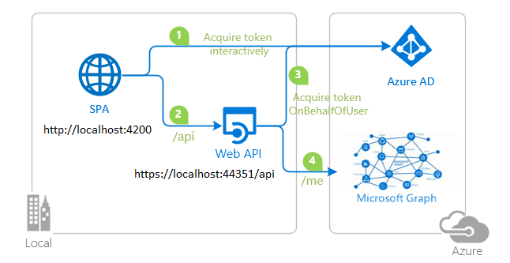

# Angular single-page application authorizing .NET Core web API to call Microsoft Graph using on-behalf-of flow

 1. [Overview](#overview)
 1. [Scenario](#scenario)
 1. [Contents](#contents)
 1. [Prerequisites](#prerequisites)
 1. [Setup](#setup)
 1. [Registration](#registration)
 1. [Running the sample](#running-the-sample)
 1. [Explore the sample](#explore-the-sample)
 1. [About the code](#about-the-code)
 1. [More information](#more-information)
 1. [Community Help and Support](#community-help-and-support)
 1. [Contributing](#contributing)

## Overview

This sample demonstrates an Angular single-page application which lets a user authenticate and obtain an access token to call an ASP.NET Core web API, protected by [Azure Active Directory (Azure AD)](https://azure.microsoft.com/services/active-directory/). The web API then calls the [Microsoft Graph API](https://developer.microsoft.com/graph) using the [OAuth 2.0 on-behalf-of flow](https://docs.microsoft.com/azure/active-directory/develop/v2-oauth2-on-behalf-of-flow). The web API's call to Microsoft Graph is made using the [Microsoft Graph SDK](https://docs.microsoft.com/graph/sdks/sdks-overview).

## Scenario

- The sample implements an **onboarding** scenario where a profile is created for a new user whose fields are pre-populated by the available information about the user on Microsoft Graph.
- The **ProfileSPA** uses [MSAL Angular](https://github.com/AzureAD/microsoft-authentication-library-for-js/tree/dev/lib/msal-angular) to authenticate a user.
- Once the user authenticates, **ProfileSPA** obtains an [access token](https://docs.microsoft.com/azure/active-directory/develop/access-tokens) from Azure AD.
- The access token is then used to authorize the **ProfileAPI** to call MS Graph API **on user's behalf**. In order to call MS Graph API, **ProfileAPI** uses the [Microsoft Graph SDK](https://docs.microsoft.com/graph/sdks/sdks-overview).
- To protect its endpoint and accept only the authorized calls, the ProfileAPI uses [Microsoft.Identity.Web](https://github.com/AzureAD/microsoft-identity-web).



## Contents

| File/folder                         | Description                                                |
|-------------------------------------|------------------------------------------------------------|
| `SPA/src/app/auth-config.ts`        | Authentication parameters for SPA project reside here.     |
| `SPA/src/app/app.module.ts`         | MSAL Angular is initialized here.                          |
| `API/ProfileAPI/appsettings.json`   | Authentication parameters for API project reside here.     |
| `API/ProfileAPI/Startup.cs`         | Microsoft.Identity.Web is initialized here.                |

## Prerequisites

- An **Azure AD** tenant. For more information see: [How to get an Azure AD tenant](https://docs.microsoft.com/azure/active-directory/develop/quickstart-create-new-tenant)
- A user account in your **Azure AD** tenant. This sample will not work with a **personal Microsoft account**. Therefore, if you signed in to the [Azure portal](https://portal.azure.com) with a personal account and have never created a user account in your directory before, you need to do that now.

## Setup

### Step 1. Clone or download this repository

```console
    git clone https://github.com/Azure-Samples/ms-identity-javascript-angular-tutorial.git
```

or download and extract the repository .zip file.

> :warning: To avoid path length limitations on Windows, we recommend cloning into a directory near the root of your drive.

### Step 2. Install .NET Core API dependencies

```console
    cd ms-identity-javascript-angular-tutorial
    cd 7-AdvancedScenarios/1-call-api-obo/API/ProfileAPI
    dotnet restore
```

### Step 3. Trust development certificates

```console
    dotnet dev-certs https --clean
    dotnet dev-certs https --trust
```

For more information and potential issues, see: [HTTPS in .NET Core](https://docs.microsoft.com/aspnet/core/security/enforcing-ssl).

### Step 4. Install Angular SPA dependencies

```console
    cd ../../
    cd SPA
    npm install
```

### Registration

There are two projects in this sample. Each needs to be separately registered in your Azure AD tenant. To register these projects, you can:

- follow the steps below for manually register your apps
- or use PowerShell scripts that:
  - **automatically** creates the Azure AD applications and related objects (passwords, permissions, dependencies) for you.
  - modify the projects' configuration files.

<details>
  <summary>Expand this section if you want to use this automation:</summary>

> :warning: If you have never used **Azure AD Powershell** before, we recommend you go through the [App Creation Scripts](./AppCreationScripts/AppCreationScripts.md) once to ensure that your environment is prepared correctly for this step.

1. On Windows, run PowerShell as **Administrator** and navigate to the root of the cloned directory
1. If you have never used Azure AD Powershell before, we recommend you go through the [App Creation Scripts](./AppCreationScripts/AppCreationScripts.md) once to ensure that your environment is prepared correctly for this step.
1. In PowerShell run:

   ```PowerShell
   Set-ExecutionPolicy -ExecutionPolicy RemoteSigned -Scope Process -Force
   ```

1. Run the script to create your Azure AD application and configure the code of the sample application accordingly.
1. In PowerShell run:

   ```PowerShell
   cd .\AppCreationScripts\
   .\Configure.ps1
   ```

   > Other ways of running the scripts are described in [App Creation Scripts](./AppCreationScripts/AppCreationScripts.md)
   > The scripts also provide a guide to automated application registration, configuration and removal which can help in your CI/CD scenarios.

</details>

### Choose the Azure AD tenant where you want to create your applications

As a first step you'll need to:

1. Sign in to the [Azure portal](https://portal.azure.com).
1. If your account is present in more than one Azure AD tenant, select your profile at the top right corner in the menu on top of the page, and then **switch directory** to change your portal session to the desired Azure AD tenant.

### Register the service app (ProfileAPI)

1. Navigate to the [Azure portal](https://portal.azure.com) and select the **Azure AD** service.
1. Select the **App Registrations** blade on the left, then select **New registration**.
1. In the **Register an application page** that appears, enter your application's registration information:
   - In the **Name** section, enter a meaningful application name that will be displayed to users of the app, for example `ProfileAPI`.
   - Under **Supported account types**, select **Accounts in this organizational directory only**.
1. Select **Register** to create the application.
1. In the app's registration screen, find and note the **Application (client) ID**. You use this value in your app's configuration file(s) later in your code.
1. Select **Save** to save your changes.
1. In the app's registration screen, select the **Certificates & secrets** blade in the left to open the page where we can generate secrets and upload certificates.
1. In the **Client secrets** section, select **New client secret**:
   - Type a key description (for instance `app secret`),
   - Select one of the available key durations (**In 1 year**, **In 2 years**, or **Never Expires**) as per your security posture.
   - The generated key value will be displayed when you select the **Add** button. Copy the generated value for use in the steps later.
   - You'll need this key later in your code's configuration files. This key value will not be displayed again, and is not retrievable by any other means, so make sure to note it from the Azure portal before navigating to any other screen or blade.
1. In the app's registration screen, select the **API permissions** blade in the left to open the page where we add access to the APIs that your application needs.
   - Select the **Add a permission** button and then,
   - Ensure that the **Microsoft APIs** tab is selected.
   - In the *Commonly used Microsoft APIs* section, select **Microsoft Graph**
   - In the **Delegated permissions** section, select the **User.Read**, **offline_access** in the list. Use the search box if necessary.
   - Select the **Add permissions** button at the bottom.
1. In the app's registration screen, select the **Expose an API** blade to the left to open the page where you can declare the parameters to expose this app as an API for which client applications can obtain [access tokens](https://docs.microsoft.com/azure/active-directory/develop/access-tokens) for.
The first thing that we need to do is to declare the unique [resource](https://docs.microsoft.com/azure/active-directory/develop/v2-oauth2-auth-code-flow) URI that the clients will be using to obtain access tokens for this Api. To declare an resource URI, follow the following steps:
   - Select `Set` next to the **Application ID URI** to generate a URI that is unique for this app.
   - For this sample, accept the proposed Application ID URI (`api://{clientId}`) by selecting **Save**.
1. All APIs have to publish a minimum of one [scope](https://docs.microsoft.com/azure/active-directory/develop/v2-oauth2-auth-code-flow#request-an-authorization-code) for the client's to obtain an access token successfully. To publish a scope, follow the following steps:
   - Select **Add a scope** button open the **Add a scope** screen and Enter the values as indicated below:
        - For **Scope name**, use `access_as_user`.
        - Select **Admins and users** options for **Who can consent?**.
        - For **Admin consent display name** type `Access ProfileAPI`.
        - For **Admin consent description** type `Allows the app to access ProfileAPI as the signed-in user.`
        - For **User consent display name** type `Access ProfileAPI`.
        - For **User consent description** type `Allow the application to access ProfileAPI on your behalf.`
        - Keep **State** as **Enabled**.
        - Select the **Add scope** button on the bottom to save this scope.

#### Configure the service app (ProfileAPI) to use your app registration

Open the project in your IDE (like Visual Studio or Visual Studio Code) to configure the code.

> In the steps below, "ClientID" is the same as "Application ID" or "AppId".

1. Open the `API\ProfileAPI\appsettings.json` file.
1. Find the key `Domain` and replace the existing value with your Azure AD tenant name.
1. Find the key `ClientId` and replace the existing value with the application ID (clientId) of `ProfileAPI` app copied from the Azure portal.
1. Find the key `ClientSecret` and replace the existing value with the key you saved during the creation of `ProfileAPI` copied from the Azure portal.
1. Find the key `TenantId` and replace the existing value with your Azure AD tenant ID.

1. Open the `API\Controllers\ProfileController.cs` file.
1. Find the variable `scopeRequiredByApi` and replace its value with the name of the API scope that you have just exposed (by default `access_as_user`).

### Register the client app (ProfileSPA)

1. Navigate to the [Azure portal](https://portal.azure.com) and select the **Azure AD** service.
1. Select the **App Registrations** blade on the left, then select **New registration**.
1. In the **Register an application page** that appears, enter your application's registration information:
   - In the **Name** section, enter a meaningful application name that will be displayed to users of the app, for example `ProfileSPA`.
   - Under **Supported account types**, select **Accounts in this organizational directory only**.
   - In the **Redirect URI (optional)** section, select **Single-page application** in the combo-box and enter the following redirect URI: `http://localhost:4200`.
1. Select **Register** to create the application.
1. In the app's registration screen, find and note the **Application (client) ID**. You use this value in your app's configuration file(s) later in your code.
1. Select **Save** to save your changes.
1. In the app's registration screen, select the **API permissions** blade in the left to open the page where we add access to the APIs that your application needs.
   - Select the **Add a permission** button and then:
       - Ensure that the **Microsoft APIs** tab is selected.
       - In the *Commonly used Microsoft APIs* section, select **Microsoft Graph**
       - In the **Delegated permissions** section, select the **User.Read** in the list. Use the search box if necessary.
       - Select the **Add permissions** button at the bottom.
   - Select the **Add a permission** button and then:
       - Ensure that the **My APIs** tab is selected.
       - In the list of APIs, select the API `ProfileAPI`.
       - In the **Delegated permissions** section, select the **Access 'ProfileAPI'** in the list. Use the search box if necessary.
       - Select the **Add permissions** button at the bottom.

#### Configure the client app (ProfileSPA) to use your app registration

Open the project in your IDE (like Visual Studio or Visual Studio Code) to configure the code.

> In the steps below, "ClientID" is the same as "Application ID" or "AppId".

1. Open the `SPA\src\app\auth-config.ts` file.
1. Find the key `Enter_the_Application_Id_Here` and replace the existing value with the application ID (clientId) of `ProfileSPA` app copied from the Azure portal.
1. Find the key `Enter_the_Tenant_Info_Here` and replace the existing value with your Azure AD tenant ID.
1. Find the key `Enter_the_Application_Id_of_Service_Here` and replace the existing value with the application ID (clientId) of `ProfileAPI` app copied from the Azure portal.

#### Configure Known Client Applications for service (ProfileAPI)

For a middle-tier web API (`ProfileAPI`) to be able to call a downstream web API, the middle-tier app needs to be granted the required permissions as well. However, since the middle-tier cannot interact with the signed-in user, it needs to be explicitly bound to the client app in its **Azure AD** registration. This binding merges the permissions required by both the client and the middle tier Web Api and presents it to the end user in a single consent dialog. The user then consent to this combined set of permissions.

To achieve this, you need to add the **Application Id** of the client app, in the Manifest of the web API in the `knownClientApplications` property. Here's how:

1. In the [Azure portal](https://portal.azure.com), navigate to your `ProfileAPI` app registration, and select **Manifest** section.
1. In the manifest editor, change the `"knownClientApplications": []` line so that the array contains the Client ID of the client application (`ProfileSPA`) as an element of the array.

For instance:

   ```json
   "knownClientApplications": ["ca8dca8d-f828-4f08-82f5-325e1a1c6428"],
   ```

1. **Save** the changes to the manifest.

## Running the sample

Using a command line interface such as VS Code integrated terminal, locate the application directory. Then:  

```console
    cd SPA
    npm start
```

In a separate console window, execute the following commands:

```console
    cd API/ProfileAPI
    dotnet run
```

## Explore the sample

1. Open your browser and navigate to `http://localhost:4200`.
2. Sign-in using the button on top-right corner.
3. If this is your first sign-in, you will be redirected to the onboarding page (the app will try to make a **GET** request: if this is the first time, it will fail -this is expected).
4. Hit **Accept** and a new account will be created for you in the database, pre-populated by the information about you fetched from Microsoft Graph.
5. Submit your changes. When you sign-in next time, the application will recognize you and show you the profile associated with your ID in the database.


> :information_source: Did the sample not work for you as expected? Then please reach out to us using the [GitHub Issues](../../../../issues) page.

## We'd love your feedback!

Were we successful in addressing your learning objective? Consider taking a moment to [share your experience with us](https://forms.office.com/Pages/ResponsePage.aspx?id=v4j5cvGGr0GRqy180BHbR73pcsbpbxNJuZCMKN0lURpUOU5PNlM4MzRRV0lETkk2ODBPT0NBTEY5MCQlQCN0PWcu).

## About the code

### Configuring the middle-tier web API (msal-dotnet-api)

In [Startup.cs](./API/ProfileAPI/Startup.cs), add services for authentication, token validation, token caching and Graph SDK support using the [Microsoft.Identity.Web](https://github.com/AzureAD/microsoft-identity-web) APIs as shown below:

```csharp
public void ConfigureServices(IServiceCollection services)
      {
         services.AddAuthentication(JwtBearerDefaults.AuthenticationScheme)
               .AddMicrosoftIdentityWebApi(Configuration)
                  .EnableTokenAcquisitionToCallDownstreamApi()
                     .AddMicrosoftGraph(Configuration.GetSection("DownstreamAPI"))
                     .AddInMemoryTokenCaches();

         services.AddDbContext<ProfileContext>(opt => opt.UseInMemoryDatabase("Profile"));

         services.AddControllers();

         // Allowing CORS for all domains and methods for the purpose of sample
         services.AddCors(o => o.AddPolicy("default", builder =>
         {
               builder.AllowAnyOrigin()
                     .AllowAnyMethod()
                     .AllowAnyHeader()
                     .WithExposedHeaders("WWW-Authenticate");
         }));
      }
```

Notice the [WWW-Authenticate](https://developer.mozilla.org/en-US/docs/Web/HTTP/Headers/WWW-Authenticate) header exposed in the CORS policy setup. This header tells the client app that authentication is needed for the middle-tier API, as middle-tier API has no user interface and cannot prompt the user itself.

### Gaining consent for the middle-tier web API

The middle-tier application adds the client to the `knownClientApplications` list in its manifest, and then the client app can trigger a combined consent flow for both itself and the middle-tier application. On the Microsoft identity platform, this is done using the `/.default` scope. When triggering a consent screen using known client applications and `/.default`, the consent screen will show permissions for both the client to the middle-tier API, and also request whatever permissions are required by the middle-tier API. The user provides consent for both applications, and then the OBO flow works.

> :information_source: **KnownClientApplications** is an attribute in **application manifest**. It is used for bundling consent if you have a solution that contains two (or more) parts: a client app and a custom web API. If you enter the `appID` (clientID) of the client app into this array, the user will have to consent only once to the client app. Azure AD will know that consenting to the client means implicitly consenting to the web API. It will automatically provision service principals for both the client and web API at the same time. Both the client and the web API app must be registered in the same tenant.

## Debugging the sample

To debug the .NET Core web API that comes with this sample, install the [C# extension](https://marketplace.visualstudio.com/items?itemName=ms-dotnettools.csharp) for Visual Studio Code.

Learn more about using [.NET Core with Visual Studio Code](https://docs.microsoft.com/dotnet/core/tutorials/with-visual-studio-code).

## More information

- [Microsoft identity platform (Azure Active Directory for developers)](https://docs.microsoft.com/azure/active-directory/develop/)
- [Overview of Microsoft Authentication Library (MSAL)](https://docs.microsoft.com/azure/active-directory/develop/msal-overview)
- [Quickstart: Register an application with the Microsoft identity platform](https://docs.microsoft.com/azure/active-directory/develop/quickstart-register-app)
- [Quickstart: Configure a client application to access web APIs](https://docs.microsoft.com/azure/active-directory/develop/quickstart-configure-app-access-web-apis)
- [Understanding Azure AD application consent experiences](https://docs.microsoft.com/azure/active-directory/develop/application-consent-experience)
- [Understand user and admin consent](https://docs.microsoft.com/azure/active-directory/develop/howto-convert-app-to-be-multi-tenant#understand-user-and-admin-consent)
- [Application and service principal objects in Azure Active Directory](https://docs.microsoft.com/azure/active-directory/develop/app-objects-and-service-principals)
- [National Clouds](https://docs.microsoft.com/azure/active-directory/develop/authentication-national-cloud#app-registration-endpoints)
- [MSAL code samples](https://docs.microsoft.com/azure/active-directory/develop/sample-v2-code)

For more information about how OAuth 2.0 protocols work in this scenario and other scenarios, see [Authentication Scenarios for Azure AD](https://docs.microsoft.com/azure/active-directory/develop/authentication-flows-app-scenarios).

## Community Help and Support

Use [Stack Overflow](http://stackoverflow.com/questions/tagged/msal) to get support from the community.
Ask your questions on Stack Overflow first and browse existing issues to see if someone has asked your question before.
Make sure that your questions or comments are tagged with [`azure-active-directory` `dotnet` `ms-identity` `adal` `msal`].

If you find a bug in the sample, raise the issue on [GitHub Issues](../../../../issues).

To provide feedback on or suggest features for Azure Active Directory, visit [User Voice page](https://feedback.azure.com/forums/169401-azure-active-directory).

## Contributing

If you'd like to contribute to this sample, see [CONTRIBUTING.MD](/CONTRIBUTING.md).

This project has adopted the [Microsoft Open Source Code of Conduct](https://opensource.microsoft.com/codeofconduct/). For more information, see the [Code of Conduct FAQ](https://opensource.microsoft.com/codeofconduct/faq/) or contact [opencode@microsoft.com](mailto:opencode@microsoft.com) with any additional questions or comments.
