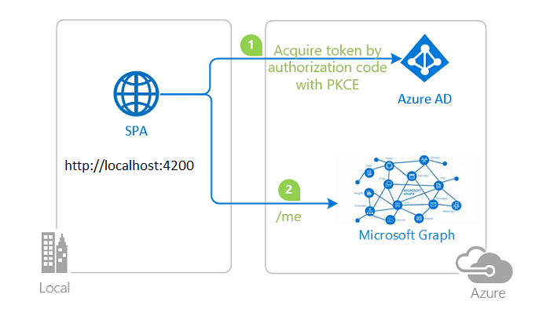

# Tutorial: Enable your Angular single-page application to sign-in users and call APIs with the Microsoft identity platform

The [Microsoft identity platform](https://docs.microsoft.com/azure/active-directory/develop/v2-overview), along with [Azure Active Directory](https://docs.microsoft.com/azure/active-directory/fundamentals/active-directory-whatis) (Azure AD) and [Azure Azure Active Directory B2C](https://docs.microsoft.com/azure/active-directory-b2c/overview) (Azure AD B2C) are central to the **Azure** cloud ecosystem. This tutorial aims to take you through the fundamentals of modern authentication with Angular, using the [Microsoft Authentication Library for Angular](https://github.com/AzureAD/microsoft-authentication-library-for-js/tree/dev/lib/msal-angular) (MSAL Angular).

We recommend following the chapters in successive order. However, the code samples are self-contained, so feel free to pick samples by topics that you may need at the moment.

## Prerequisites

- [Node.js v14 LTS or later](https://nodejs.org/en/download/)
- [Dotnet Core SDK v6 or later](https://dotnet.microsoft.com/download)
- [Visual Studio Code](https://code.visualstudio.com/download)
- [VS Code Azure Tools Extension](https://marketplace.visualstudio.com/items?itemName=ms-vscode.vscode-node-azure-pack)
- A modern web browser

Please refer to each sample's README for sample-specific prerequisites.

## Recommendations

- [jwt.ms](https://jwt.ms) for inspecting your tokens
- [Fiddler](https://www.telerik.com/fiddler) for monitoring your network activity and troubleshooting
- Check [MSAL.js FAQ](https://github.com/AzureAD/microsoft-authentication-library-for-js/blob/dev/lib/msal-browser/FAQ.md) and [MSAL Angular FAQ](https://github.com/AzureAD/microsoft-authentication-library-for-js/blob/dev/lib/msal-angular/docs/FAQ.md) for your questions
- Follow the [Azure AD Blog](https://techcommunity.microsoft.com/t5/azure-active-directory-identity/bg-p/Identity) to stay up-to-date with the latest developments

Please refer to each sample's README for sample-specific recommendations.

## Contents

- For **Azure AD**, start the tutorial from [here](./1-Authentication/1-sign-in/README-incremental.md)
- For **Azure AD B2C**, start the tutorial from [here](./1-Authentication/2-sign-in-b2c/README-incremental.md)

Alternatively, choose below the sample you want to review.

### Chapter 1: Sign-in a user to your application

|               |               |
|---------------|---------------|
|  | [**Sign-in with Azure AD**](./1-Authentication/1-sign-in/README.md)   Sign-in your users with the **Azure AD** and learn to work with **ID Tokens**. Learn how **single sign-on (SSO)** works. Learn to secure your apps to operate in **national clouds**. |
|  | [**Sign-in with Azure AD B2C**](./1-Authentication/2-sign-in-b2c/README.md)   Sign-in your customers with **Azure AD B2C**. Learn to integrate with **external social identity providers**. Learn how to use **user-flows** and **custom policies**. |

### Chapter 2: Sign-in a user and get an Access Token for Microsoft Graph

|                |               |
|----------------|---------------|
|  | [**Get an Access Token from Azure AD and call Microsoft Graph**](./2-Authorization-I/1-call-graph/README.md)   Authenticate your users and acquire an **Access Token** for Microsoft Graph and then call the **Microsoft Graph API**. Learn how to handle continuous access evaluation (CAE) events. |

### Chapter 3: Protect an API and call the API from your client app

|                 |               |
|-----------------|---------------|
|  | [**Protect and call a web API on Azure AD**](./3-Authorization-II/1-call-api/README.md)   Protect your web API with the **Azure AD**. Use a client application to sign-in a user, acquire an **Access Token** for your web API and call your protected Web API. |
|  | [**Protect and call a web API on Azure AD B2C**](./3-Authorization-II/2-call-api-b2c/README.md)   Protect your web API with **Azure AD B2C**. Use a client application to sign-in a user, acquire an **Access Token** for your web API and call your protected web API. |

### Chapter 4: Deploy your applications to Azure

|                 |               |
|-----------------|---------------|
|  | [**Deploy to Azure Storage and App Service**](./4-Deployment/README.md)   Prepare your app for deployment to various **Azure** services. Learn how to package and upload files, configure authentication parameters and use **Azure** services for managing your operations. |

### Chapter 5: Control access to your protected API using App Roles and Security Groups

|                 |               |
|-----------------|---------------|
|  | [**Call a web API using App Roles**](./5-AccessControl/1-call-api-roles/README.md)   Define App Roles and use roles claim in an ID Token to implement Role-based Access Control (RBAC) for your protected web API. |
|  | [**Call a web API using Security Groups**](/5-AccessControl/2-call-api-groups/README.md)   Create Security Groups and use groups claim in an ID Token to implement Role-based Access Control (RBAC) for your protected web API. Handle overage scenarios.  |

### Chapter 6: Dive into advanced scenarios

|                 |               |
|-----------------|---------------|
|  | [**Call Microsoft Graph using on-behalf-of flow**](./6-AdvancedScenarios/1-call-api-obo/README.md)   Use OAuth 2.0 on-behalf-of flow to call Microsoft Graph from your client app via a .NET Core web API. Understand combined consent and **.default** scope. Learn how to handle continuous access evaluation (CAE) events in downstream APIs |
|  | [**Call a multi-tenant web API from any tenant**](./6-AdvancedScenarios/2-call-api-mt/README.md)   Develop and provision a multi-tenant SaaS application. Handle provisioning your app to other tenants and control who can access your resources. |

## We'd love your feedback!

Were we successful in addressing your learning objective? Consider taking a moment to [share your experience with us](https://forms.office.com/Pages/ResponsePage.aspx?id=v4j5cvGGr0GRqy180BHbR73pcsbpbxNJuZCMKN0lURpUOU5PNlM4MzRRV0lETkk2ODBPT0NBTEY5MCQlQCN0PWcu).

## More information

Learn more about the **Microsoft identity platform**:

- [Microsoft identity platform](https://docs.microsoft.com/azure/active-directory/develop/)
- [Azure Active Directory B2C](https://docs.microsoft.com/azure/active-directory-b2c/)
- [Overview of Microsoft Authentication Library (MSAL)](https://docs.microsoft.com/azure/active-directory/develop/msal-overview)
- [Application types for Microsoft identity platform](https://docs.microsoft.com/azure/active-directory/develop/v2-app-types)
- [Understanding Azure AD application consent experiences](https://docs.microsoft.com/azure/active-directory/develop/application-consent-experience)
- [Understand user and admin consent](https://docs.microsoft.com/azure/active-directory/develop/howto-convert-app-to-be-multi-tenant#understand-user-and-admin-consent)
- [Application and service principal objects in Azure Active Directory](https://docs.microsoft.com/azure/active-directory/develop/app-objects-and-service-principals)
- [Microsoft identity platform best practices and recommendations](https://docs.microsoft.com/azure/active-directory/develop/identity-platform-integration-checklist)

See more code samples:

- [MSAL code samples](https://docs.microsoft.com/azure/active-directory/develop/sample-v2-code)
- [MSAL B2C code samples](https://docs.microsoft.com/azure/active-directory-b2c/code-samples)

## Community Help and Support

Use [Stack Overflow](http://stackoverflow.com/questions/tagged/msal) to get support from the community.
Ask your questions on Stack Overflow first and browse existing issues to see if someone has asked your question before.
Make sure that your questions or comments are tagged with [`ms-identity` `azure-ad` `azure-ad-b2c` `msal` `javascript`].

If you find a bug in the sample, please raise the issue on [GitHub Issues](../../issues).

To provide a recommendation, visit the following [User Voice page](https://feedback.azure.com/forums/169401-azure-active-directory).

## Contributing

This project welcomes contributions and suggestions.  Most contributions require you to agree to a
Contributor License Agreement (CLA) declaring that you have the right to, and actually do, grant us
the rights to use your contribution. For details, visit https://cla.opensource.microsoft.com.

## Code of Conduct

This project has adopted the [Microsoft Open Source Code of Conduct](https://opensource.microsoft.com/codeofconduct/).
For more information see the [Code of Conduct FAQ](https://opensource.microsoft.com/codeofconduct/faq/) or
contact [opencode@microsoft.com](mailto:opencode@microsoft.com) with any additional questions or comments.
